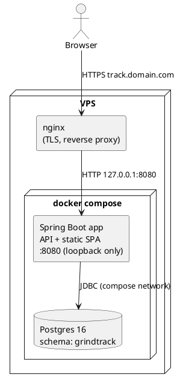

# Architecture

Grindtrack v2 is a single-container Spring Boot application serving both a JSON API and a
pre-built React SPA, backed by Postgres. TLS terminates at the host nginx; the app container
is bound to 127.0.0.1 only.



## Layers

| Layer | Tech | Notes |
|---|---|---|
| UI | React 18 + TypeScript, Vite | Built in Docker stage 1, copied into Spring `static/` |
| API | Spring Boot 3.5, Java 21 | Virtual threads enabled (`spring.threads.virtual.enabled=true`) |
| Auth | Spring Security + custom JWT filter | See [auth.md](auth.md) |
| Persistence | Spring Data JPA → Postgres | Hibernate `ddl-auto: validate` — it never touches schema |
| Schema | preliquibase + Liquibase | preliquibase creates the `grindtrack` schema; Liquibase owns all objects |

## Schema management flow

Order on startup: **preliquibase → Liquibase → JPA validate**.

1. preliquibase executes `resources/preliquibase/postgresql.sql` (`CREATE SCHEMA IF NOT EXISTS`).
   This solves the chicken-and-egg problem: Liquibase needs a schema to write its own
   DATABASECHANGELOG into.
2. Liquibase runs `db/changelog/db.changelog-master.yaml`, which includes formatted-SQL
   changesets. Every schema change forever after is a new changeset — never edit an applied one.
3. Hibernate validates that entities match reality and refuses to start on drift.

## Package layout (backend)

Package-by-feature at the top level; inside each feature, layers get their own subpackage
(`api` → `service` → `domain`; only `api` and `service` may depend on `domain`).

```
dev.grindtrack
├── config/            SecurityConfig, AppProperties
├── auth/
│   ├── api/           AuthController (login/refresh/logout/me + LoginRequest DTO)
│   ├── service/       AuthService, JwtService, TotpService, LoginRateLimiter, UserBootstrap
│   ├── domain/        User, RefreshToken + their Spring Data repositories
│   └── security/      JwtAuthFilter (cookie → SecurityContext)
└── tracking/
    ├── api/           TrackingController (authed), PublicController (landing page), Dtos
    ├── service/       StatsService, Stats (its result record)
    └── domain/        DailyLog, WeeklyReview + their Spring Data repositories
```
