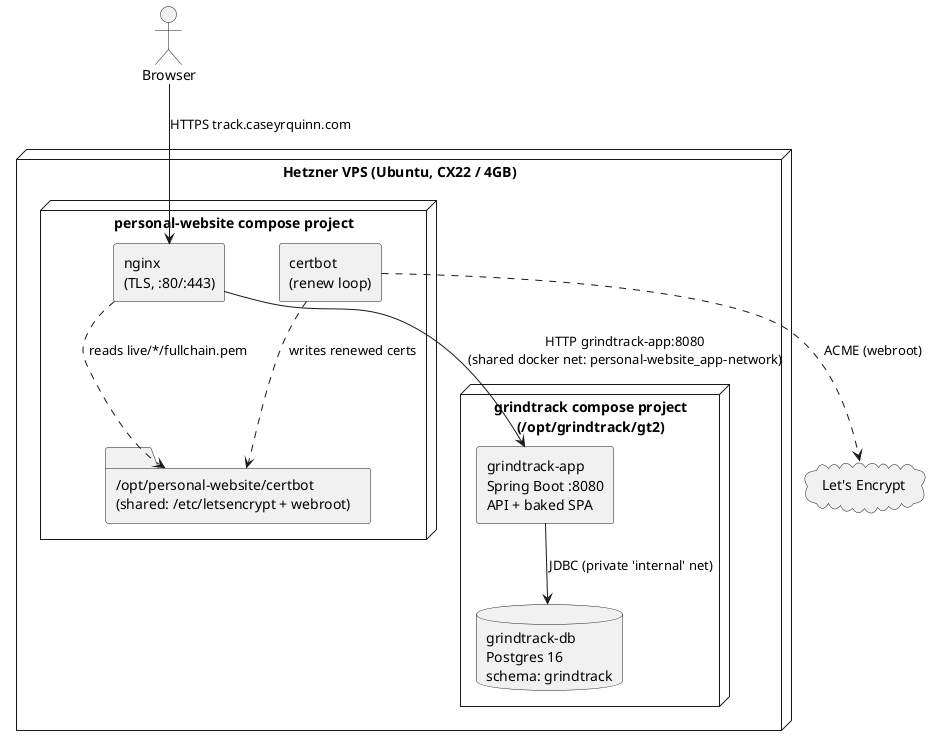
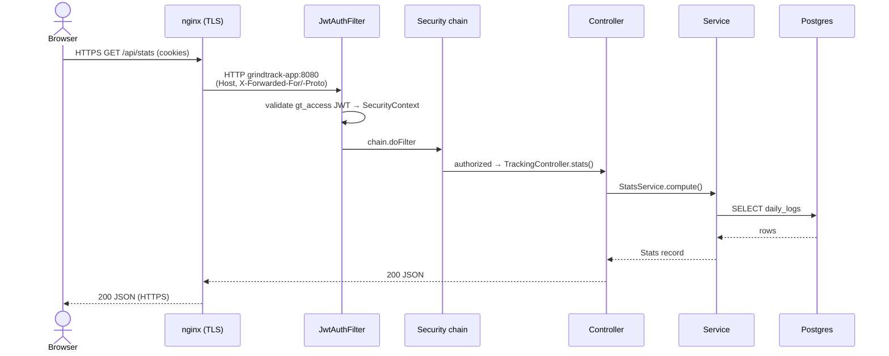

# Architecture

Grindtrack v2 is a **single Spring Boot container** that serves both a JSON API and a pre-built
React SPA from one origin, backed by its own Postgres. It runs as a second app on the same
Hetzner VPS as the personal-website stack, and reuses that stack's **containerized nginx + certbot**
for TLS and routing. See [deployment.md](deployment.md) for the operational detail.

> Diagram convention: **PlantUML for structural/topology diagrams**, **Mermaid for sequence
> diagrams**. PlantUML renders in IntelliJ (PlantUML plugin), VS Code, and plantuml.com — but
> **not** on GitHub. Mermaid renders on GitHub and in the IDE.

## Deployment topology (on the VPS)



Key points: the app publishes **no host port** — nginx reaches it by container name over the
shared docker network. Only `grindtrack-app` joins that shared network; `grindtrack-db` stays on
a private network so the two apps' databases can't see each other. See
[deployment.md](deployment.md) for how the TLS cert is issued into the shared certbot volume and
renewed automatically alongside the website's certs.

## Layers

| Layer | Tech | Notes |
|---|---|---|
| UI | React 18 + TypeScript, Vite | Built in Docker stage 1, copied into Spring `static/` (baked into the jar) — [frontend.md](frontend.md) |
| API | Spring Boot 3.5.16, Java 21 | Virtual threads enabled (`spring.threads.virtual.enabled=true`) — one vthread per request |
| Auth | Spring Security + custom JWT filter | BCrypt + TOTP + rotating refresh tokens — [auth.md](auth.md) |
| Persistence | Spring Data JPA → Postgres 16 | Hibernate `ddl-auto: validate` — it never mutates schema |
| Schema | preliquibase + Liquibase | preliquibase creates the `grindtrack` schema; Liquibase owns all objects — [backend.md](backend.md) |

## One origin, no CORS

Because the compiled SPA is served from the same Spring Boot app that exposes `/api/**`, the
browser talks to a single origin. That's what makes the httpOnly + `SameSite=Strict` cookie model
work with **no CORS configuration at all** (grep confirms there is none). In local dev, Vite serves
the UI on `:5173` and proxies `/api` to `:8080`, preserving the same-origin illusion.

## Request lifecycle



Every request runs on a Java 21 **virtual thread**, so blocking JDBC calls don't tie up platform
threads. The full filter → controller → service → repository trace, including the write path
(e.g. `FocusService.record` upserting the day's hours in one transaction), is in
[backend.md](backend.md).

## Schema management flow

Order on startup: **preliquibase → Liquibase → JPA validate**.

1. preliquibase executes `resources/preliquibase/postgresql.sql` (`CREATE SCHEMA IF NOT EXISTS
   grindtrack`). This solves the chicken-and-egg problem: Liquibase needs a schema to write its
   own `DATABASECHANGELOG` into.
2. Liquibase runs `db/changelog/db.changelog-master.yaml`, which includes four formatted-SQL
   changelogs in order (users/tokens → tracking → focus → plan). Every schema change forever after
   is a new changeset — never edit an applied one.
3. Hibernate validates that entities match reality (`ddl-auto: validate`) and refuses to start on
   drift.

> preliquibase must stay on **1.6.x** while Boot is 3.5.x (2.x needs Boot 4).

## Package layout (backend)

Package-by-feature at the top level; inside each feature, layers get their own subpackage
(`api` → `service` → `domain`, plus `security` for auth; only `api` and `service` may depend on
`domain`). Full class inventory in [backend.md](backend.md).

```
dev.grindtrack
├── GrindtrackApplication         @SpringBootApplication + @ConfigurationPropertiesScan
├── config/                       SecurityConfig, AppProperties
├── auth/
│   ├── api/                      AuthController (login/refresh/logout/me)
│   ├── service/                  AuthService, JwtService, TotpService, LoginRateLimiter, UserBootstrap
│   ├── security/                 JwtAuthFilter (cookie → SecurityContext)
│   └── domain/                   User, RefreshToken + repositories
├── tracking/
│   ├── api/                      TrackingController, FocusController, PublicController, Dtos
│   ├── service/                  StatsService (+Stats record), FocusService
│   └── domain/                   DailyLog, WeeklyReview, FocusSession + repositories
└── plan/
    ├── api/                      PlanController, PlanDtos
    ├── service/                  PlanService
    └── domain/                   PlanItem, PlanQuarter, PlanReference + repositories
```

There is intentionally **no** CORS config, `@ControllerAdvice`, `WebMvcConfigurer`, or
SPA-forwarding controller — Spring Boot's default static handler serves the baked SPA from
`classpath:/static/`, and `SecurityConfig` permits the static paths.
