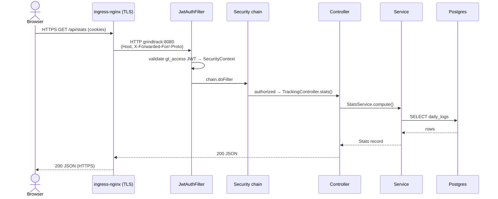

# Architecture

Grindtrack v2 is a **single Spring Boot container** that serves both a JSON API and a pre-built
React SPA from one origin, backed by its own Postgres. It runs in its own namespace on a two-node
**kubeadm cluster on Hetzner Cloud**, behind ingress-nginx with TLS from cert-manager, alongside
the personal-website stack. See [deployment.md](deployment.md) for the operational detail.

> Diagram convention: **PlantUML for structural/topology diagrams**, **Mermaid for sequence
> diagrams**. PlantUML renders in IntelliJ (PlantUML plugin), VS Code, and plantuml.com — but
> **not** on GitHub, which is why the SVGs in [`diagrams/`](diagrams/) are committed. Mermaid
> renders on GitHub and in the IDE.

## Deployment topology (on the cluster)


<sub>PlantUML source: [`diagrams/topology.puml`](diagrams/topology.puml) — edit it and regenerate the SVG with [`diagrams/render.sh`](diagrams/render.sh).</sub>

Key points: the app publishes **no host port and no NodePort** — the only way in is the ingress,
which terminates TLS and forwards to a ClusterIP Service. Postgres has no ingress at all and
lives in the `grindtrack` namespace, so the two apps' databases cannot see each other. The
cluster itself — Terraform, Ansible, ingress-nginx, cert-manager, and grindtrack's own manifests
— is defined in the separate **`k8s-cluster-hetzner`** repo, not here.

## Layers

| Layer | Tech | Notes |
|---|---|---|
| UI | React 18 + TypeScript, Vite | Built in Docker stage 1, copied into Spring `static/` (baked into the jar) — [frontend.md](frontend.md) |
| API | Spring Boot 3.5.16, Java 21 | Virtual threads enabled (`spring.threads.virtual.enabled=true`) — one vthread per request |
| Auth | Spring Security + custom JWT filter | BCrypt + TOTP + rotating refresh tokens — [auth.md](auth.md) |
| Persistence | Spring Data JPA → Postgres 16 | Hibernate `ddl-auto: validate` — it never mutates schema |
| Schema | preliquibase + Liquibase | preliquibase creates the `grindtrack` schema; Liquibase owns all objects — [backend.md](backend.md) |

## One origin, no CORS

Because the compiled SPA is served from the same Spring Boot app that exposes `/api/**`, the
browser talks to a single origin. That's what makes the httpOnly + `SameSite=Strict` cookie model
work with **no CORS configuration at all** (grep confirms there is none). In local dev, Vite serves
the UI on `:5173` and proxies `/api` to `:8080`, preserving the same-origin illusion.

## Request lifecycle


```mermaid
sequenceDiagram
    actor B as Browser
    participant N as ingress-nginx (TLS)
    participant F as JwtAuthFilter
    participant SEC as Security chain
    participant C as Controller
    participant S as Service
    participant DB as Postgres
    B->>N: HTTPS GET /api/stats (cookies)
    N->>F: HTTP grindtrack:8080<br/>(Host, X-Forwarded-For/-Proto)
    F->>F: validate gt_access JWT → SecurityContext
    F->>SEC: chain.doFilter
    SEC->>C: authorized → TrackingController.stats()
    C->>S: StatsService.compute()
    S->>DB: SELECT daily_logs
    DB-->>S: rows
    S-->>C: Stats record
    C-->>N: 200 JSON
    N-->>B: 200 JSON (HTTPS)
```

Every request runs on a Java 21 **virtual thread**, so blocking JDBC calls don't tie up platform
threads. The full filter → controller → service → repository trace, including the write path
(e.g. `FocusService.record` upserting the day's hours in one transaction), is in
[backend.md](backend.md).

One coupling worth naming, because it is invisible from inside this repo: `LoginRateLimiter`
buckets by client IP, which means it is only as trustworthy as `X-Forwarded-For`. ingress-nginx's
default is to set that header to the client IP **as nginx sees it**, overwriting anything the
client sent — which is what the old nginx config did by hand, and what the limiter needs. The
Ingress manifest in the k8s repo carries a comment saying not to enable
`compute-full-forwarded-for`, which would trust a client-supplied chain and make the limit
trivially bypassable.

## Schema management flow

Order on startup: **preliquibase → Liquibase → JPA validate**.

1. preliquibase executes `resources/preliquibase/postgresql.sql` (`CREATE SCHEMA IF NOT EXISTS
   grindtrack`). This solves the chicken-and-egg problem: Liquibase needs a schema to write its
   own `DATABASECHANGELOG` into.
2. Liquibase runs `db/changelog/db.changelog-master.yaml`, which includes the formatted-SQL
   changelogs in numeric order — currently `001`–`019`, roughly users/tokens → tracking → focus →
   plan → work → todos → finance → relationship, with later changesets widening earlier CHECKs as
   the app grew. Every schema change forever after is a new changeset — **never edit an applied
   one**. The full annotated list is in [backend.md](backend.md#migrations).
3. Hibernate validates that entities match reality (`ddl-auto: validate`) and refuses to start on
   drift.

> preliquibase must stay on **1.6.x** while Boot is 3.5.x (2.x needs Boot 4).

## Package layout (backend)

Package-by-feature at the top level; inside each feature, layers get their own subpackage
(`api` → `service` → `domain`, plus `security` for auth; only `api` and `service` may depend on
`domain`). Full class inventory in [backend.md](backend.md).

```
dev.grindtrack
├── GrindtrackApplication         @SpringBootApplication + @ConfigurationPropertiesScan
├── config/                       SecurityConfig, AppProperties, StaticContentConfig
├── web/                          Requests, Responses, BadRequest/ConflictException,
│                                 ApiExceptionHandler — the shared HTTP edge
├── auth/
│   ├── api/                      AuthController, AuthDtos
│   ├── service/                  AuthService, JwtService, TotpService, TrustedDeviceService,
│   │                             LoginRateLimiter, UserBootstrap
│   ├── security/                 JwtAuthFilter (cookie → SecurityContext), Cookies
│   └── domain/                   User, RefreshToken, TrustedDevice + repositories
├── tracking/
│   ├── api/                      TrackingController, FocusController, PublicController,
│   │                             ExportController, TrackingDtos
│   ├── service/                  TrackingService, StatsService (+Stats), FocusService,
│   │                             ReadingService (+ReadingProgress)
│   └── domain/                   DailyLog, WeeklyReview, FocusSession, FocusKind + repositories
├── plan/                         PlanController/PlanDtos · PlanService · PlanItem, PlanQuarter,
│                                 PlanReference
├── todo/                         TodoController/TodoDtos · TodoService · Todo
├── calendar/
│   ├── api/                      CalendarController, UpkeepController, CalendarDtos
│   ├── service/                  CalendarService, UpkeepService (+UpkeepItem)
│   └── domain/                   CalendarEvent, EventKind, RecurringTask,
│                                 RecurringTaskCompletion, TaskCategory + repositories
├── work/                         WorkController/WorkDtos · WorkService · WorkLog, WorkSkill
├── finance/
│   ├── api/                      FinanceController, TransactionController, CategoryRuleController,
│   │                             SpendingController, BudgetController, StatementImportController
│   │                             + FinanceDtos, BudgetDtos, StatementImportDtos
│   ├── service/                  FinanceService, BudgetService (+BudgetMonth), CategoryRuleService,
│   │                             RecurringDetector, StatementImportService, TxnTypeClassifier,
│   │                             MerchantNormalizer, parse/* (7 formats: 6 bank CSV + OFX/QFX)
│   └── domain/                   Account, Transaction, Budget, BudgetExtra, BudgetSettings,
│                                 CategoryRule, ImportBatch, SavingsGoal, … + enums
├── relationship/
│   ├── api/                      RelationshipController, RelationshipDtos
│   ├── service/                  RelationshipService (+RelationshipSummary)
│   └── domain/                   Moment, Idea, Occasion, Reading + enums
└── assistant/                    AssistantController/AssistantDtos · ContextService
                                  (+AssistantContext) — a read-only GET surface over every
                                  other feature; owns no table
```

Every record a browser sends or receives is in a feature's `api/<Feature>Dtos.java`; a service
returns entities or its own computed record. `dev.grindtrack.web` holds what no feature owns —
request parsing, the two acknowledgement bodies, and the single advice that turns an exception into
a status. See [architecture-conventions.md](architecture-conventions.md).

There is intentionally **no** CORS config, `WebMvcConfigurer`, or SPA-forwarding controller — Spring Boot's default static handler serves the baked SPA from
`classpath:/static/`, and `SecurityConfig` permits the static paths.
