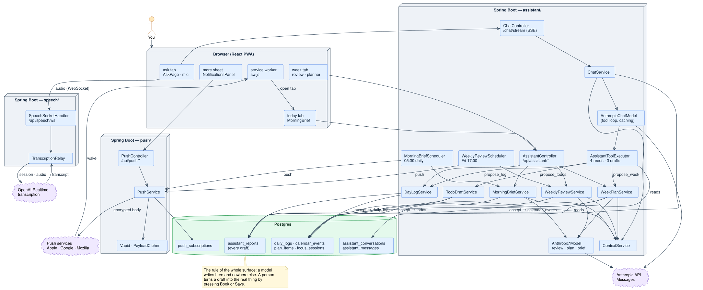
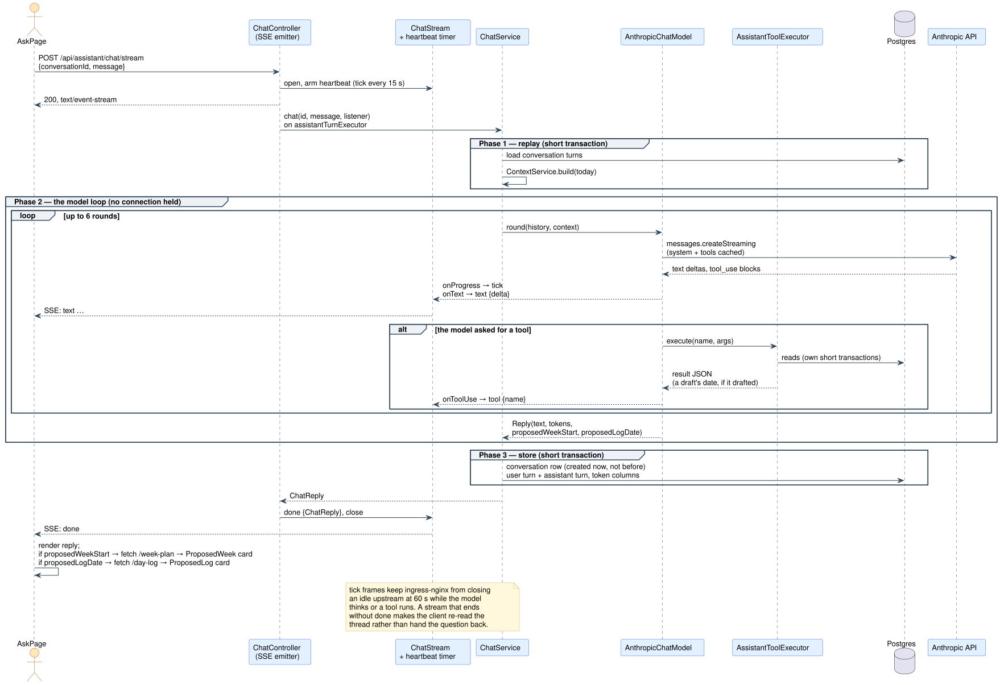
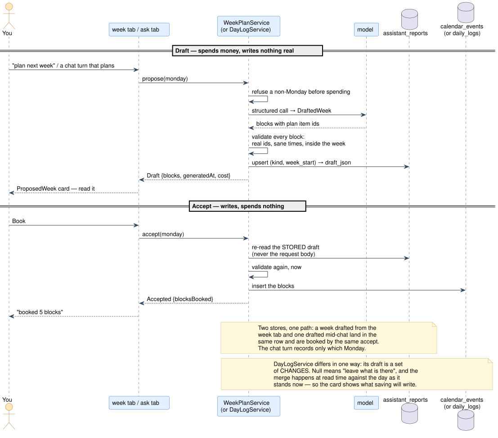
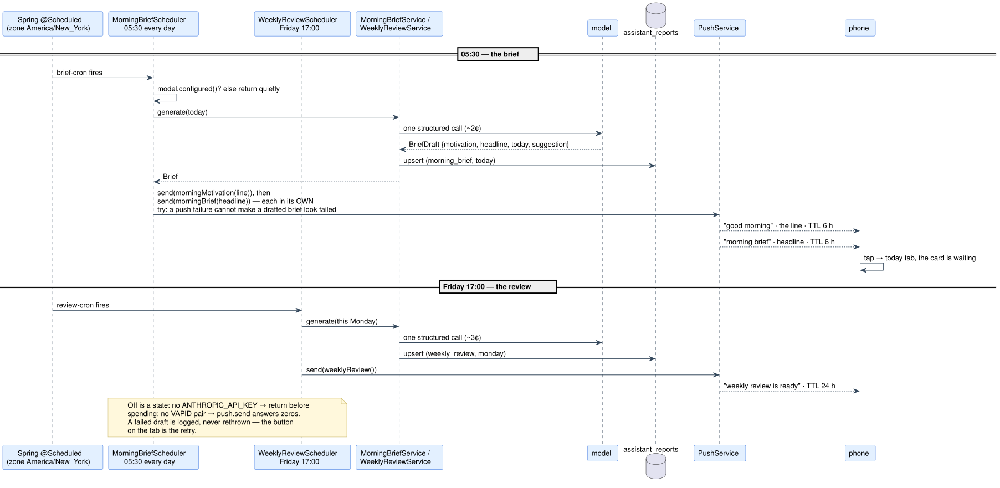
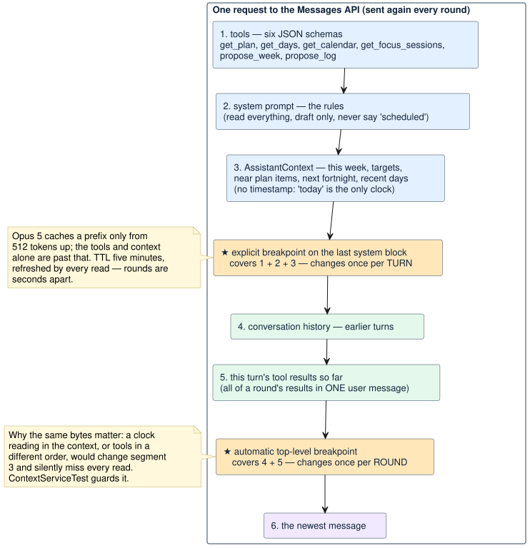
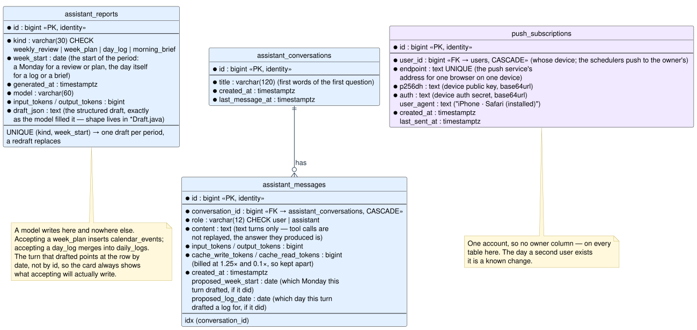

# The assistant

Six features, one API key, and a hard rule: **the model can read everything, and the only thing
it can produce is a draft.** Nothing a model says reaches the calendar or the log. The writes in
the whole surface are `WeekPlanService.accept` and `DayLogService.accept`, which a person reaches
by pressing a button on a draft they have already read, and which re-validate everything first.

With no key the assistant is *off*, not broken: every endpoint answers 503 with a sentence, the
scheduled jobs stay quiet, and the rest of the app neither knows nor cares. That is what makes it
safe to deploy this before the secret exists.

> Turning it on in production, and the other two keys (push, speech): the
> [optional features runbook](deployment.md#optional-features-the-assistant-push-and-speech).

## The map



<sub>PlantUML source: [`diagrams/assistant-map.puml`](diagrams/assistant-map.puml) — edit it and regenerate with [`diagrams/render.sh`](diagrams/render.sh).</sub>

Read it bottom-up. Every arrow from a service to a store lands on `assistant_reports` except the
two labelled *accept*, and those start from a button. Three packages, three outside services,
one rule.

### Where the code lives

| Piece | Backend | Frontend |
|---|---|---|
| Context the models reason over | `assistant/service/ContextService`, `AssistantContext` | — |
| Weekly review | `WeeklyReviewService`, `AnthropicReviewModel`, `ReviewDraft`, `WeeklyReviewScheduler` | `features/assistant/Week*` (week tab) |
| Week planner | `WeekPlanService`, `AnthropicWeekPlanModel`, `DraftedWeek`, `WeekPlanDraft` | `ProposedWeek.tsx` |
| Day log from chat | `DayLogService`, `DayLogDraft` | `ProposedLog.tsx` |
| Morning brief | `MorningBriefService`, `AnthropicBriefModel`, `BriefDraft`, `MorningBriefScheduler` | `MorningBrief.tsx` (today tab) |
| Chat | `ChatService`, `AnthropicChatModel`, `ChatModel`, `AssistantToolExecutor` | `AskPage.tsx`, `ConversationsSheet.tsx`, `assistantApi.ts` |
| HTTP | `assistant/api/AssistantController`, `ChatController`, `ChatStream` | `lib/api.ts` (`stream()`) |
| Storage | `assistant/domain/AssistantReport`, `AssistantMessage`, `AssistantConversation` + repositories | — |
| Prices | `Costs` | the `askbill` line under the ask box |
| Configuration | `config/AssistantProperties`, `AssistantAsyncConfig` | — |
| Speech to text | `speech/` — see [speech-to-text.md](speech-to-text.md) | `lib/speech.ts` |
| Push | `push/` — see [push-notifications.md](push-notifications.md) | `lib/push.ts`, `features/push/` |

## What it does

| Feature | Where | Calls | Writes |
|---|---|---|---|
| Weekly review draft | week tab, and a Friday 17:00 job | 1 per week | a stored draft, never the review itself |
| Chat | ask tab | 1–6 per turn | conversation history |
| Week planner | week tab | 1 per proposal | calendar blocks — only on **Book** |
| Planning in chat | ask tab | +1 on the turn that plans | a stored draft; the card's **Book** is the same accept path |
| Logging in chat | ask tab | none beyond the turn | a stored draft of *changes*; the card's **Save** merges them over the day |
| Morning brief | today tab, and a 06:00 job | 1 per day | a stored draft, replaced by a redraft; nothing else |
| Speaking a question | ask tab | a transcription session per dictation | nothing — words land in the box |

## Configuration

```yaml
grindtrack.assistant:
  api-key: ${ANTHROPIC_API_KEY:}   # blank means off
  model: claude-opus-5
  zone: America/New_York           # "Friday at five" means the owner's Friday, not the pod's UTC
  review-cron: "0 0 17 * * FRI"    # Spring cron: second minute hour day month weekday
  brief-cron: "0 0 6 * * *"        # before the morning block; every day, because "nothing booked" is an answer
```

`AssistantProperties.configured()` is the single switch. It is deliberately separate from
`AppProperties`: a missing JWT secret is a broken deployment, a missing API key is a feature
switched off. The push and speech blocks below it follow the same pattern with their own keys.

## The context, and why it has no timestamp

`ContextService` assembles `AssistantContext` — this week against its targets, planned versus
actual study hours, the lunch streak, in-flight and near plan items, the next fortnight of calendar,
and the recent logged days with your own notes. Two rules govern it: it is **compact** (194 plan
items would be most of a context window spent on rows years away) and every actual arrives **next
to its target**, because a number with nothing to compare it to invites the model to invent the
comparison.

It carries no assembled-at timestamp. `today` already carries the freshness anything in the prompt
reasons over, and a per-request clock reading would sit inside the cached prefix and change on
every call — see caching below. `ContextServiceTest` asserts that two builds of the same day
serialize to identical bytes, which guards the invariant rather than the one field that broke it.

The same context feeds every feature. The review, the planner, the brief and the chat differ in
their prompts and in what they are allowed to produce, not in what they know.

## A chat turn, end to end



<sub>PlantUML source: [`diagrams/chat-turn.puml`](diagrams/chat-turn.puml).</sub>

Three phases. Only the outer two hold a database connection, which is why `ChatService` drives
transactions by hand with a `TransactionTemplate` instead of wearing `@Transactional` over the
whole method: the model call in the middle takes ten to thirty seconds, and holding a pooled
connection across it would pin one of ten to a request doing nothing but waiting on a socket. The
split also means the conversation row is written *after* the reply arrives, so a failed turn no
longer leaves an empty thread in the list.

Streamed turns run on `assistantTurnExecutor`, a pool of two — not Tomcat's threads, which are
needed for the requests that answer in milliseconds. Nothing under there reads the authenticated
principal (the app has one user and the services are written without one), so the security context
staying behind on the request thread costs nothing. **That stops being true the day a second user
exists.**

### The stream

`POST /api/assistant/chat/stream` sends the turn as it happens; `POST /api/assistant/chat` waits
and returns it. Same turn, same storage, same bill — the streaming one just has somebody watching.
The plain one stays because a stream is a poor thing to test against and a worse thing to curl.

POST rather than GET rules out `EventSource` on the client, which only does GET, in favour of
reading the response body as a stream (`lib/api.ts`, `stream()`). The alternative — post the
question, get a handle, open a second request to watch it — is two round trips and a piece of
server state to invent a lifetime for.

Events, each a JSON payload:

| Event | Payload | Means |
|---|---|---|
| `tool` | `{"name":"get_plan"}` | the model started reading something |
| `text` | `{"delta":"…"}` | a fragment of the answer |
| `tick` | `{}` | still alive; ignore |
| `done` | the `ChatReply` | finished, stored, billed |
| `error` | `{"error":"…"}` | the turn failed |

Three things about that list are deliberate. The payload is JSON so a newline inside an answer is
not a frame boundary. A failure arrives as an **event**, not a status code, because by the time a
turn can fail the response has been 200 for some seconds and the status line is long gone. And
`tick` exists because ingress-nginx closes an idle upstream connection after sixty seconds while a
model can think for longer than that before its first word, and a tool such as `propose_week` runs
a second model call in silence. `ChatStream` sends a tick from a timer, so silence of any origin is
covered.

A stream that ends without `done` throws `StreamCutError` on the client, which re-reads the thread
rather than handing the question back: the turn itself has usually finished and been stored, and
showing it beats asking again and paying twice.

## The tools: four reads and two drafts

`AssistantToolExecutor` is the whole tool surface.

| Tool | Does |
|---|---|
| `get_plan` | reads the full plan, all 194 items |
| `get_days` | reads daily logs over a range |
| `get_calendar` | reads calendar events over a range |
| `get_focus_sessions` | reads one day's focus sessions |
| `propose_week` | **drafts** a week of study blocks — a row and a card, never a booking |
| `propose_log` | **drafts** a day's log entry from what was said — a row and a card, never a save |

Ranges are capped at 120 days. Bad arguments come back to the model as an error string rather than
throwing, so it can correct itself instead of failing the turn.

The loop in `AnthropicChatModel` is manual rather than the SDK's runner, because the runner
instantiates tool classes itself and these are thin wrappers over Spring services. It enforces two
rules. Every tool result of a round goes back in **one** user message — splitting them trains the
model out of parallel calls. And it is bounded at six rounds: a model still reading after six is not
going to be saved by a seventh, and the turn fails with a message rather than running up a bill.

When a turn drafts something, the date it drafted for is read from the **tool result**, never from
the model's arguments (`AnthropicChatModel.draftedDate`). The model can ask for a Tuesday; the
service answers with the Monday it actually stored; the card fetches that.

### Why `propose_week` delegates

It calls `WeekPlanService.propose` rather than letting the chat model invent blocks itself. The
planner has its own prompt — mornings before work, one to three hours, real plan item ids, book for
the week you actually had rather than the ideal one — and reproducing that inside a conversational
answer would mean maintaining it twice and getting a worse plan. It costs a second model call,
which is the honest price of a better draft.

It also means there is **one** draft store and **one** accept path, whether a week was drafted from
the week tab or mid-conversation. The turn records only which Monday it drafted; the blocks are
fetched from the week-plan endpoint, so the card always shows what accepting will actually book.

A `weekStart` that is not a Monday is refused before a model call is spent, as a sentence the model
can act on rather than an exception that ends a turn someone is waiting on.

### `propose_log` is a merge, not a day

The chat turn is the drafter — there is no second model call. The draft holds **only what was
said**; every field it does not mention is null, and null means *leave what is there*. That is the
whole contract, and it is what makes "logged two hours on etcd" safe over a day that already has the
morning's wins written down.

The merge happens at read time, against the day as it stands *now* — so the card always shows the
whole day as it will read once saved, with the changed fields marked, and a day edited on the phone
after the draft was made is still the base. `DayLogService.accept` re-reads the stored draft, merges
again, and hands the result to `TrackingService.saveDay`, whose own validation runs on it. Hours
follow the form's rule: absent means unchanged, never zero.

## Draft, then accept



<sub>PlantUML source: [`diagrams/draft-accept.puml`](diagrams/draft-accept.puml).</sub>

This is the shape every feature shares, and the reason the money and the mutation are in different
HTTP calls. Drafting spends and writes nothing real; accepting writes and spends nothing. Neither
can be mistaken for the other, and accept always re-reads the **stored** draft — never a request
body — so what was shown is what gets written.

`WeekPlanService.accept` is not idempotent: pressing **Book** twice books the blocks twice. The
button disables itself after one press, which is the whole defence today.

## The morning brief and the Friday review



<sub>PlantUML source: [`diagrams/scheduled-jobs.puml`](diagrams/scheduled-jobs.puml).</sub>

**The review** is drafted on Friday at five so it is waiting when the week tab opens, instead of
the week tab starting a thirty-second model call on click. One structured call, one row keyed by
the Monday, about 3¢.

**The brief** is the one thing the assistant says without being asked, so it has to earn the
space every day. Three short pieces — what today is shaped like, where the nearest plan item stands
and what last night's notes said, one suggestion for the morning block — read in under a minute,
above the daily log.

It is told what it is *not* as firmly as what it is: not a plan (that is the planner with worse
information) and not a review (that is the review a week early). Numbers only from the context,
plan items by title, and a short quote from yesterday's notes rather than a paraphrase, because a
blocker written last night is the most useful sentence available at six the next morning.

One row per day in `assistant_reports`, so the today tab's **redraft** replaces rather than
accumulates. About 2¢. Off is a quiet state: before six, or with no key, the card is one line and
the log is where it always was.

Both schedulers push to the phone after the row is stored, each in its own `try`, so a push
failure can never make a succeeded draft look like a failed one. With no VAPID pair the push is a
no-op. The scheduler's other rule: a failed draft is logged, never rethrown — the button on the
tab is the retry.

## Caching

A turn is not one request. Every round resends the whole prompt, so without caching a turn that
reads the plan and then last week's days pays for the system prompt, the six tool schemas and the
context three times before it answers a word.



<sub>PlantUML source: [`diagrams/cache-prefix.puml`](diagrams/cache-prefix.puml).</sub>

Two breakpoints, placed by how often each part changes:

| Breakpoint | Covers | Changes |
|---|---|---|
| explicit, on the last system block | tools + system prompt + context | per turn |
| automatic, top-level | the history and accumulating tool results | per round |

`tools` renders before `system`, which is why a marker on the last system block caches both. The
default five-minute TTL is right here: rounds are seconds apart and a read refreshes the entry, so
an hour would only double the write price.

**This works only while the cached prefix is byte-identical.** The missing timestamp and the fixed
tool order are both load-bearing. Change either and the cache silently stops hitting — no error,
just `cacheReadTokens` at zero and a bigger bill.

Only chat caches. A weekly review is one call a week with nothing to reuse; a breakpoint there
would buy the write premium and never a read.

## What it costs

Opus 5 bills **$5 per million input tokens and $25 per million output**, with cache writes at 1.25×
the input rate and cache reads at 0.1×. Cached tokens are stored in their own columns because they
are not billed at the same rate, and the API reports them separately and leaves them out of
`input_tokens` entirely — folding them in would make the month's figure understate the invoice.
Every rate lives in `Costs`, because a rate that lives in three files is wrong in one of them.

`GET /api/assistant/status` prices the month from what actually happened, and reports
`cacheSavingUsd`: reads saved minus writes paid for. **It can go negative**, and that is the point —
a prefix written and never read back is a surcharge, and a persistently negative number means the
breakpoints should come out.

Rough shape: a review is about 3¢, a brief about 2¢, a planner draft a few cents, and chat is the
variable one. Speech is billed by the minute on a different account (see
[speech-to-text.md](speech-to-text.md)). A hard cap belongs at the provider's account, not here.

## The data



<sub>PlantUML source: [`diagrams/data-model-assistant.puml`](diagrams/data-model-assistant.puml).</sub>

`assistant_reports` is the one table a model writes to. Its `kind` column is a closed list
(migrations 024, 026, 029, 030 each widened it by one), and `(kind, week_start)` is unique, which
is what makes every redraft a replacement. `week_start` is the start of the period a draft covers:
a Monday for a review or plan, the day itself for a log or a brief. The column keeps its original
name because renaming it to fit a third kind would cost a migration to say the same thing.

`assistant_messages` stores text turns only. The tool calls a reply made are not replayed on the
next turn — the answer they produced is — which keeps a conversation's prompt small and stable.

## Speaking a question

The mic in the ask box streams the microphone to a transcription model through a relay on the
server, and phrases land in the box to be read before anything is sent. It has its own document:
[speech-to-text.md](speech-to-text.md).

## Reaching the phone

The brief and the review push to the installed app. Design, keys and the runbook are in
[push-notifications.md](push-notifications.md).

## Testing without spending money

`ChatModel`, `ReviewModel`, `WeekPlanModel` and `BriefModel` are interfaces for one reason: tests
must not call the API. The `Anthropic*` implementations are the only classes that know a key
exists. The same idea holds for push (`PushTransport`) and speech (`TranscriptionUpstream`).

| Test | Pins down |
|---|---|
| `ContextServiceTest` | the context is compact, and two builds of one day are byte-identical |
| `ChatServiceTest` | replay → model → store; a failed turn leaves no conversation row |
| `AssistantToolExecutorTest` | each tool's arguments, caps and error strings; a non-Monday is refused before spending |
| `WeekPlanServiceTest` | validation of every block; accept re-reads the stored draft |
| `DayLogServiceTest` | the merge: null leaves a field alone, hours absent means unchanged |
| `WeeklyReviewServiceTest`, `MorningBriefServiceTest` | one priced row per period; redraft replaces; off is a state |
| `ChatControllerTest` | the SSE frame format — a contract with a hand-written parser in the browser |

To exercise the real thing, set `ANTHROPIC_API_KEY` in your own shell and run the backend locally.
That variable is unrelated to the one in the cluster — see [deployment.md](deployment.md).

## Exercises

For a week of study, in rough order of difficulty. Each one is a change you can make and check.

1. **Trace a turn.** Run the backend locally with a key, ask a question that needs the plan, and
   read the log: which tools ran, how many rounds, and what `cacheReadTokens` came back on the
   second round. Then ask a follow-up in the same thread and watch the first round hit the cache.
2. **Move the brief.** Change `brief-cron` to a minute from now and confirm the row appears in
   `assistant_reports` and the card on the today tab. Then set it back.
3. **Break the cache on purpose.** Add a timestamp to `AssistantContext`, run `ContextServiceTest`,
   and watch it fail. Remove it. You now know what the test is for.
4. **Add a read tool.** `get_todos` over the todo repository: a schema in `AnthropicChatModel`, a
   case in `AssistantToolExecutor`, a test next to the others. Keep the cap and the error-string
   convention.
5. **Make accept idempotent.** Give `WeekPlanService.accept` a way to notice the blocks it already
   booked (a draft id on `calendar_events`, or a stored `accepted_at` on the report). Write the test
   that books twice and asserts once.
