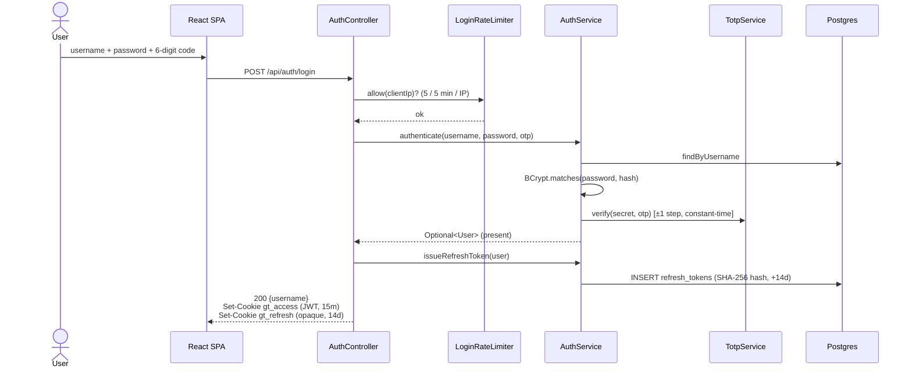
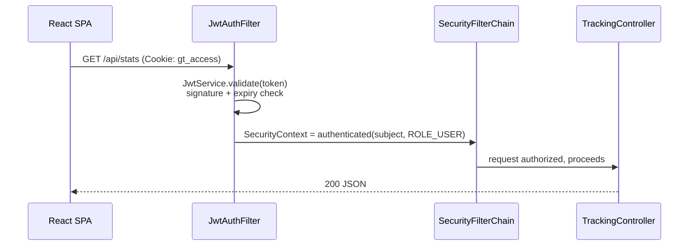
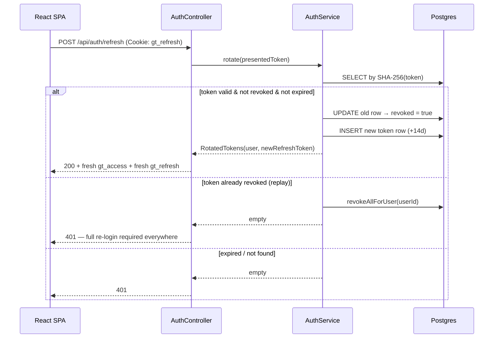
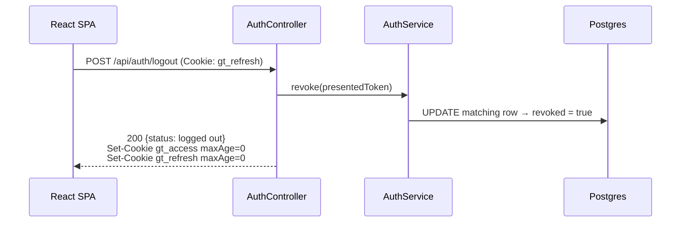

# Authentication

Two factors, three tokens, all state in httpOnly cookies. This document explains each decision so
the design can be defended (and reused at work).

> Diagram convention: **sequence diagrams are Mermaid** (they render on GitHub and in the IDE).
> Structural/detail diagrams elsewhere use PlantUML.

## The factors

1. **Password** — stored as a BCrypt hash (`BCryptPasswordEncoder`, cost 10). BCrypt is slow on
   purpose: brute-forcing a leaked hash is expensive.
2. **TOTP (RFC 6238)** — a 6-digit code from an authenticator app. Implemented by hand in
   `TotpService` so the mechanism is visible: `HMAC-SHA1(secret, floor(unix_time / 30))`,
   dynamic truncation (RFC 4226 §5.3), mod 10⁶. A ±1 step window tolerates clock drift.
   The secret is generated at first boot and printed **once** as an `otpauth://` URI. Verification
   uses a constant-time compare (`MessageDigest.isEqual`) with no early exit across the ±1 window,
   so timing can't leak which step matched.

Login failures return the same 401 regardless of which factor failed — an attacker learns
nothing about whether the username exists or the password was close.

## The tokens

| Token | Form | Lifetime | Where | Why this form |
|---|---|---|---|---|
| Access | JWT (HS256) | 15 min | `gt_access` cookie, `Path=/` | Stateless verification on every request — no DB hit |
| Refresh | Opaque random 256-bit string | 14 days | `gt_refresh` cookie, `Path=/api/auth` | Deliberately **not** a JWT: stored (hashed) server-side so it can be revoked and rotated |

The asymmetry is the core lesson: **JWTs can't be revoked** (they're valid until expiry, full
stop), so anything long-lived must be a server-side record. Short-lived JWT + revocable refresh
token gets both properties: cheap request auth and a real kill switch.

Refresh tokens are stored as SHA-256 hashes — a database leak yields nothing usable. Token
lifetimes are configuration (`grindtrack.access-token-minutes`, `grindtrack.refresh-token-days`
in `AppProperties`), not hardcoded.

## Cookie decisions

All auth cookies are `HttpOnly` (JavaScript can never read them — XSS can't exfiltrate tokens,
which is why localStorage is the wrong place), `Secure` (HTTPS only; toggle off via
`COOKIE_SECURE=false` for local http dev), and `SameSite=Strict` (the browser refuses to attach
them to any cross-site request — this is the CSRF defense, which is why Spring's CSRF token
machinery is disabled). The refresh cookie is additionally scoped to `Path=/api/auth` so it is
only ever transmitted to the auth endpoints, not on every API call. Cookie names are the
constants `JwtAuthFilter.ACCESS_COOKIE` (`gt_access`) and `AuthController.REFRESH_COOKIE`
(`gt_refresh`); both are built by `AuthController.build(...)`.

## Login flow



If either factor fails, `authenticate` returns `Optional.empty()` and the controller returns a
bare `401 {error}` — identical for wrong user, wrong password, or wrong code. Exceeding the rate
limit returns `429` before authentication is even attempted.

## Authenticated request



`JwtAuthFilter` is a `OncePerRequestFilter` registered before `UsernamePasswordAuthenticationFilter`.
If the JWT is missing/expired/invalid, the filter sets nothing, the chain's authorization rules
reject the request, and the entry point returns a bare 401.

## Refresh with rotation



**Why rotate?** Each refresh token is single-use. If a token is stolen and the thief uses it,
the legitimate client's next refresh presents an already-revoked token — theft becomes
*detectable*, and the server acts on the signal: presenting a revoked token revokes **all** of
that user's live refresh tokens (`revokeAllForUser`), forcing a fresh password+TOTP login
everywhere. A non-rotating refresh token can be silently replayed for its whole lifetime.

The SPA side (see `frontend/src/lib/api.ts`): any 401 (except from login itself, where it means
bad credentials) triggers one refresh attempt and a replay of the original request; if the
refresh also 401s, the app drops to the login screen. Concurrent 401s share a single in-flight
refresh (`refreshInFlight`) so the rotating token is never raced — see [frontend.md](frontend.md).

## Logout



`POST /api/auth/logout` revokes the presented refresh token in the database and expires both
cookies. The access token technically remains valid for up to its remaining ≤15 minutes — that
window is the accepted trade-off of stateless access tokens, and is why the access TTL is short.

## Bootstrap

On first startup with an empty `users` table, `UserBootstrap` (a `CommandLineRunner`) creates the
user from `GRINDTRACK_USERNAME` / `GRINDTRACK_PASSWORD` and logs the TOTP secret + provisioning URI
once:

```
docker compose -f docker-compose.prod.yml logs app | grep -A4 "Bootstrap user"
```

Add the secret to your authenticator app (manual entry, or paste the `otpauth://` URI into any
QR generator and scan it), then treat those log lines as sensitive and clear them (recreate the
container after setup: `docker compose -f docker-compose.prod.yml up -d --force-recreate app`).
It runs on every boot but no-ops once any user exists. If no user *and* no bootstrap credentials
are set, it logs a warning that login is impossible rather than creating a blank account.

## Threat-model notes (honest edges)

- **XSS**: httpOnly cookies protect the tokens, not the session — injected script could still
  call the API as you while the page is open. React's escaping + no `dangerouslySetInnerHTML`
  is the real defense.
- **Access-token window after logout**: ≤15 min, by design; see Logout.
- **Rate limiter is in-memory**: `LoginRateLimiter` is a per-IP sliding window in a
  `ConcurrentHashMap` (max 5 / 5 min, bounded to 10k tracked IPs). It resets on restart and is
  per-instance. Fine for one user on one node; a multi-instance deployment would move it to Redis.
  It keys on the first `X-Forwarded-For` entry (see the nginx note below), falling back to
  `getRemoteAddr()`.
- **X-Forwarded-For trust**: the rate limiter trusts the *first* XFF entry as the client IP, so
  the reverse proxy must **overwrite** (not append) that header — see the `proxy_set_header`
  comment in `nginx/track.conf.example`. If it appended, a client could spoof the leading entry
  and dodge the limiter.
- **No account lockout**: the TOTP factor makes online guessing impractical; the rate limiter
  handles volume.