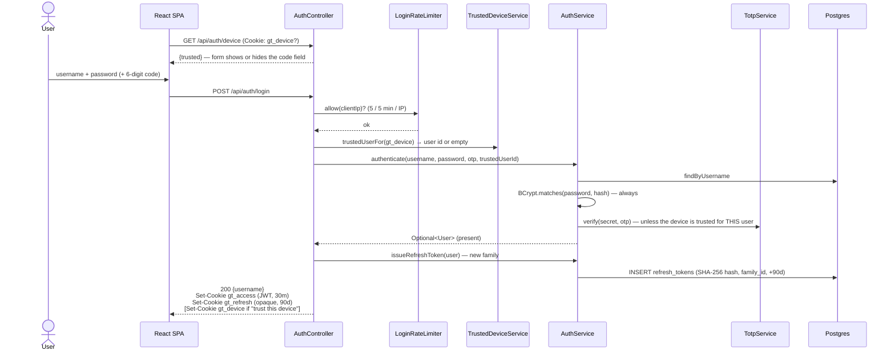
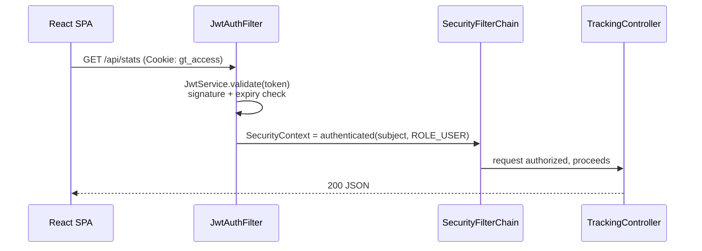
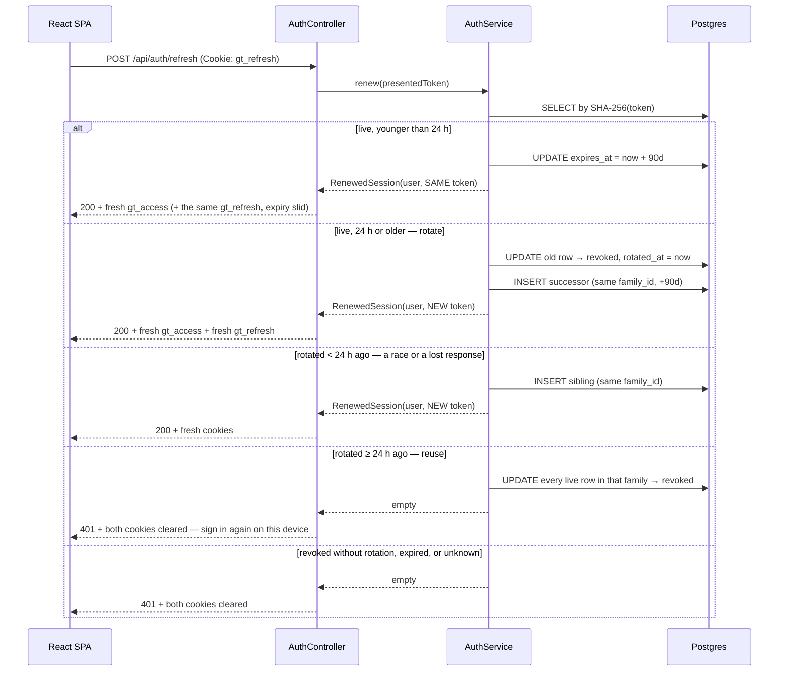
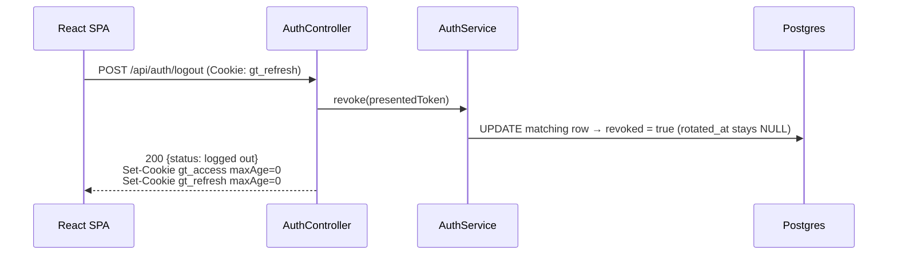

# Authentication

Two factors, four cookies, all state in httpOnly cookies. This document explains each decision so
the design can be defended (and reused at work).

> Diagram convention: **sequence diagrams are Mermaid** (they render on GitHub and in the IDE).
> Structural/detail diagrams elsewhere use PlantUML.

## The factors

1. **Password** — stored as a BCrypt hash (`BCryptPasswordEncoder`, cost 10). BCrypt is slow on
   purpose: brute-forcing a leaked hash is expensive.
2. **TOTP (RFC 6238)** — a 6-digit code from an authenticator app. Implemented by hand in
   `TotpService` so the mechanism is visible: `HMAC-SHA1(secret, floor(unix_time / 30))`,
   dynamic truncation (RFC 4226 §5.3), mod 10⁶. A ±1 step window tolerates clock drift.
   The secret is generated at first boot and printed **once** as an `otpauth://` URI. Verification
   uses a constant-time compare (`MessageDigest.isEqual`) with no early exit across the ±1 window,
   so timing can't leak which step matched.

Login failures return the same 401 regardless of which factor failed — an attacker learns
nothing about whether the username exists or the password was close.

A browser can be **trusted** for 30 days after it has presented a code once (the checkbox on the
login form). A trusted browser is asked for the password only. The password is never waived — see
[Trusted devices](#trusted-devices).

## The tokens

| Token | Form | Lifetime | Where | Why this form |
|---|---|---|---|---|
| Access | JWT (HS256) | 30 min | `gt_access` cookie, `Path=/` | Stateless verification on every request — no DB hit |
| Session (refresh) | Opaque random 256-bit string | 90 days, **sliding**; replaced every 24 h | `gt_refresh` cookie, `Path=/api/auth` | Deliberately **not** a JWT: stored (hashed) server-side so it can be revoked and rotated |
| Device | Opaque random 256-bit string | 30 days, sliding | `gt_device` cookie, `Path=/api/auth` | Remembers that this browser passed the second factor. Not an identity — see below |

The asymmetry is the core lesson: **JWTs can't be revoked** (they're valid until expiry, full
stop), so anything long-lived must be a server-side record. Short-lived JWT + revocable session
token gets both properties: cheap request auth and a real kill switch.

Session and device tokens are stored as SHA-256 hashes — a database leak yields nothing usable.
Lifetimes are configuration (`grindtrack.access-token-minutes`, `refresh-token-days`,
`refresh-rotate-hours`, `trusted-device-days` in `AppProperties`), not hardcoded.

### Renewing is not rotating

The session token does two different jobs, and the design only started working once they were
separated:

- **Renew** — mint a new access cookie and slide the session's expiry out another 90 days. This
  happens every time the access cookie lapses, dozens of times a day, and **hands the same session
  token back**. An app opened most days never expires; one abandoned for three months does.
- **Rotate** — replace the session token with a successor. This happens on the first renewal after
  the token is 24 hours old, so an ordinary week costs seven rotations rather than several hundred.

The first version rotated on every renewal. Every rotation is a chance for the response to be lost
— a phone suspending mid-request, a pod replaced mid-deploy — and a client that never received the
successor is left presenting a token the server has already retired. Making that rare is what makes
the reuse detection below safe to keep.

### Families, and what reuse detection may touch

Every login starts a **family** (`refresh_tokens.family_id`, a UUID). Each rotation issues the
successor into the same family, so a family is one login's whole lineage on one device. Two devices
are two families. This is the model in RFC 9700 (the OAuth 2.0 Security BCP), §4.14.2.

A rotated token presented again is one of two things:

- **Inside the 24-hour grace** after its rotation: a race (two windows sharing a cookie jar) or a
  lost response. The presenter gets a sibling token in the same family and nothing is revoked.
- **Outside the grace**: reuse. Two parties held this token and one of them is not the owner. The
  **family** is revoked — that login, on that device, is over — and nothing else is touched.

A token that was revoked *without* being rotated (a logout, or a family already revoked) has no
successor and proves nothing. Presenting one gets a plain 401 and, since the 401 clears the cookie,
the browser stops presenting it.

**Why the scope matters** — the original cascade revoked every live token for the *user*. With one
device that is indistinguishable from revoking the family. With two or more it is a trap: a
logged-out browser still holding its dead cookie trips the cascade on every visit and signs the
phone out; the phone signs in again and is now the browser holding a dead cookie. Production logged
ten of those cascades in twelve hours before this was scoped to families. Reaching across families
is now only possible through [logout everywhere](#logout), by a deliberate click.

## Cookie decisions

All auth cookies are `HttpOnly` (JavaScript can never read them — XSS can't exfiltrate tokens,
which is why localStorage is the wrong place), `Secure` (HTTPS only; toggle off via
`COOKIE_SECURE=false` for local http dev), and `SameSite=Strict` (the browser refuses to attach
them to any cross-site request — this is the CSRF defense, which is why Spring's CSRF token
machinery is disabled). The session and device cookies are additionally scoped to `Path=/api/auth`
so they are only ever transmitted to the auth endpoints, not on every API call. Cookie names are
the constants `JwtAuthFilter.ACCESS_COOKIE` (`gt_access`) and `AuthController.REFRESH_COOKIE` /
`DEVICE_COOKIE` (`gt_refresh`, `gt_device`); all are built by `AuthController.authCookie(...)`.

## Login flow


```mermaid
sequenceDiagram
    actor User
    participant SPA as React SPA
    participant AC as AuthController
    participant RL as LoginRateLimiter
    participant TD as TrustedDeviceService
    participant AS as AuthService
    participant TOTP as TotpService
    participant DB as Postgres
    SPA->>AC: GET /api/auth/device (Cookie: gt_device?)
    AC-->>SPA: {trusted} — form shows or hides the code field
    User->>SPA: username + password (+ 6-digit code)
    SPA->>AC: POST /api/auth/login
    AC->>RL: allow(clientIp)?  (5 / 5 min / IP)
    RL-->>AC: ok
    AC->>TD: trustedUserFor(gt_device) → user id or empty
    AC->>AS: authenticate(username, password, otp, trustedUserId)
    AS->>DB: findByUsername
    AS->>AS: BCrypt.matches(password, hash)  — always
    AS->>TOTP: verify(secret, otp)  — unless the device is trusted for THIS user
    AS-->>AC: Optional<User> (present)
    AC->>AS: issueRefreshToken(user)  — new family
    AS->>DB: INSERT refresh_tokens (SHA-256 hash, family_id, +90d)
    AC-->>SPA: 200 {username}<br/>Set-Cookie gt_access (JWT, 30m)<br/>Set-Cookie gt_refresh (opaque, 90d)<br/>[Set-Cookie gt_device if "trust this device"]
```

If either factor fails, `authenticate` returns `Optional.empty()` and the controller returns a
bare `401 {error}` — identical for wrong user, wrong password, or wrong code. Exceeding the rate
limit returns `429` before authentication is even attempted.

## Trusted devices

TOTP on every sign-in is the part people route around, so a browser that has presented a code once
can be remembered for 30 days, sliding on each sign-in. What it buys is skipping the code; the
password is required every time.

That line is enforced by construction rather than by care. `authenticate` checks the password first
and independently, and the device is passed in as **the user id it belongs to**, compared against
the user the password authenticated. A boolean would let a device trusted by one account waive the
second factor for another; an id cannot. A trusted device presenting a wrong password fails exactly
where a wrong password always failed.

`GET /api/auth/device` is public and answers only whether this browser holds a live device cookie —
never who, and never anything that gets you in without the password. `POST /api/auth/devices/forget`
(authenticated) revokes every remembered device, the answer to a lost phone. Logging out
deliberately does **not** forget the device.

## Authenticated request


```mermaid
sequenceDiagram
    participant SPA as React SPA
    participant F as JwtAuthFilter
    participant SEC as SecurityFilterChain
    participant TC as TrackingController
    SPA->>F: GET /api/stats (Cookie: gt_access)
    F->>F: JwtService.validate(token)<br/>signature + expiry check
    F->>SEC: SecurityContext = authenticated(subject, ROLE_USER)
    SEC->>TC: request authorized, proceeds
    TC-->>SPA: 200 JSON
```

`JwtAuthFilter` is a `OncePerRequestFilter` registered before `UsernamePasswordAuthenticationFilter`.
If the JWT is missing/expired/invalid, the filter sets nothing, the chain's authorization rules
reject the request, and the entry point returns a bare 401.

## Refresh: renew, rotate, or refuse


```mermaid
sequenceDiagram
    participant SPA as React SPA
    participant AC as AuthController
    participant AS as AuthService
    participant DB as Postgres
    SPA->>AC: POST /api/auth/refresh (Cookie: gt_refresh)
    AC->>AS: renew(presentedToken)
    AS->>DB: SELECT by SHA-256(token)
    alt live, younger than 24 h
        AS->>DB: UPDATE expires_at = now + 90d
        AS-->>AC: RenewedSession(user, SAME token)
        AC-->>SPA: 200 + fresh gt_access (+ the same gt_refresh, expiry slid)
    else live, 24 h or older — rotate
        AS->>DB: UPDATE old row → revoked, rotated_at = now
        AS->>DB: INSERT successor (same family_id, +90d)
        AS-->>AC: RenewedSession(user, NEW token)
        AC-->>SPA: 200 + fresh gt_access + fresh gt_refresh
    else rotated < 24 h ago — a race or a lost response
        AS->>DB: INSERT sibling (same family_id)
        AS-->>AC: RenewedSession(user, NEW token)
        AC-->>SPA: 200 + fresh cookies
    else rotated ≥ 24 h ago — reuse
        AS->>DB: UPDATE every live row in that family → revoked
        AS-->>AC: empty
        AC-->>SPA: 401 + both cookies cleared — sign in again on this device
    else revoked without rotation, expired, or unknown
        AS-->>AC: empty
        AC-->>SPA: 401 + both cookies cleared
    end
```

**Why rotate at all?** A stolen session token stops working within a day even if the theft is
never noticed, and if the thief and the owner both present the same rotated token, the second one
outside the grace is *detectable* and the server acts on it — for that family. A non-rotating token
can be silently replayed for its whole 90-day life.

**Why the 401 clears the cookie.** A refused token left in the jar comes back on every visit for
as long as the cookie lasts. Nothing bad happens server-side any more, but there is no reason to
keep sending a token the server has already refused, and the frontend's "session expired" path is
cleaner when the next probe simply has no cookie.

The SPA side (see `frontend/src/lib/api.ts`): any 401 (except from login itself, where it means
bad credentials) triggers one refresh attempt and a replay of the original request. Only a 401
*from the refresh endpoint* means the session is over (`AuthError` → landing page); a 502/503/504
or a network failure is `OfflineError` and leaves the screen alone. Concurrent 401s share a single
in-flight refresh (`refreshInFlight`) — see [frontend.md](frontend.md). The focus timer, which can
run an hour without a request, renews on a ten-minute schedule so its save lands on a live cookie.

## Logout


```mermaid
sequenceDiagram
    participant SPA as React SPA
    participant AC as AuthController
    participant AS as AuthService
    participant DB as Postgres
    SPA->>AC: POST /api/auth/logout (Cookie: gt_refresh)
    AC->>AS: revoke(presentedToken)
    AS->>DB: UPDATE matching row → revoked = true (rotated_at stays NULL)
    AC-->>SPA: 200 {status: logged out}<br/>Set-Cookie gt_access maxAge=0<br/>Set-Cookie gt_refresh maxAge=0
```

`POST /api/auth/logout` ends this browser's session and expires both cookies; the device cookie is
kept on purpose. `POST /api/auth/logout-all` (authenticated) ends **every** live session for the
account — the one deliberate path across families — and answers with how many it ended. Other
devices notice when their access cookie next lapses. In both cases the access token technically
remains valid for up to its remaining ≤30 minutes — that window is the accepted trade-off of
stateless access tokens, and is why the access TTL is short.

## Bootstrap

On first startup with an empty `users` table, `UserBootstrap` (a `CommandLineRunner`) creates the
user from `GRINDTRACK_USERNAME` / `GRINDTRACK_PASSWORD` and logs the TOTP secret + provisioning URI
once:

```bash
kubectl -n grindtrack logs deploy/grindtrack | grep -A4 "Bootstrap user"
```

Add the secret to your authenticator app (manual entry, or paste the `otpauth://` URI into any
QR generator and scan it), then treat those log lines as sensitive and clear them by replacing the
pod: `kubectl -n grindtrack rollout restart deploy/grindtrack`. TOTP is time-based, so the node
clock has to be right.

It runs on every boot but no-ops once any user exists. If no user *and* no bootstrap credentials
are set, it logs a warning that login is impossible rather than creating a blank account.

(Locally, the same lines come from `docker compose logs app`.)

## Reading the logs

`AuthService` logs every path that ends a session, because "I was logged out again" needs to be
answerable from something the app recorded:

| Line | Meaning |
|---|---|
| `Refresh presented a token that is not on file.` | Cookie from before a database reset, or another deployment. Harmless. |
| `Refresh presented a revoked token for user … a stale cookie, refused.` | A logged-out browser still had its cookie. The 401 clears it. Harmless. |
| `Refresh token for user … inside the grace window: issuing a sibling` | Two windows raced, or a rotation's response was lost. Harmless. |
| `Refresh token reuse for user … Revoking that family.` (WARN) | A token replayed more than a day after rotation. That device signs in again; if you didn't cause it, investigate. |
| `Session for user … expired at …` | 90 days without use. |

## Threat-model notes (honest edges)

- **XSS**: httpOnly cookies protect the tokens, not the session — injected script could still
  call the API as you while the page is open. React's escaping + no `dangerouslySetInnerHTML`
  is the real defense.
- **Access-token window after logout**: ≤30 min, by design; see Logout.
- **Grace window**: a stolen session token replayed within 24 hours of its rotation gets a
  session instead of tripping detection. The thief would have had one anyway — the cookie they
  took was live until it rotated — and what is bought is the honest owner not being signed out by
  a dropped packet.
- **Trusted device + password**: a stolen device cookie downgrades the account to password-only on
  that cookie for up to 30 days. "Forget trusted devices" is the answer; the cookie is scoped to
  `/api/auth`, httpOnly, and only a hash is stored.
- **Rate limiter is in-memory**: `LoginRateLimiter` is a per-IP sliding window in a
  `ConcurrentHashMap` (max 5 / 5 min, bounded to 10k tracked IPs). It resets on restart and is
  per-instance. Fine for one user on one node; a multi-instance deployment would move it to Redis.
  It keys on the first `X-Forwarded-For` entry, falling back to `getRemoteAddr()`.
- **X-Forwarded-For trust**: the rate limiter trusts the *first* XFF entry as the client IP, so
  the reverse proxy (ingress-nginx) must **overwrite** (not append) that header. If it appended, a
  client could spoof the leading entry and dodge the limiter.
- **No account lockout**: the TOTP factor makes online guessing impractical; the rate limiter
  handles volume.
- **No purge of dead rows**: rotated and revoked `refresh_tokens` rows are kept. At one rotation
  a day per device that is a few hundred rows a year; a scheduled delete of rows revoked more than
  a grace-window ago is the obvious next step if it ever matters.
