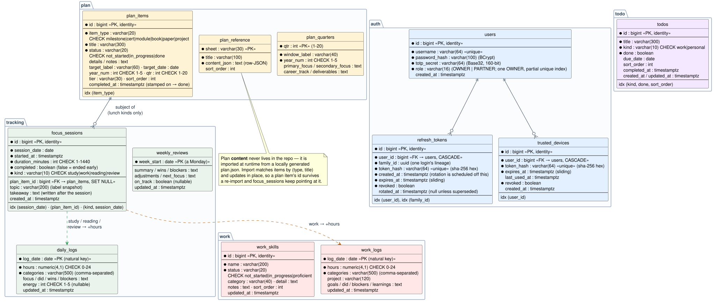
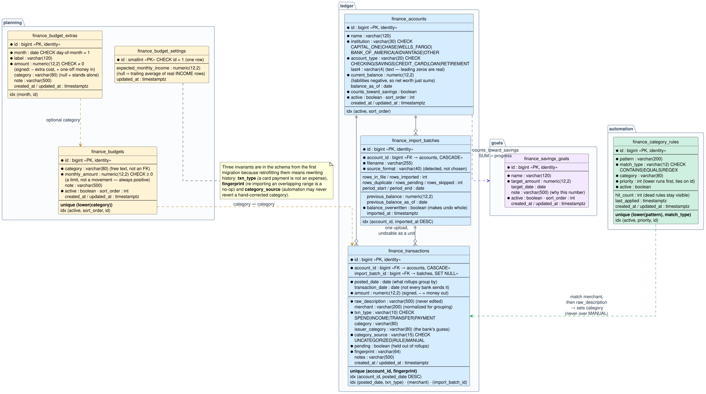
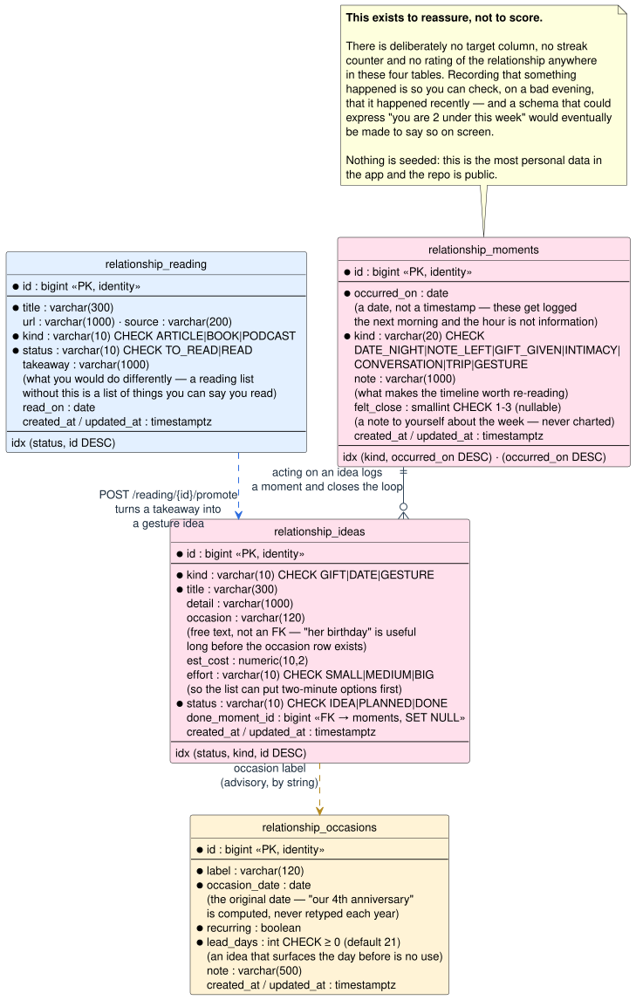
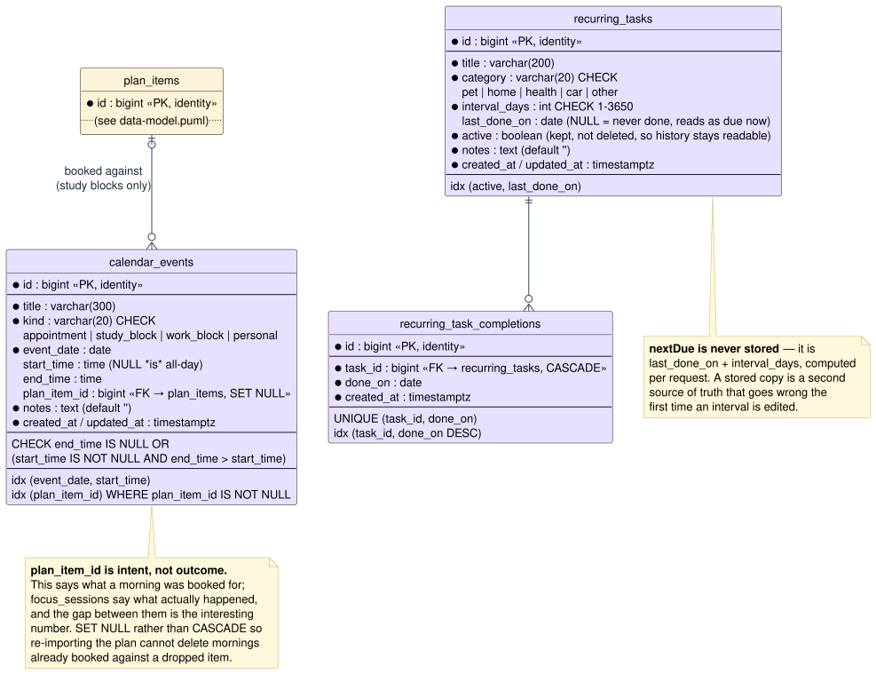

# Backend

Spring Boot 3.5.16 on Java 21. Base package `dev.grindtrack`; entry point
`GrindtrackApplication` (`@SpringBootApplication` + `@ConfigurationPropertiesScan` — the latter is
what activates `AppProperties` without an explicit `@EnableConfigurationProperties`). Final
artifact: `target/grindtrack.jar` (`finalName=grindtrack`).

> See [architecture.md](architecture.md) for the system view and [auth.md](auth.md) for the auth
> internals and their sequence diagrams. This doc is the code-level reference: layers, endpoints,
> data model, config, build, and the request lifecycle.

## Package-by-feature, layered

Each feature is a top-level package split into layer subpackages:

| Subpackage | Holds | Depends on |
|---|---|---|
| `api` | `@RestController`s + one `<Feature>Dtos` record holder | `service`, `domain` |
| `service` | business logic, `@Transactional` boundaries, computed result records | `domain` |
| `domain` | JPA entities + Spring Data repositories | — |
| `security` | (auth only) the JWT filter | `service` |
| `web` | shared, feature-agnostic: request parsing, exception→status mapping | — |
| `assistant` | the read-only context an assistant reasons over | `/api/assistant` |
| `calendar` | events on days, and recurring upkeep | `/api/calendar`, `/api/upkeep` |
| `config` | cross-cutting: `SecurityConfig`, `StaticContentConfig`, `AppProperties` | — |

Full inventory:

```
dev.grindtrack
├── GrindtrackApplication.java
├── config/
│   ├── AppProperties.java        record, @ConfigurationProperties(prefix="grindtrack")
│   ├── SecurityConfig.java       @EnableWebSecurity, SecurityFilterChain + PasswordEncoder beans
│   └── StaticContentConfig.java  Tomcat MIME mapping for .webmanifest (the PWA manifest)
├── web/                          the shared HTTP edge — no feature may duplicate it
│   ├── Requests.java             requireDate/optionalDate/monthOrNow/requireText/enumValue/…
│   ├── Responses.java            Deleted, Saved — the two acknowledgement bodies
│   ├── BadRequestException.java  malformed shape → 400
│   ├── ConflictException.java    well-formed but inapplicable → 409
│   └── ApiExceptionHandler.java  the one @RestControllerAdvice
├── auth/
│   ├── api/{AuthController,AuthDtos}.java
│   ├── service/AuthService.java           (+ nested RenewedSession record)
│   ├── service/TrustedDeviceService.java   "trust this device" tokens
│   ├── service/{JwtService,TotpService,LoginRateLimiter}.java
│   ├── service/UserBootstrap.java          CommandLineRunner (not a REST bean)
│   ├── security/{JwtAuthFilter,Cookies}.java
│   └── domain/{User,RefreshToken,TrustedDevice}.java + repositories
├── tracking/
│   ├── api/{TrackingController,FocusController,PublicController,ExportController,TrackingDtos}.java
│   ├── service/{TrackingService,StatsService,Stats,FocusService}.java
│   └── domain/{DailyLog,WeeklyReview,FocusSession,FocusKind}(+Repository).java
├── plan/
│   ├── api/{PlanController,PlanDtos}.java
│   ├── service/PlanService.java
│   └── domain/{PlanItem,PlanQuarter,PlanReference}(+Repository).java
├── todo/
│   ├── api/{TodoController,TodoDtos}.java
│   ├── service/TodoService.java
│   └── domain/{Todo,TodoRepository}.java
├── calendar/
│   ├── api/{CalendarController,UpkeepController,CalendarDtos}.java
│   ├── service/{CalendarService,UpkeepService,UpkeepItem}.java
│   └── domain/{CalendarEvent,EventKind,RecurringTask,RecurringTaskCompletion,
│               TaskCategory}(+Repository).java
├── work/
│   ├── api/{WorkController,WorkDtos}.java
│   ├── service/WorkService.java
│   └── domain/{WorkLog,WorkSkill}(+Repository).java
├── finance/
│   ├── api/{FinanceController,TransactionController,CategoryRuleController,
│   │         SpendingController,BudgetController,StatementImportController}.java
│   ├── api/{FinanceDtos,BudgetDtos,StatementImportDtos}.java
│   ├── service/{FinanceService,BudgetService,BudgetMonth,CategoryRuleService,
│   │            RecurringDetector,StatementImportService,TxnTypeClassifier,MerchantNormalizer}.java
│   ├── service/parse/{StatementParser,<Bank>Parser,OfxInvestmentParser,Csv,Amounts,
│   │                  ParsedStatement,ParsedRow,StatementFormat,StatementParseException}.java
│   └── domain/{Account,Transaction,Budget,BudgetExtra,BudgetSettings,CategoryRule,SavingsGoal,
│               ImportBatch,CategoryTotal}(+Repository) + enums.java
├── relationship/
│   ├── api/{RelationshipController,RelationshipDtos}.java
│   ├── service/{RelationshipService,RelationshipSummary}.java
│   └── domain/{Moment,Idea,Occasion,Reading}(+Repository) + enums.java
└── assistant/
    ├── api/{AssistantController,AssistantDtos}.java
    └── service/{ContextService,AssistantContext}.java   — no domain/: owns no table
```

DTOs are Java **records** in `<feature>/api/<Feature>Dtos.java`; response records carry a static
`from(entity)` factory. Every `…Dtos` holder is `final` with a private constructor (a namespace,
not something to instantiate). Nothing a browser sends or receives is declared anywhere else — see
[architecture-conventions.md](architecture-conventions.md) for why that rule exists and what
happened without it.

`Stats`, `BudgetMonth` and `RelationshipSummary` are the exception that proves it: they are results
a service computes rather than projections of an entity, so they live in `service/`, each in its
own file rather than nested inside the service class.

## REST endpoints

All controllers are `@RestController`. "Public" = permitted in `SecurityConfig`; everything else
requires a valid `gt_access` JWT cookie. Full request/response bodies in [api.md](api.md).

Every error body is `{"error": "..."}`, produced by the single `ApiExceptionHandler`:
`BadRequestException` (and `StatementParseException`) → 400, `IllegalArgumentException` from a
service → 400, `ConflictException` → 409, `NoSuchElementException` → 404. Anything else stays a 500
with its stack trace intact — there is deliberately no `@ExceptionHandler(Exception.class)`.

### `AuthController` — `/api/auth`
| Method | Path | Access |
|---|---|---|
| POST | `/login` — `{username,password,otp?,trustDevice?}` → sets `gt_access`+`gt_refresh` (+`gt_device`); 401 / 429 | Public |
| GET | `/device` — `{trusted,count}`: does this browser hold a live device cookie | Public |
| POST | `/refresh` — renews (same token) or, once a day, rotates via `gt_refresh`; 401 clears both cookies | Public |
| POST | `/logout` — revokes this session + expires cookies | Public |
| POST | `/logout-all` — revokes every session for the account; `{status,sessionsEnded}` | Authenticated |
| POST | `/devices/forget` — revokes every trusted device; `{trusted:false,count}` | Authenticated |
| GET | `/me` — `{username}` from `Principal` | Authenticated |

### `TrackingController` — `/api`
| Method | Path | Notes |
|---|---|---|
| GET | `/days?from=&to=` | range, ordered; 400 on bad dates |
| GET | `/days/{date}` | one `DayResponse` or `null` |
| PUT | `/days/{date}` | upsert; validates hours 0–24, energy 1–5, ≤50 categories, text ≤10k |
| DELETE | `/days/{date}` | |
| GET | `/weeks/{weekStart}` | date snapped to Monday (`previousOrSame(MONDAY)`) |
| PUT | `/weeks/{weekStart}` | upsert weekly review |
| GET | `/stats` | `Stats` aggregate |

### `FocusController` — `/api/focus`
| Method | Path | Notes |
|---|---|---|
| POST | `/sessions` | `{date,startedAt,durationMinutes(1–1440),completed,kind,planItemId?,topic?}`; only `work` folds into `work_logs`, the rest into `daily_logs`; absent→study, unknown→400 |
| PATCH | `/sessions/{id}/takeaway` | the note written after the session ends |
| GET | `/sessions?date=[&kind=]` | that day's sessions, ordered by start; optional `kind` filter |
| GET | `/reading` | `ReadingProgress`: weekday streak, week against target, per-subject totals, recent takeaways |

`kind` is the `FocusKind` enum — `STUDY`, `WORK`, `READING`, `REVIEW` — stored lower-case through
an `AttributeConverter` so existing rows and the frontend's union are untouched. It used to be a
bare string coerced to `"study"` when unrecognised, which meant a typo filed work hours as study
time.

`READING` and `REVIEW` are the lunch kinds. They are separate constants from `STUDY` so the lunch
streak can be counted apart from the 6–8am block, which would otherwise be satisfied by any long
evening. `ReadingService` computes that streak over **weekdays**, skipping weekends rather than
counting them as misses — the same reasoning that makes `StatsService` show the work scope
days-this-month instead of a streak.

A session records what it went into twice over: `plan_item_id` is the live link, and `topic` is the
label snapshotted at write time. Both, deliberately — the snapshot keeps history readable when the
workbook renames or drops an item, and a code-review session has no plan row to point at.

`FocusService` deliberately depends on both `DailyLogRepository` and (cross-feature) `WorkLogRepository` so a work session's minutes fold into the work log in the same transaction.

### `PublicController` — `/api/public`
| Method | Path | Notes |
|---|---|---|
| GET | `/stats` | `{streak,totalHours,daysLogged,days[]}` — last 26 weeks of `{date,hours}` only. **Never exposes text**, and reads `stats.study()` only: work hours are not public. |

### `TodoController` — `/api/todos`
| Method | Path | Notes |
|---|---|---|
| GET | `` | `?kind=work\|personal` optional; open items first, then `sortOrder`, then id |
| POST | `` | `{title,kind?,dueDate?}`; title required ≤300 chars; defaults to `personal` |
| PATCH | `/{id}` | partial; null `dueDate` means "leave alone", `clearDueDate:true` removes it; `done` keeps `completedAt` in step; 404 if missing |
| DELETE | `/{id}` | remove |

Flat CRUD over `TodoService`. The validation here is all shape — a title within its column, a kind
from the closed set the schema allows — which is why it stays in the controller.

### `PlanController` — `/api/plan`
| Method | Path | Notes |
|---|---|---|
| GET | `` | `{items,quarters,reference}` |
| PATCH | `/items/{id}` | `{status,notes}`; 404 if missing; validates status ∈ {not_started,in_progress,done} |
| POST | `/import` | bulk `{items[],quarters[],reference[]}` |

Import matches by `(type, title)` and updates matched rows **in place**, so a plan item's id
survives a re-import along with its status, notes and completion date. That matters because focus
sessions reference those ids: the previous delete-all-and-reinsert was safe only for as long as
nothing pointed at them. The workbook may seed `notes` onto an item that has none; it can never
overwrite a note written in the app.

### `WorkController` — `/api/work`
| Method | Path | Notes |
|---|---|---|
| GET/PUT/DELETE | `/days/{date}` | day-job log upsert `{hours,categories[],project,goals,did,blockers,learnings}`; hours 0–24 |
| GET | `/days?from=&to=` | ordered range (the 40h/week view) |
| GET/POST | `/skills` | competency checklist; POST create `{name,category?,detail?}` |
| PATCH/DELETE | `/skills/{id}` | partial update; status ∈ {not_started,in_progress,proficient}; 404 if missing |

`WorkService` owns the rules about what a work log may contain (hours 0–24, category count and
length), because they hold whether the log arrives over HTTP or from anywhere else; the controller
owns parsing and column-length limits, which are facts about a request.

### `ExportController` — `/api`
| Method | Path | Notes |
|---|---|---|
| GET | `/export` | Study logs + weekly reviews as one JSON download. Work, finance and relationship are deliberately excluded — an export lands in a downloads folder, so what goes in it is a decision rather than a default. |

### `FinanceController` — `/api/finance`
| Method | Path | Notes |
|---|---|---|
| GET | `/summary` | Dashboard: savings balance, net worth, goals with progress, accounts, uncategorized count. Reads the savings SUM once and hands it down. |
| GET/POST | `/accounts` | list (`?includeInactive`) / create |
| PUT/DELETE | `/accounts/{id}` | full update / remove (cascades to its transactions) |
| PATCH | `/accounts/{id}/balance` | `{balance, asOf?}`; sign corrected server-side for cards and loans |
| GET | `/accounts/{id}/transactions` | that account's rows, newest first |
| GET/POST | `/goals` | list (`?includeInactive`) / create |
| PUT/DELETE | `/goals/{id}` | full update / remove |

`SavingsGoal.progressPercent(savings)` and `.remaining(savings)` are on the entity, not the service:
they are arithmetic over the goal's own target.

### `TransactionController` — `/api/finance/transactions`
| Method | Path | Notes |
|---|---|---|
| GET | `` | paged browse: `accountId, txnType, uncategorizedOnly, sort=date\|amount, page, size≤200` |
| GET | `/uncategorized` | the review inbox |
| POST | `` | create by hand; **409** if an identical row exists |
| PATCH | `/{id}/category` | `{category}` — sets `categorySource=MANUAL`, which automation may never overwrite |
| POST | `/{id}/categorize` | file the row and optionally learn a rule from it — the review inbox's whole point |
| PATCH | `/{id}/type` | `{txnType}` ∈ SPEND/INCOME/TRANSFER/PAYMENT |
| POST | `/reclassify` | re-run the type classifier over every row |
| DELETE | `/{id}` | remove |

### `CategoryRuleController` — `/api/finance/rules`
| Method | Path | Notes |
|---|---|---|
| GET/POST | `` | list (`?includeInactive`) / create `{pattern, matchType?, category, priority?}`; `matchType` defaults to CONTAINS |
| PUT/DELETE | `/{id}` | update / remove |
| POST | `/apply` | re-run every rule over the whole history; hand-corrected rows are never touched |

Whether a pattern compiles is `CategoryRuleService`'s check, not the controller's — it must hold for
a rule created by an import job too.

### `SpendingController` — `/api/finance`
| Method | Path | Notes |
|---|---|---|
| GET | `/spending?from=&to=` | rollup over a window, default the last 30 days; transfers and payments excluded by the query |
| GET | `/spending/monthly?months=6` | months side by side (1–36) |
| GET | `/recurring` | the charges that come back every month — budget seed and subscription audit |

### `BudgetController` — `/api/finance/budget`
| Method | Path | Notes |
|---|---|---|
| GET | `/month?month=yyyy-MM` | `BudgetMonth`: the plan, what happened, and the gap. Defaults to this month |
| GET/POST | `/lines` | the recurring plan |
| PUT/DELETE | `/lines/{id}` | |
| GET/POST | `/extras` | one-off costs and windfalls for a single month |
| PUT/DELETE | `/extras/{id}` | |
| PUT | `/income` | `{expectedMonthlyIncome}`; null or zero reverts to the trailing average of real deposits |

### `StatementImportController` — `/api/finance/imports`
| Method | Path | Notes |
|---|---|---|
| GET | `` | upload history |
| POST | `?accountId=&dryRun=` | multipart `file`, ≤5 MB, read into memory and never written to disk |
| DELETE | `/{id}` | undo a batch; answers how many transactions went with it |

### `RelationshipController` — `/api/relationship`
| Method | Path | Notes |
|---|---|---|
| GET | `/summary` | recency, the closeness card, upcoming occasions, ready ideas, recent moments |
| GET/POST | `/moments` | timeline (`?limit`) / log one |
| PUT/DELETE | `/moments/{id}` | |
| GET/POST | `/ideas` | list (`?includeDone`) / create |
| PUT/DELETE | `/ideas/{id}` | |
| POST | `/ideas/{id}/done` | acting on an idea logs it as a moment and takes it off the list |
| GET/POST/PUT/DELETE | `/occasions[/{id}]` | writes answer with the whole list: every next date shifts together |
| GET/POST/DELETE | `/reading[/{id}]` | |
| POST | `/reading/{id}/read` | record the takeaway |
| POST | `/reading/{id}/promote` | turn a takeaway into a gesture idea |

Absent from `/api/public/**` on purpose: none of this has a public shape and none of it ever should.

### `CalendarController` — `/api/calendar`
| Method | Path | Notes |
|---|---|---|
| GET | `` | `?month=YYYY-MM` (default: this month) or an explicit `?from=&to=`; `to` before `from` → 400 |
| POST | `` | `{title,kind,date,startTime?,endTime?,planItemId?,notes?}`; `kind` ∈ `appointment/study_block/work_block/personal` |
| PATCH | `/{id}` | partial; `clearTimes:true` makes it all-day, `clearPlanItem:true` unlinks; 404 if missing |
| DELETE | `/{id}` | remove |

A **date plus an optional time**, never a timestamp: "09:00 on Sep 12" on a personal calendar is
wall clock and must not move when a server's zone does. A null `startTime` *is* all-day, and
`allDay` is derived from it so the two cannot disagree. Only a study block carries a `planItemId`;
sent with any other kind it is **dropped, not rejected**, the same rule a focus session follows for
its reading subject.

### `UpkeepController` — `/api/upkeep`
| Method | Path | Notes |
|---|---|---|
| GET | `` | every task with its derived `nextDue` and overdue state |
| POST | `` | create a recurring task |
| GET | `/{id}/history` | past completions |
| POST | `/{id}/done` | record that it was done; this is what moves `nextDue` |
| PATCH/DELETE | `/{id}` | edit / remove |

`nextDue` is **derived, never stored** — `lastDoneOn + intervalDays`, computed per request. A stored
copy is a second source of truth that goes wrong the first time an interval is edited.

### `AssistantController` — `/api/assistant`
| Method | Path | Notes |
|---|---|---|
| GET | `/context` | the whole picture in one request (~1.5k tokens); `?today=` for reproducing a Friday review on a Saturday, and for tests |
| GET | `/tools` | the read tools, described — generated from the app so it cannot drift from it |

Read-only, and completely so: every endpoint is a GET and there is no write path, because the first
thing an assistant with one does wrong is mark the wrong plan item done. **Nothing here calls a
model** — the context is useful on its own, and wiring it to an API is a separate change with a
separate cost. The package owns no table; it reads the other features. Shapes in [api.md](api.md).

## Auth internals (summary)

Deep dive with sequence diagrams in [auth.md](auth.md). The moving parts:

- **`JwtService`** — HS256 (`Keys.hmacShaKeyFor(jwtSecret)`), 15-min access tokens; `validate()`
  returns `Optional<subject>`, empty on any `JwtException`.
- **`TotpService`** — hand-rolled RFC 6238 (HMAC-SHA1, 30s period, 6 digits, ±1 window),
  constant-time compare; `generateSecret()` = 160-bit Base32; `provisioningUri()` builds the
  `otpauth://` URI.
- **`AuthService`** — `authenticate` (BCrypt always; TOTP unless the device cookie is trusted for
  *this* user); `issueRefreshToken` (32 random bytes, stores only SHA-256(token), starts a new
  **family**); `renew` (slides the session expiry and hands the same token back; rotates it into a
  successor in the same family once it is `refresh-rotate-hours` old; a rotated token replayed
  inside a 24 h grace gets a sibling, outside it ⇒ `revokeFamily` — never the whole user);
  `revoke` (logout); `revokeAllForUser` (logout everywhere, the one deliberate cross-family path).
  Every session-ending path logs why. Details and the incident behind the family scoping:
  [auth.md](auth.md).
- **`TrustedDeviceService`** — `trustedUserFor(token)` answers *whose* device (an id, never a
  boolean); `trust`, `touch` (slide expiry on sign-in), `forgetAll`. Hash-only storage like
  refresh tokens.
- **`LoginRateLimiter`** — in-memory per-IP sliding window, 5 / 5 min, bounded to 10k IPs.
- **`SecurityConfig`** — CSRF disabled (SameSite=Strict mitigates), session policy STATELESS,
  permitAll on static assets + the PWA shell + `/api/public/**` + login/refresh/logout/device,
  everything else authenticated, bare-401 entry point, `JwtAuthFilter` before `UsernamePasswordAuthenticationFilter`.
- **`JwtAuthFilter`** — reads `gt_access`, validates, sets a
  `UsernamePasswordAuthenticationToken(username, null, [ROLE_USER])` into the `SecurityContextHolder`.

## Data model

One Postgres schema, `grindtrack`, drawn as four diagrams — twenty-seven tables on one canvas is a
slab nobody reads, and the schema already separates cleanly along the same lines the app does.

**Effort — auth, tracking, plan, todo, work:**



**Money — the finance tab:**



**The relationship tab:**



**Calendar and recurring upkeep:**



<sub>PlantUML sources: [`diagrams/data-model.puml`](diagrams/data-model.puml), [`diagrams/data-model-finance.puml`](diagrams/data-model-finance.puml), [`diagrams/data-model-relationship.puml`](diagrams/data-model-relationship.puml), [`diagrams/data-model-calendar.puml`](diagrams/data-model-calendar.puml) — edit and regenerate with [`diagrams/render.sh`](diagrams/render.sh).</sub>

Design notes worth remembering:

- **Natural keys for time-series rows.** `daily_logs` is keyed by `log_date` and `weekly_reviews`
  by `week_start` (always a Monday) — one row per day/week, so upserts are just save-by-id. No
  surrogate id, no uniqueness constraint to manage.
- **Loose coupling for tokens.** `refresh_tokens.user_id` is a plain column (FK enforced in SQL
  with `ON DELETE CASCADE`), not a JPA `@ManyToOne` — the auth domain doesn't need object graphs.
  `family_id` is likewise a bare UUID rather than a self-referencing FK to the parent token: the
  question asked of it is "revoke everything in this family", which is one indexed query.
- **`categories`** is stored as a comma-separated string, exposed as `List<String>` via
  `DailyLog.categoryList()`. Fine for a single-user app; it's the obvious first thing to normalize
  if the model grows.
- **State transitions in the entity.** `PlanItem.setStatus()` stamps/clears `completed_at` on
  entering/leaving `done`; `DailyLog.addHours(delta)` clamps at 24 (`MAX_DAY_HOURS`).
- **Finance carries three invariants in the schema itself**, because retrofitting any of them
  would mean rewriting historical rows:
  - `finance_transactions.txn_type` separates real spending from money merely moving. A card
    payment settles a purchase already counted as `SPEND`; counting both doubles every dollar.
    In the first pass over real statements, 78 of 947 rows were transfers or payments.
  - `fingerprint` (unique per account) makes re-importing an overlapping statement range a no-op.
    Bank of America supplies a real reference number; everyone else gets a SHA-256 of
    account + posted date + amount + normalized description.
  - `category_source` (`UNCATEGORIZED`/`RULE`/`MANUAL`) means automation can never revert a
    hand-corrected category. `Transaction.categorizeByRule()` returns `false` rather than
    overwriting a `MANUAL` decision.
- **A focus session records its subject twice**, on purpose. `plan_item_id` is the live foreign
  key (`ON DELETE SET NULL`) and `topic` is the label snapshotted at write time. The snapshot
  keeps history readable when the workbook renames or drops an item, and it is the only subject a
  `review` session has — a repo is not a plan item. The link survives a re-import because
  `PlanService` now updates matched rows in place instead of deleting and reinserting them.
- **Categories are free text on both sides of finance, and there is no category table.** Budgets,
  rules and transactions join by string because categories are whatever the rules produce.
  Uniqueness is enforced on `lower(category)` / `lower(pattern)` so case can't split one category
  into two.
- **The relationship tables have no target, streak or rating column, deliberately.** The feature
  exists to reassure, not to score: recording that something happened lets you check on a bad
  evening that it happened recently, and a schema able to express "you are 2 under this week"
  would eventually be made to say so on screen. `felt_close` (1–3, nullable) is a note to yourself
  about the week, never charted.

### Migrations

Schema **`grindtrack`**; Hibernate is `validate`-only, so Liquibase is the single source of truth.

- `resources/preliquibase/postgresql.sql` — `CREATE SCHEMA IF NOT EXISTS grindtrack` (runs first).
- `resources/db/changelog/db.changelog-master.yaml` includes, in numeric order:

| # | File | What it does |
|---|---|---|
| 001 | `users-and-tokens.sql` | `users`, `refresh_tokens` (+ `idx_refresh_tokens_user`) |
| 002 | `tracking.sql` | `daily_logs` (CHECK hours 0–24, energy 1–5), `weekly_reviews` |
| 003 | `focus-sessions.sql` | `focus_sessions` (CHECK duration 1–1440, + index) |
| 004 | `plan.sql` | `plan_quarters`, `plan_items` (CHECKs + index), `plan_reference` |
| 005 | `plan-year4.sql` | widen year/qtr CHECKs to 4 years / 16 quarters |
| 006 | `plan-paper.sql` | add `paper` to the `plan_items` item_type CHECK |
| 007 | `work.sql` | `work_logs` (CHECK hours 0–24), `work_skills` (status CHECK) |
| 008 | `focus-kind.sql` | add `kind` (study/work) to `focus_sessions` (CHECK) |
| 009 | `todos.sql` | `todos` (kind CHECK work/personal, `idx_todos_kind_done`) |
| 010 | `finance.sql` | `finance_accounts`, `finance_transactions` (unique fingerprint per account, three supporting indexes), `finance_savings_goals` |
| 011 | `finance-imports.sql` | `finance_import_batches` (one row per uploaded file) + nullable `finance_transactions.import_batch_id` — nullable so hand-entered rows have no batch and deleting a batch can't cascade into them |
| 012 | `finance-import-balance-snapshot.sql` | snapshot `previous_balance`/`_as_of` + `balance_overwritten` on the batch, so undoing an import that rewrote an account balance actually restores it |
| 013 | `finance-category-rules.sql` | `finance_category_rules` (priority order, unique `lower(pattern)`+match_type, hit counters) |
| 014 | `finance-budgets.sql` | `finance_budgets` (the recurring plan, unique per category), `finance_budget_extras` (one-off months, `month` CHECK day = 1), `finance_budget_settings` (single row, CHECK `id = 1`) |
| 015 | `relationship.sql` | `relationship_moments`, `_ideas`, `_occasions`, `_reading` |
| 016 | `finance-retirement-accounts.sql` | add `RETIREMENT` to the account-type CHECK — real net worth, deliberately not the house fund |
| 017 | `focus-reading.sql` | widen `focus_sessions.kind` to study/work/**reading**/**review**; add `plan_item_id` (FK, SET NULL), `topic`, `takeaway` + two indexes |
| 018 | `focus-subject-lunch-only.sql` | data repair: clear `plan_item_id`/`topic` on non-lunch rows written before the service refused to set them. Irreversible by design |
| 019 | `plan-year5.sql` | widen year/qtr CHECKs again to 5 years / 20 quarters |
| 020 | `calendar.sql` | `calendar_events`, `recurring_tasks`, `recurring_task_completions` |
| 021 | `refresh-rotation-grace.sql` | `refresh_tokens.rotated_at` — when a token was rotated away, so the loser of a race can be told from a replay |
| 022 | `trusted-devices.sql` | `trusted_devices` (+ `idx_trusted_devices_user`) — the second factor, remembered per browser |
| 023 | `refresh-token-families.sql` | `refresh_tokens.family_id` (+ `idx_refresh_tokens_family`) — reuse detection revokes one login's lineage, never every session the user has |

- Every changeset has a `--rollback` (018's is a documented no-op — the values it cleared were
  wrong and there is nothing to restore them to). Time columns are `TIMESTAMPTZ DEFAULT now()`.
  **Add schema changes only as new changesets** — never edit an applied one.
- Nothing personal is ever seeded in SQL. The repo is public, so plan content, category rules and
  every relationship row are created through the app and live only in the database.

## Configuration

`resources/application.yml`, bound where noted:

| Key | Env var | Default | Bound to |
|---|---|---|---|
| datasource url/user/pass | `SPRING_DATASOURCE_URL/USERNAME/PASSWORD` | localhost/grind/grind | Spring |
| `grindtrack.jwt-secret` | `JWT_SECRET` | insecure placeholder | `AppProperties.jwtSecret` |
| `grindtrack.access-token-minutes` | — | `30` | `AppProperties` |
| `grindtrack.refresh-token-days` | — | `90` (sliding) | `AppProperties` |
| `grindtrack.refresh-rotate-hours` | — | `24` | `AppProperties` |
| `grindtrack.trusted-device-days` | — | `30` (sliding) | `AppProperties` |
| `grindtrack.cookie-secure` | `COOKIE_SECURE` | `false` | `AppProperties` |
| `grindtrack.bootstrap-username` | `GRINDTRACK_USERNAME` | empty | `AppProperties` |
| `grindtrack.bootstrap-password` | `GRINDTRACK_PASSWORD` | empty | `AppProperties` |

Also: `spring.threads.virtual.enabled: true` (Java 21 virtual threads), `ddl-auto: validate`,
`hibernate.default_schema: grindtrack`, `server.port: 8080`. **No Spring profiles** — environment
differences are driven purely by env vars (see `.env.example`; compose also injects
`POSTGRES_USER/PASSWORD/DB` and `JAVA_TOOL_OPTIONS`).

## Build

`pom.xml`: parent `spring-boot-starter-parent:3.5.16`, Java 21. Notable deps:
`spring-boot-starter-{web,security,data-jpa,validation}`, `postgresql` (runtime), `liquibase-core`,
`net.lbruun.springboot:preliquibase-spring-boot-starter:1.6.1`, JJWT `0.12.6`
(`jjwt-api` + runtime `jjwt-impl`/`jjwt-jackson`), `commons-codec` (Base32 for TOTP).

**Spotless** (`spotless-maven-plugin`, google-java-format, GOOGLE style) binds `spotless:check` to
`verify` — CI fails on formatting drift. Run `mvn spotless:apply` to fix.

**Frontend baking** (`gt2/Dockerfile`, 3 stages): stage 1 builds the SPA to `frontend/dist`;
stage 2 does `COPY --from=ui /ui/dist ./src/main/resources/static` then `mvn package`, so the
compiled UI ends up inside `grindtrack.jar` at `classpath:/static/` and is served by Spring Boot's
default static handler. `src/main/resources/static` does **not** exist in the repo — it's
materialized only during the Docker build. Stage 3 runs `java -jar app.jar` on
`eclipse-temurin:21-jre-alpine`.

## Request lifecycle (trace)

1. **Dispatch** — request hits Tomcat on `:8080`, gets a **virtual thread**; Spring Security's
   filter chain runs first.
2. **`JwtAuthFilter`** — reads `gt_access`; on a valid JWT, populates `SecurityContextHolder`.
3. **Authorization** (`SecurityConfig`) — static assets + the PWA shell (`/manifest.webmanifest`,
   `/sw.js`, icons) + `/api/public/**` + login/refresh/logout/device
   bypass; anything else needs an authentication or the entry point writes **401** and stops.
4. **`DispatcherServlet` → controller** — e.g. `PUT /api/days/{date}` → `TrackingController`,
   which parses/validates path + body and returns `badRequest()` on failure.
5. **Service / repository** — mutations run through repositories directly or `@Transactional`
   services. Example: `FocusService.record` saves a `FocusSession` **and**, in the same
   transaction, upserts the day's `DailyLog` adding the session's minutes (÷60, rounded to 0.1 h,
   clamped to 24) — so the streak/heatmap update atomically.
6. **Response mapping** — entities → record DTOs via `from(...)`, serialized by Jackson; auth
   endpoints attach `Set-Cookie` via `ResponseCookie` (httpOnly, SameSite=Strict, secure per
   `cookieSecure`).
7. **Return** — JSON body + any cookies; the virtual thread is released.

Read-path example (`GET /api/stats`): `StatsService.compute()` loads all `daily_logs` **and all
`work_logs`**, maps both onto a source-agnostic `DayRow(date, hours, categories)`, and runs the same
folds three times — study, work, and the two combined. Each scope yields total hours, 12-week window
totals, per-category shares (a day's hours split evenly across its categories), a current streak by
walking backward from today, `daysThisMonth`, and the 26-week heatmap series. It deliberately
aggregates in Java ("~350 rows/year… simpler and plenty fast") rather than in SQL.

Two details in the combined scope that are easy to get wrong:

- **Hours** merge per date, so a day logged on both sides counts once with the sum.
- **Categories** are the **sum of the two scopes' category maps**, not a fold over merged rows.
  Because `categoryTotals` splits a day's hours evenly across its categories, merging rows first
  would spread the combined hours across the union of that day's study and work tags and
  mis-attribute both sides. `StatsServiceTest.categoryTotalsAreSummedPerScopeNotSplitAcrossTheUnion`
  pins this.

`streak` is carried on every scope but is close to meaningless for work — weekends off reset it
every Saturday — so that view shows `daysThisMonth` instead. That is a UI choice, not a data one.
