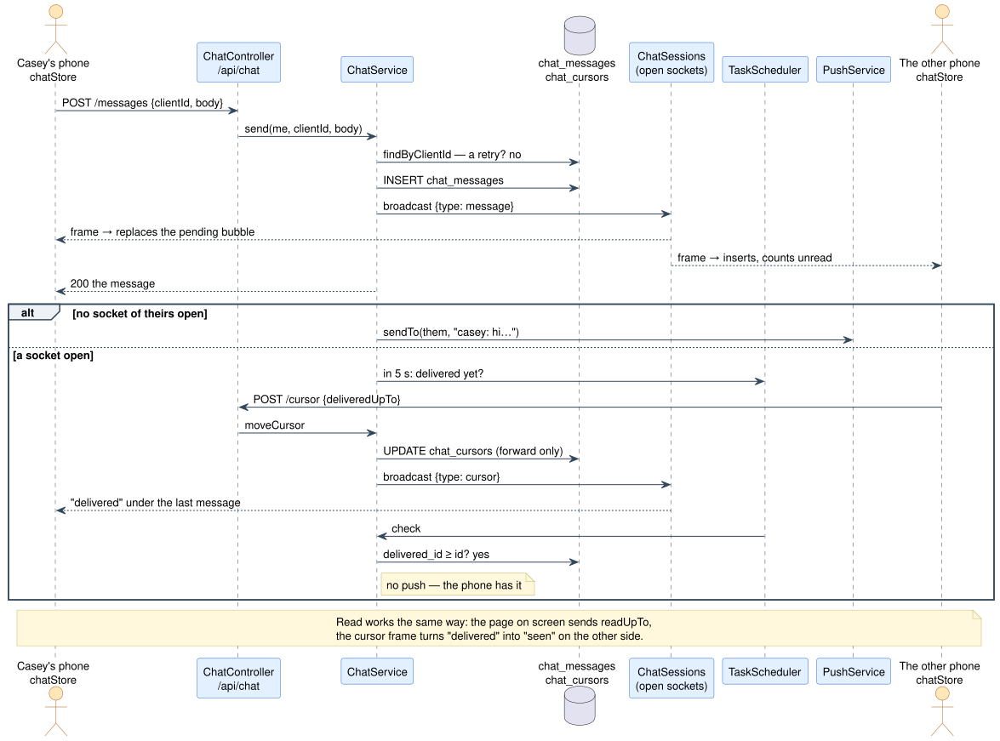
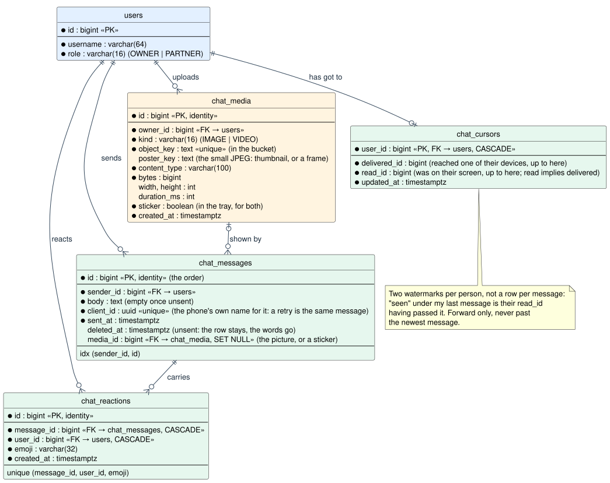

# The chat

One room, two people: the owner and the partner. Text messages, pictures and video, stickers, reactions, unsend, delivered and
read, the other person typing, and a push to whichever phone is not looking. This document is the
plan and the record: the shape, the protocol, what is stored, and what the phone does when the
network goes away.

It stands on [roles](auth.md#roles-and-what-a-partner-may-reach): `/api/chat/**` is one of the
few paths a partner may reach, and the only one they write to.

## The shape

PlantUML source: [`diagrams/chat-flow.puml`](diagrams/chat-flow.puml) — edit it and regenerate with [`diagrams/render.sh`](diagrams/render.sh).

**Requests change the room; sockets carry the news.** Sending, unsending, reacting and moving a
read cursor are ordinary `POST`/`PUT`/`DELETE` requests through the same `api()` wrapper as
everything else, with the same one-shot refresh on a lapsed cookie and the same error bodies. Each
of them ends by handing a frame to `ChatSessions`, which writes it to every open socket of both
accounts — so a phone with the chat open sees the change without asking, and the sender's own
laptop does too. The socket carries one thing the other way, typing, because typing is nothing to
store and nothing to retry.

The alternative — sending over the socket — needs an acknowledgement protocol to know a message
landed, which is exactly what HTTP already is. A dropped request is retried with the same
`clientId` and the server answers the row it already made.

**One socket per open app**, for as long as it is open, whichever tab is showing. It is what keeps
the unread mark on the header honest and a message already there when the tab is opened. The rest
of the app has no shared store; the chat has a small one for this reason
([frontend.md](frontend.md#session-state-no-token-in-js)).

## Data model

PlantUML source: [`diagrams/data-model-chat.puml`](diagrams/data-model-chat.puml).

Migrations `039-chat.sql` and `040-chat-media.sql`, package `dev.grindtrack.chat` (`domain`, `service`, `api`):

| Table | Row is | Notes |
|---|---|---|
| `chat_messages` | one message | `sender_id`, `body`, `client_id` (UUID, unique: the phone's own name for it), `sent_at`, `deleted_at` (unsent: body cleared, row kept) |
| `chat_reactions` | one person's one emoji on one message | unique on `(message_id, user_id, emoji)`; cascades with the message |
| `chat_cursors` | how far one person has got | `delivered_id`, `read_id` — two watermarks per person, not two rows per message |
| `chat_media` | one photo or clip in the bucket | `owner_id`, `kind`, `object_key`, `poster_key`, the shape, `sticker` (in the tray); a message points at it by `media_id` |

**No conversation table**, because there is one conversation. A third person would mean rooms,
and that is a migration for that day; nothing here would be thrown away by it.

**The id is the order.** A phone that knows the last id it saw asks for everything after it and
gets the gap, whatever its clock says. Timestamps are for display.

**Unsend keeps the row.** The body is cleared and `deleted_at` set, so both sides' lists keep
their shape and show "unsent" where the words were. There is no edit yet; unsend and say it
again is what the first version has.

**Two watermarks, not a ledger.** Everything up to `delivered_id` reached one of that person's
devices; everything up to `read_id` was on their screen. Read implies delivered. Neither ever
moves backwards, and neither can move past the newest message, so a phone with a wrong number
cannot mark tomorrow read. "Seen" under my last message is the other person's `read_id` having
passed it; "delivered" is their `delivered_id`; otherwise "sent".

## The socket

`/api/chat/ws`, registered by `ChatSocketConfig` beside the speech socket. The handshake is an
ordinary GET through the security filter: the access cookie gates it, and the principal it proved
is on the session, so `ChatSocketHandler` registers the socket to that account and nothing else.
`ChatSessions` keeps the open sockets by account and wraps each in Spring's
`ConcurrentWebSocketSessionDecorator`, so two threads never write to one socket at once and a
socket that will not take a send within five seconds is dropped as a phone that went away.

Server to browser, every frame JSON with a `type`:

| Frame | Carries | The store does |
|---|---|---|
| `message` | the message | inserts it; if it is theirs, counts it unread (unless the chat is on screen) and acknowledges |
| `unsent` | the message as it now stands | replaces it |
| `reaction` | the message with its reactions | replaces it |
| `cursor` | `{userId, deliveredId, readId}` | mine: another device read up to there; theirs: "seen" moves |
| `typing` | `{userId, on}` | shows "typing…", and clears it after six seconds or on `on: false` |

Browser to server, one frame: `{"type":"typing","on":true|false}` — sent at most every three
seconds while the keys move, `false` on send or when the box empties or the keys stop for five
seconds.

**Keepalive.** `ChatSessions.ping` sends a WebSocket ping to every open socket every thirty
seconds. The ingress closes an idle upstream connection after five minutes (`proxy-read-timeout`
on the Ingress), and a phone that slept through a ping answers nothing; the ping finds both.
Browsers answer pings themselves, so the client has nothing to do.

**Reconnect** is the client's job (`chatSocket.ts`): a second, then doubling, never more than half
a minute; and at once when the app returns to the foreground or the network returns. Before every
handshake the session is renewed (`keepSessionAlive`), because the access cookie the handshake
carries lasts thirty minutes and an app that sat idle would otherwise be refused and retried for
nothing. Every reopen makes the store **catch up**: `GET /messages?after=<last id>` until
`hasMore` is false, then the room's state again, so nothing said or read in the gap is missed.

## The push

The other person is told about a message **unless one of their open sockets delivered it
first.** In `RoomService.send`:

- no socket of theirs open → push at once;
- a socket open → wait five seconds (`DELIVERY_GRACE`, a `TaskScheduler` task); if their
  `delivered_id` has not passed the message by then, push.

An app in the foreground acknowledges within a second and gets no push. An app whose socket is
open but asleep in the background — an iPhone that was just put down — does not, and gets the
push after all. The notification is their username and the first 120 characters, tag `chat` so a
burst is one notification showing the latest, held a day. Tapping it opens the chat tab (the owner)
or the room (a partner, whose home is the room). A push that fails is a log line, never a failed
send: the message is already in the room. With push off (no VAPID pair) nothing is scheduled.

## The client

`features/chat/`:

| File | Is |
|---|---|
| `chatStore.ts` | the one shared store: messages (ascending, contiguous from the oldest loaded to the newest known), cursors, unread, typing, the connection, pending sends; `useChat()` reads it with `useSyncExternalStore`. Started by `App` when someone signs in, stopped when they sign out |
| `chatSocket.ts` | the socket, and its coming back |
| `chatApi.ts` | the requests, and the upload with its progress |
| `media.ts` | what the phone does to a photo or a clip before it is sent: resized, upright, the EXIF gone, a poster made; and the big-emoji test |
| `ChatPage.tsx` | the room: the thread as the page, a sticky composer like the ask tab, "earlier messages" at the top, day lines between days, the receipt under my last message |
| `Message.tsx` | one bubble; its reactions as chips; tapped, a row of six reactions and, for mine, unsend |

**Pending sends.** A message shows the moment it is sent, dimmed, with "sending…" under it; the
server's answer replaces it by `clientId`. A failed send stays with *retry* and *discard*; retry
reuses the `clientId`, so a request that reached the server but whose answer was lost does not
land twice.

**Reading.** While `ChatPage` is mounted and the document is visible, what arrives is read as it
arrives: the store batches a `POST /cursor` with `deliveredUpTo` and `readUpTo` (250 ms debounce)
so a burst of messages is one request. Off the page, only `deliveredUpTo` moves and the unread
count climbs; the header shows it on the `chat` tab, as a dot on the phone's "more" button, and in
the window title.

**Where it lives.** The owner has it as the `chat` tab (in the more sheet for now — promoting it
to the bottom bar is the one line in `lib/tabs.ts`). A partner's home *is* the room, with the
notifications switch and the way out behind one word above it.

## Pictures and video

A photo or a clip is **uploaded first, then sent**: `POST /api/chat/media` takes the file and the
small poster the phone made, answers with an id, and the message follows with that id (and a
caption, or none). Two requests rather than one so a failed message after a good upload is retried
without uploading again, and so the words never wait on a hundred megabytes.

**Where the bytes live.** An S3-compatible bucket — Hetzner Object Storage in `nbg1`, next to the
cluster — reached with the AWS SDK for Java pointed at Hetzner's endpoint. `S3MediaStore` is the
four settings that make an S3 client talk to a non-Amazon S3: the endpoint override, the location
name as the signing region, the bucket as a subdomain (virtual-hosted addressing, which Hetzner
serves), and the SDK's integrity checksums turned down to "when required", which some S3-compatible
services need since the SDK began adding one to every upload. Four variables in the secret turn it
on — `MEDIA_S3_ENDPOINT`, `MEDIA_S3_BUCKET`, `MEDIA_S3_ACCESS_KEY`, `MEDIA_S3_SECRET_KEY`
([deployment.md](deployment.md#optional-features-the-assistant-push-and-speech)). Off is a state:
`/api/chat/media/status` says so and the attach button is not drawn. On is asked, not assumed: the
same status answers `bucket: "ok"` only after a `HeadBucket` with those keys, and otherwise repeats
what the bucket said (`NoSuchBucket (404) — no bucket named … answers at …`), with the same line
logged once at boot. The first bucket taught that: the console listed it, `ListBuckets` listed it,
and it answered 404 to everything else until it was deleted and made again. A refused upload names
the error code for the same reason — the SDK's own message drops it when Ceph sends an empty one.

**Uploads go through the app; downloads are signed links.** The pod streams the multipart body to
the bucket (100 MB a file; the multipart limits and the ingress body size are set to match), so the
bucket needs no CORS rule and the browser never holds a credential. Nothing in the bucket is public:
`GET /api/chat/media/{id}` answers a 302 to a link signed for ten minutes, the browser follows it
straight to the bucket, and an `img` or `video` tag loads it cross-origin without CORS. An expired
link is a fresh 302 the next time the picture is asked for. The thumbnail is best effort: a poster
the bucket refuses is a warning in the log and a row without one — the thread shows the picture
itself — not a lost photo. (The first evening, the bucket took two pictures and refused their
thumbnails; each refusal failed the upload and left an orphan object.) A picture that fails to load is asked
for once more after the session is renewed, because an `img` tag cannot refresh a lapsed cookie
by itself — and the store renews the session every twenty minutes while the chat is open for the
same reason.

**What the phone does first** (`media.ts`): a photo is redrawn at most 2000 px on its long side and
saved as a JPEG — an iPhone photo goes from ten megabytes to under one, orientation is applied, and
the EXIF block with the GPS position in it is gone, which is the right default for a picture leaving
your network. A poster of at most 1200 px is made for the thread (480 at first: the thread draws it
up to 340 CSS pixels wide, a thousand device pixels on a phone, and it was upscaled more than twice
and looked it). A GIF is kept as it is, so it still
moves. A clip is sent as it is (no transcoding on a phone), with a frame from half a second in as
its poster. An iPhone records HEVC, which Chrome on Windows may not play; Settings → Camera →
Formats → *Most Compatible* if that matters.

**In the thread**, the poster is what loads; a tap opens the full picture; a clip plays in place.
The message's `media` carries the shape, so the thread lays out before anything loads. Unsending a
message with a picture removes the objects from the bucket too — best effort: a stranded object is
a log line, not an unsend that did not happen.

## Voice messages

The microphone button in the composer records; the bar that replaces the attachment shows the
clock, *cancel* and *send*, and *send* stops the recording and sends it as its own message the
moment it ends — no caption, because a voice message is the whole message. `VoiceRecorder` in
`media.ts` is the browser's `MediaRecorder` on `getUserMedia({audio: true})`: Opus in WebM on
Chrome and Android, AAC in MP4 on an iPhone (iOS 14.3 and later), whichever the browser says it
can make; the server takes both (`audio/webm`, `audio/mp4`, and MP3, OGG, AAC, WAV besides), with
the codec parameter a recorder appends stripped before the type is checked. Ten minutes at most;
under half a second is not sent. The upload is the same two-step as a picture, kind `AUDIO`, no
poster, the length in `durationMs`.

In the thread a voice message is a play button, a bar that fills and the time, drawn over an
`audio` element rather than the browser's own controls, which are a different size on every
phone and fit in no bubble. The push says `🎤 voice message`. Recording needs the app open in the
foreground; a phone that locks mid-recording ends it.

## Stickers and emoji

Emoji are text: whatever the keyboard types is in the message, and a message that is only a few
emoji is shown big, the way every chat shows them. Reactions are the six on a tap. A link in the
words is live (`http://` or `https://`, up to the next space, without the full stop a sentence
ends on); it opens in a new tab and does not open the message's actions.

A **sticker** is any picture in the room that either of you kept: tap a picture, *keep as sticker*,
and it is in the tray — shared, because the room is — to send again with a tap. Sending one is a
message with that picture's id, `sticker: true` and no upload; it shows small and without a bubble.
The flag is the message's (`chat_messages.sticker`, migration 041), not the picture's: the photo
it first arrived on stays a photo, and the same picture is a sticker only on the messages sent
from the tray.

Tapping a picture opens the message's actions, like any bubble — *open* among them shows it
full-size — rather than the picture itself, because a picture with no caption is otherwise a
bubble whose only tappable part is its four-pixel rim, and *keep as sticker* was unreachable. Unsending such a
message leaves the sticker; *drop sticker* takes it out of the tray, and a picture no message shows
any more is removed from the bucket then. Nothing here needs a key or a service.

## API

All under `/api/chat`, owner or partner. Exact shapes in [api.md](api.md#chat-authenticated-owner-or-partner).

| Method and path | Does |
|---|---|
| `GET /` | Who is in the room, my cursor and theirs, how many are unread for me, the newest id |
| `GET /messages` | The newest fifty, oldest first within the page; `?before=<id>` the page above; `?after=<id>` everything since, up to five hundred, with `hasMore` |
| `POST /messages` | `{clientId, body}` — the message; the same `clientId` again is the same message |
| `DELETE /messages/{id}` | Unsend my own; 404 for anyone else's |
| `PUT` / `DELETE /messages/{id}/reactions/{emoji}` | On and off; the message as it now stands |
| `POST /cursor` | `{deliveredUpTo?, readUpTo?}` — forward only, clamped to the newest message |
| `GET /ws` | The socket |
| `GET /media/status` | Whether there is a bucket, and how big one upload may be |
| `POST /media` | The upload, before the message: the file (a photo, a clip, or a voice recording), the poster, the shape or the length |
| `GET /media/{id}`, `/poster` | A 302 to a link signed for ten minutes |
| `GET /media/stickers` | The tray |
| `PUT` / `DELETE /media/{id}/sticker` | Into the tray, out of it |

## What runs when

| Every | Job | Does |
|---|---|---|
| 30 s | `ChatSessions.ping` | a WebSocket ping to every open socket; drops the ones that are gone |
| on a send, +5 s | a `TaskScheduler` task from `RoomService.tell` | the push, if the other person's socket did not deliver it |

## Privacy

The room is the two of them and nobody else's: the assistant's context and tools never read it,
it is absent from the JSON export, and a push carries the sender's name and the start of the
message encrypted to the device like every other push. The owner cannot read as the partner or the
partner as the owner — every request is answered for the account in the cookie, and unsend is the
sender's alone.

## Decisions taken

- **REST in, sockets out**, for the reasons above; typing is the one exception.
- **One room.** No conversation table until there is a third person.
- **Two cursors per person**, not per-message receipts.
- **Unsend, not edit**, in the first version; the row stays.
- **Push unless delivered within five seconds**, rather than "push unless a socket is open":
  an open socket on a sleeping phone delivers nothing.
- **4000 characters** a message, one emoji a reaction (up to 32 characters, so a family with skin
  tones fits), the newest fifty a page, five hundred a catch-up; 100 MB a picture or clip.
- **Uploads through the app, downloads by signed link.** No bucket CORS, no credential in the
  browser, nothing public; the pod carries bytes in and never out.
- **The phone resizes.** 2000 px JPEG, EXIF gone; the server trusts the declared type within its
  allow-list and checks the size.
- **A shared tray.** Stickers are pictures either of you kept, for both of you.
- **Single replica.** `ChatSessions` is a map in one pod, like `SchedulingConfig` says of the
  jobs; a second pod means a channel between them.

## Runbook

The whole first day on two phones — the partner account, her phone, the bucket, the test — is
[go-live-chat.md](go-live-chat.md). Pictures need the bucket ([above](#pictures-and-video)); the
words need nothing: the socket goes through the same Ingress as everything else, which passes
the `Upgrade` header by default, and push needs only what push already needs. The first message
between two phones is the live check; if it does not arrive, `kubectl logs` for `Chat socket` and
`Chat push` says which half did not happen.

## Not yet

Calls. Edit. Search. GIF search (a Tenor key). Video notes. A third person.
