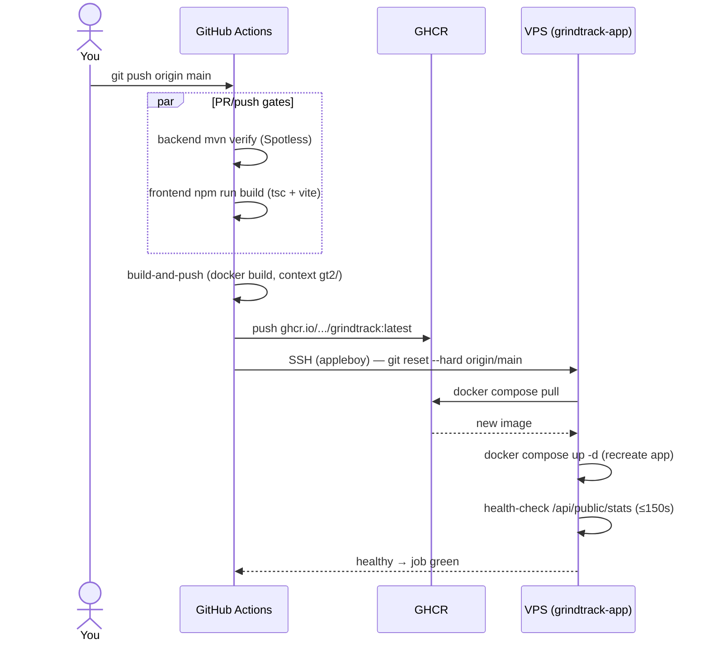

# Deployment (Hetzner VPS, behind the existing containerized nginx)

grindtrack runs on the same VPS as the personal-website stack and reuses its nginx +
certbot containers. The model matches personal-website: **CI builds the image and pushes
it to GHCR; the VPS only pulls.** Nothing is compiled on the VPS.

- App image: `ghcr.io/caseythecoder90/grindtrack:latest` (built by `.github/workflows/ci-cd.yml`).
- On the VPS: `/opt/grindtrack` (git checkout) with `gt2/docker-compose.prod.yml` running
  `grindtrack-app` + its own `grindtrack-db` Postgres.
- `grindtrack-app` attaches to the shared `personal-website_app-network` so the existing
  nginx container can proxy `track.caseyrquinn.com` → `grindtrack-app:8080`. The db stays
  on a private network.

## 0. DNS (do this first — it propagates while you work)

Add an A record `track` → the VPS public IP at your DNS provider for `caseyrquinn.com`.
(Add AAAA too if the other site uses IPv6.) Verify: `dig +short track.caseyrquinn.com`.

## 1. Get the code on the VPS

Public repo, so a plain clone works:
```bash
sudo git clone https://github.com/caseythecoder90/grindtrack.git /opt/grindtrack
sudo chown -R $USER:$USER /opt/grindtrack
cd /opt/grindtrack/gt2
```
Confirm the shared network name the compose file expects:
```bash
docker network ls | grep app-network     # expect personal-website_app-network
```
If it differs, fix `networks.web.name` in `docker-compose.prod.yml`.

## 2. Secrets

```bash
cp .env.example .env
openssl rand -base64 48   # → JWT_SECRET
vim .env                  # POSTGRES_PASSWORD, JWT_SECRET, GRINDTRACK_USERNAME/PASSWORD; COOKIE_SECURE=true
chmod 600 .env
```
`.env` never leaves the VPS and is gitignored.

> If the GHCR package is private, the VPS must `docker login ghcr.io` once (username =
> GitHub user, password = a PAT with `read:packages`). If personal-website already pulls
> from GHCR on this box, you're already logged in.

## 3. Start the containers

```bash
docker compose -f docker-compose.prod.yml up -d
docker compose -f docker-compose.prod.yml logs -f app   # wait for "Started GrindtrackApplication"
```
`grindtrack-app` has no host ports — it's reachable only over the docker network and via
`docker compose exec`. Sanity check from the host:
```bash
docker compose -f docker-compose.prod.yml exec app wget -qO- http://localhost:8080/api/public/stats
```

## 4. First-login TOTP (once)

On first boot with an empty `users` table, `UserBootstrap` creates the user and logs the
TOTP secret **once**:
```bash
docker compose -f docker-compose.prod.yml logs app | grep -A4 "Bootstrap user"
```
Add the secret to your authenticator (manual entry, or paste the `otpauth://` URI into a QR
generator and scan). It is never shown again. TOTP is time-based — make sure the VPS clock
is synced (`timedatectl`). Then clear the trace:
`docker compose -f docker-compose.prod.yml up -d --force-recreate app`.

## 5. nginx + TLS (via the existing containers)

The nginx container serves config from `/opt/personal-website/nginx/conf.d/` and shares
`certbot/{www,conf}` with the certbot container. Because nginx won't start if a server
block references a cert that doesn't exist yet, issue the cert **before** enabling HTTPS.

**a. HTTP-only block first** — create `/opt/personal-website/nginx/conf.d/track.conf` with
just the `listen 80` server from `gt2/nginx/track.conf.example` (the acme-challenge +
redirect block), then reload:
```bash
cd /opt/personal-website
docker compose -f docker-compose.prod.yml exec nginx nginx -t
docker compose -f docker-compose.prod.yml exec nginx nginx -s reload
```

**b. Issue the cert** with the certbot container (webroot):
```bash
docker compose -f docker-compose.prod.yml run --rm certbot \
  certonly --webroot -w /var/www/certbot -d track.caseyrquinn.com
```

**c. Enable HTTPS** — add the `listen 443 ssl` server from the example to `track.conf`,
`nginx -t`, reload. The certbot container's renew loop keeps it fresh automatically.

Visit `https://track.caseyrquinn.com` and log in from your phone.

> Gotcha: your certbot service's entrypoint is overridden to the renew *loop*, so a one-off
> `docker compose run certbot certonly …` is ignored. Issue the first cert with a standalone
> container instead:
> ```bash
> docker run --rm \
>   -v /opt/personal-website/certbot/www:/var/www/certbot \
>   -v /opt/personal-website/certbot/conf:/etc/letsencrypt \
>   certbot/certbot certonly --webroot -w /var/www/certbot -d track.caseyrquinn.com
> ```

## 5.1 How issuance & renewal actually work (and the reload hook)

There is no separate renewal setup for grindtrack — issuing the cert into the **shared**
`/etc/letsencrypt` volume *is* the configuration. Three pieces, all pointing at the same host
directories:

1. **Issuance writes a renewal recipe.** `certonly` saves the cert under
   `/etc/letsencrypt/live/track.caseyrquinn.com/` **and** writes
   `/etc/letsencrypt/renewal/track.caseyrquinn.com.conf`, recording the domain, the `webroot`
   method, and the webroot path.
2. **The certbot container renews everything.** Its loop is just `certbot renew; sleep 12h`.
   `certbot renew` takes **no domain arguments** — it scans every `*.conf` in
   `/etc/letsencrypt/renewal/` and renews any cert within 30 days of expiry. Because track's recipe
   now sits alongside `caseyrquinn.com` and `api.caseyrquinn.com` in the shared volume, it's picked
   up automatically.
3. **The shared volumes are the glue.** Both nginx and certbot mount the host's
   `certbot/conf → /etc/letsencrypt` and `certbot/www → /var/www/certbot`. certbot writes the ACME
   challenge into `/var/www/certbot`; nginx serves it from the same host dir (`:ro`).

```
/opt/personal-website/certbot/conf  ─┬─► certbot : /etc/letsencrypt  (renew loop reads all *.conf)
                                     └─► nginx   : /etc/letsencrypt  (:ro, reads live/*/fullchain.pem)
/opt/personal-website/certbot/www   ─┬─► certbot writes /var/www/certbot/.well-known/...
                                     └─► nginx   serves /var/www/certbot/.well-known/...
```

### The reload hook (fixing a real gap)

The renew loop renews certs on disk but **never reloads nginx** — so a renewed cert isn't served
until nginx restarts. For long-lived containers that can mean serving a cert that's already been
rotated (or, worst case, expired). Fix it by making **nginx reload itself periodically**; renewals
happen roughly monthly, so a 6-hour reload cadence is plenty.

In `/opt/personal-website/docker-compose.prod.yml`, give the `nginx` service a `command` that
backgrounds a reload loop next to the server (the `$${!}` escaping matches your certbot entry):

```yaml
  nginx:
    image: nginx:alpine
    # ...existing ports/volumes/depends_on...
    command: >
      /bin/sh -c 'while :; do sleep 6h & wait $${!}; nginx -s reload; done & nginx -g "daemon off;"'
```

Apply it (brief blip on the website while nginx recreates):

```bash
cd /opt/personal-website
docker compose -f docker-compose.prod.yml up -d nginx
docker compose -f docker-compose.prod.yml exec nginx nginx -t   # sanity
```

This benefits **both** apps' certs, not just grindtrack. (Alternative: a certbot `--deploy-hook`,
but the hook runs inside the certbot container which can't signal nginx in another container
without mounting the docker socket — the periodic nginx reload is the cleaner pattern for this
compose topology.)

## 6. CI/CD — automated deploys

`.github/workflows/ci-cd.yml`:
- **Every PR to `main`**: backend `mvn verify` (compile + Spotless) and frontend
  `npm run build` (strict tsc + Vite) must pass.
- **Every push to `main`**: `build-and-push` builds the image (context `gt2/`) and pushes
  `ghcr.io/caseythecoder90/grindtrack:latest`; `deploy` SSHes in, `git reset --hard
  origin/main` (to pick up compose/config changes), `docker compose -f
  docker-compose.prod.yml pull && up -d`, and health-checks `/api/public/stats`.



One-time setup — three **repository secrets** (Settings → Secrets and variables → Actions):

| Secret | Value |
|---|---|
| `VPS_HOST` | VPS IP or hostname |
| `VPS_USER` | SSH user that owns `/opt/grindtrack` |
| `VPS_SSH_KEY` | Private key for that user (`ssh-keygen -t ed25519 -f deploy_key`; `.pub` → VPS `~/.ssh/authorized_keys`, private half → the secret) |

Until the secrets exist the deploy job skips gracefully (green, not red). Manual fallback:
```bash
cd /opt/grindtrack && git pull && cd gt2 && \
  docker compose -f docker-compose.prod.yml pull && \
  docker compose -f docker-compose.prod.yml up -d
```
Liquibase applies new changesets on startup. Data lives in the `pgdata` volume;
`down` is safe, `down -v` destroys it.

## 7. Backups (do this the same day)

```bash
mkdir -p ~/backups
crontab -e
# nightly dump at 03:10, keep 14 days:
10 3 * * * cd /opt/grindtrack/gt2 && docker compose -f docker-compose.prod.yml exec -T db pg_dump -U grind grindtrack | gzip > ~/backups/grindtrack-$(date +\%F).sql.gz && ls -t ~/backups/grindtrack-*.sql.gz | tail -n +15 | xargs -r rm
```
Copy them **off** the VPS (Hetzner Storage Box or `rsync` to your laptop), then prove the
restore loop once:
```bash
gunzip -c grindtrack-YYYY-MM-DD.sql.gz | docker compose -f docker-compose.prod.yml exec -T db psql -U grind -d grindtrack
```

## Checklist

- [ ] `dig +short track.caseyrquinn.com` returns the VPS IP
- [ ] `docker network ls` name matches `networks.web.name` in the prod compose
- [ ] `.env` is chmod 600 and gitignored
- [ ] `grindtrack-app` and `grindtrack-db` are Up; app health check returns JSON
- [ ] nginx `track.conf` present, cert issued, `nginx -t` clean
- [ ] TOTP enrolled, bootstrap log lines cleared (force-recreate app)
- [ ] Backup cron installed AND one restore tested
- [ ] Login works from your phone over HTTPS
- [ ] Plan imported: generate `plan.json` locally (`gt2/tools/plan-import/`), upload via the
      Plan tab (plan content is personal — it ships via import, never via git)
- [ ] Three GitHub repo secrets set → push to main auto-deploys