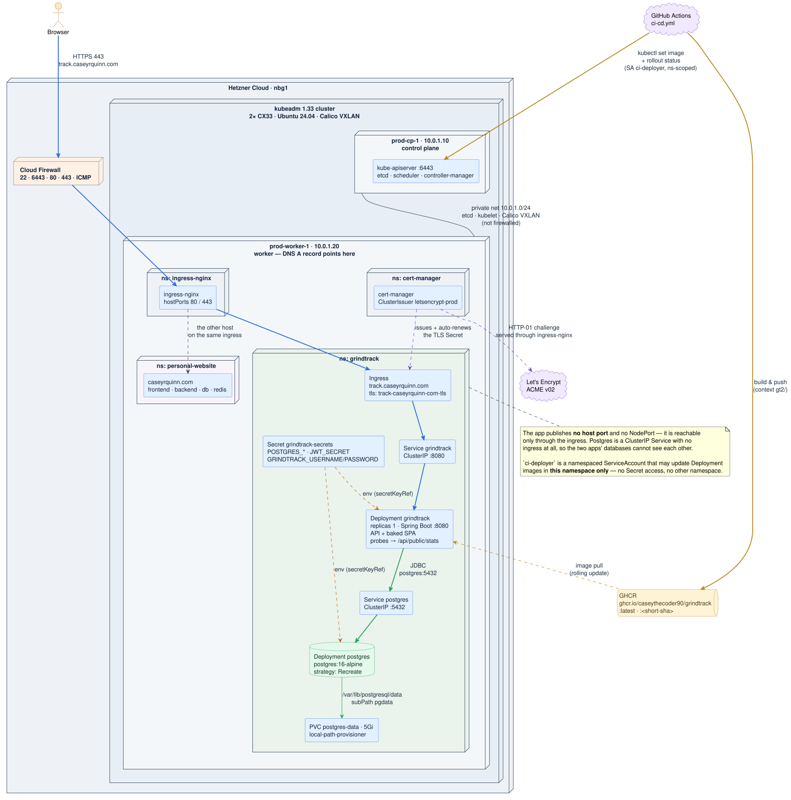
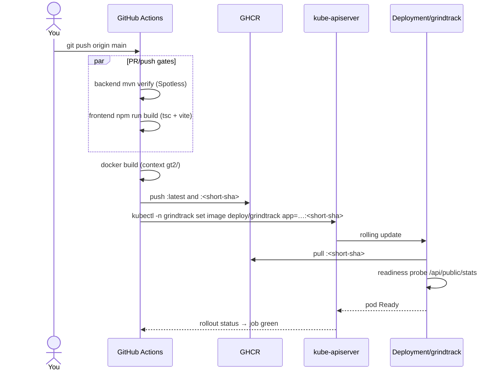

# Deployment

grindtrack runs on a **two-node kubeadm cluster on Hetzner Cloud**, in its own `grindtrack`
namespace, behind ingress-nginx with TLS from cert-manager. CI builds the image and pushes it to
GHCR; the cluster only pulls. Nothing is ever compiled on a server.

> **The cluster is not defined in this repo.** Terraform, Ansible, the ingress controller,
> cert-manager and every manifest below live in **[`k8s-cluster-hetzner`](https://github.com/caseythecoder90/k8s-cluster-hetzner)**
> (`kubernetes/apps/grindtrack/`). This document covers the app's side: what the manifests expect
> of the image, how a deploy happens, and the day-2 tasks specific to grindtrack. For anything
> about the cluster itself — provisioning, node replacement, Kubernetes upgrades — read that
> repo's `docs/runbook.md`.

## Topology



<sub>PlantUML source: [`diagrams/topology.puml`](diagrams/topology.puml) — edit it and regenerate the SVG with [`diagrams/render.sh`](diagrams/render.sh).</sub>

| | |
|---|---|
| Cluster | kubeadm 1.33, 2× CX33 (Nuremberg `nbg1`), Ubuntu 24.04, Calico VXLAN |
| Namespace | `grindtrack` (the personal-website stack has its own; neither can reach the other's Postgres) |
| Image | `ghcr.io/caseythecoder90/grindtrack` — `:latest` and `:<short-sha>` |
| App | `Deployment/grindtrack`, 1 replica, Spring Boot on `:8080` serving the API **and** the baked SPA |
| Service | `Service/grindtrack` ClusterIP `:8080` — no NodePort, no hostPort |
| Ingress | `track.caseyrquinn.com` → `grindtrack:8080`, `ingressClassName: nginx` |
| TLS | cert-manager `ClusterIssuer/letsencrypt-prod`, HTTP-01, into Secret `track-caseyrquinn-com-tls`. Renewal is automatic — there is no reload hook to maintain any more |
| Database | `Deployment/postgres` (`postgres:16-alpine`), `strategy: Recreate`, ClusterIP `:5432` |
| Storage | PVC `postgres-data`, 5Gi, `local-path-provisioner` |
| Secrets | `Secret/grindtrack-secrets` — `POSTGRES_DB/USER/PASSWORD`, `JWT_SECRET`, `GRINDTRACK_USERNAME/PASSWORD`; optional `ANTHROPIC_API_KEY` (assistant), `OPENAI_API_KEY` (speech to text) and `PUSH_VAPID_PUBLIC_KEY`/`PUSH_VAPID_PRIVATE_KEY`/`PUSH_VAPID_SUBJECT` (push, see [push-notifications.md](push-notifications.md)) |

The app publishes no host port. It is reachable only through the ingress, and Postgres has no
ingress at all.

### What the manifests expect of the image

Change any of these and the k8s repo has to change with it:

- **Listens on `8080`** (container port named `http`).
- **`/api/public/stats` is unauthenticated and cheap** — it is both the readiness and the liveness
  probe. Readiness starts at 20s, liveness at 60s. A successful `rollout status` therefore already
  proves the app is serving; CI needs no separate health loop.
- **Configured entirely by environment variables** — no profiles, no mounted config file. The
  Deployment sets `SPRING_DATASOURCE_URL` to `jdbc:postgresql://postgres:5432/$(POSTGRES_DB)`, so
  `POSTGRES_DB` must be declared *before* the URL in the env list (`$(VAR)` expansion only sees
  earlier entries).
- **`COOKIE_SECURE=true`**, because TLS terminates at the ingress.
- **Runs in 512Mi** — `JAVA_TOOL_OPTIONS: -Xmx256m -Xms64m`, request 100m CPU / 256Mi.

`gt2/docker-compose.prod.yml` is **not** used in production any more. `gt2/docker-compose.yml`
is still the local-development stack and is unaffected.

## CI/CD

`.github/workflows/ci-cd.yml`:

- **Every PR to `main`**: backend `mvn verify` (compile + Spotless) and frontend `npm run build`
  (strict `tsc --noEmit` + Vite) must pass.
- **Every push to `main`**: `build-and-push` builds the image (context `gt2/`) and pushes both
  `:latest` and `:<short-sha>`; `deploy` then rolls that exact SHA out to the cluster.


```mermaid
sequenceDiagram
    actor Dev as You
    participant GH as GitHub Actions
    participant GHCR as GHCR
    participant API as kube-apiserver
    participant K as Deployment/grindtrack
    Dev->>GH: git push origin main
    par PR/push gates
        GH->>GH: backend mvn verify (Spotless)
        GH->>GH: frontend npm run build (tsc + vite)
    end
    GH->>GH: docker build (context gt2/)
    GH->>GHCR: push :latest and :<short-sha>
    GH->>API: kubectl -n grindtrack set image deploy/grindtrack app=…:<short-sha>
    API->>K: rolling update
    K->>GHCR: pull :<short-sha>
    K->>K: readiness probe /api/public/stats
    K-->>API: pod Ready
    API-->>GH: rollout status → job green
```

The deploy job **pins the short SHA rather than `:latest`** — `set image` with a tag that is
already on the Deployment is a no-op, so rolling `:latest` would silently deploy nothing.

One repository secret:

| Secret | Value |
|---|---|
| `KUBE_CONFIG` | base64 kubeconfig for the `ci-deployer` ServiceAccount |

`ci-deployer` is deliberately least-privilege: it may update Deployment images **in the
`grindtrack` namespace only** — no Secret access, no other namespace. Its RBAC and the generator
script are in `kubernetes/cluster/ci-deployer/` in the k8s repo. If `KUBE_CONFIG` is unset the
deploy job skips (green, not red) instead of failing.

> `VPS_HOST`, `VPS_USER` and `VPS_SSH_KEY` are **stale** — they authenticate to a host that no
> longer exists. Safe to delete.

## First deploy into a fresh namespace

The cluster foundations (storage class, cert-manager, ingress-nginx, namespaces) are the k8s
repo's job — `docs/04-deploy-workloads.md` there. Once they exist, grindtrack needs:

**1. The secret.** Never committed; created imperatively:

```bash
kubectl -n grindtrack create secret generic grindtrack-secrets \
  --from-literal=POSTGRES_DB=grindtrack \
  --from-literal=POSTGRES_USER=grind \
  --from-literal=POSTGRES_PASSWORD="$(openssl rand -base64 24)" \
  --from-literal=JWT_SECRET="$(openssl rand -base64 48)" \
  --from-literal=GRINDTRACK_USERNAME=casey \
  --from-literal=GRINDTRACK_PASSWORD='<the login password>'
```

**2. Apply the manifests** from the k8s repo:

```bash
kubectl apply -k kubernetes/apps/grindtrack/overlays/prod
kubectl -n grindtrack rollout status deploy/postgres
kubectl -n grindtrack rollout status deploy/grindtrack
```

Liquibase runs on startup and creates the whole schema — see [backend.md](backend.md).

**3. Enroll TOTP (once).** On first boot against an empty `users` table, `UserBootstrap` creates
the user and logs the `otpauth://` URI **once**:

```bash
kubectl -n grindtrack logs deploy/grindtrack | grep -A4 "Bootstrap user"
```

Add it to your authenticator (manual entry, or paste the URI into a QR generator). It is never
shown again. TOTP is time-based, so the nodes' clocks must be synced. Then clear the trace:

```bash
kubectl -n grindtrack rollout restart deploy/grindtrack
```

**4. Import the plan.** Plan content is personal and never ships in git: generate `plan.json`
locally with `gt2/tools/plan-import/xlsx_to_plan_json.py` and upload it through the Plan tab.

## Day-2 operations

```bash
# what's running, and on which image
kubectl -n grindtrack get pods,svc,ingress
kubectl -n grindtrack get deploy grindtrack -o jsonpath='{..image}{"\n"}'

# logs
kubectl -n grindtrack logs -f deploy/grindtrack

# roll back to the previous image
kubectl -n grindtrack rollout undo deploy/grindtrack

# restart (picks up a changed Secret — env vars are read only at startup)
kubectl -n grindtrack rollout restart deploy/grindtrack

# psql
kubectl -n grindtrack exec -it deploy/postgres -- psql -U grind -d grindtrack

# reach the app without the ingress (e.g. to test a probe path)
kubectl -n grindtrack port-forward deploy/grindtrack 8080:8080
```

**Changing a secret requires a restart.** Every value arrives as an env var via `secretKeyRef`,
and env vars are resolved once at container start — editing the Secret alone changes nothing.

**Postgres uses `strategy: Recreate`, not RollingUpdate.** Two Postgres pods must never hold the
same PVC. A database change therefore has a few seconds of downtime, which is correct.

## Backups — currently a gap

> ⚠️ **There is no automated backup.** The nightly `pg_dump` cron ran on the old VPS and was not
> replaced when the app moved to the cluster. The PVC is `local-path`, meaning the data lives on
> **one node's local disk** with no replication — if `prod-worker-1`'s disk is lost, so is every
> daily log, transaction and moment.

Manual dump and restore, until a CronJob exists:

```bash
# dump
kubectl -n grindtrack exec deploy/postgres -- \
  pg_dump -U grind -Fc grindtrack > grindtrack-$(date +%F).dump

# restore into a fresh database
kubectl -n grindtrack exec -i deploy/postgres -- \
  pg_restore -U grind -d grindtrack --clean --if-exists < grindtrack-YYYY-MM-DD.dump
```

The fix is a `CronJob` running `pg_dump` to object storage (Hetzner Storage Box or S3), which
`k8s-cluster-hetzner/docs/04-deploy-workloads.md` names as the intended approach but does not yet
implement. **Prove the restore path once** after building it — an untested backup is not a backup.

## Checklist

- [ ] `dig +short track.caseyrquinn.com` returns `prod-worker-1`'s public IP
- [ ] `kubectl -n grindtrack get pods` — `grindtrack` and `postgres` both `1/1 Running`
- [ ] `kubectl -n grindtrack get ingress` shows the host, and the TLS Secret exists
- [ ] `kubectl -n grindtrack get certificate` reports `Ready=True`
- [ ] `curl -s https://track.caseyrquinn.com/api/public/stats` returns JSON over a valid cert
- [ ] TOTP enrolled and the bootstrap log line cleared (`rollout restart`)
- [ ] `KUBE_CONFIG` set → a push to `main` rolls out automatically
- [ ] Login works from your phone over HTTPS
- [ ] Plan imported through the Plan tab
- [ ] **Backup CronJob built, and a restore actually tested** ← open

## History

Until August 2026 grindtrack ran on a single Hetzner VPS shared with the personal-website stack,
reusing that stack's containerized nginx + certbot for TLS and routing, deployed over SSH with
`docker compose`. That VPS has been deleted and both apps migrated to the cluster.

What the move changed, and why it was worth doing:

- **TLS stopped needing a babysitter.** The certbot container renewed certs but never reloaded
  nginx, so the compose setup needed a periodic self-reload loop bolted on. cert-manager renews
  and reloads with no such hook.
- **Deploys stopped needing SSH.** A namespaced ServiceAccount replaced a private key that could
  log into the whole box, and `rollout status` replaced a hand-rolled health-check loop.
- **A bad deploy became reversible.** `rollout undo` against a SHA-pinned image, rather than
  `git reset --hard` and a re-pull.

The old runbook is in this file's git history if it is ever needed; the migration itself is
recorded step by step in `k8s-cluster-hetzner/docs/05-app-migration.md`.
