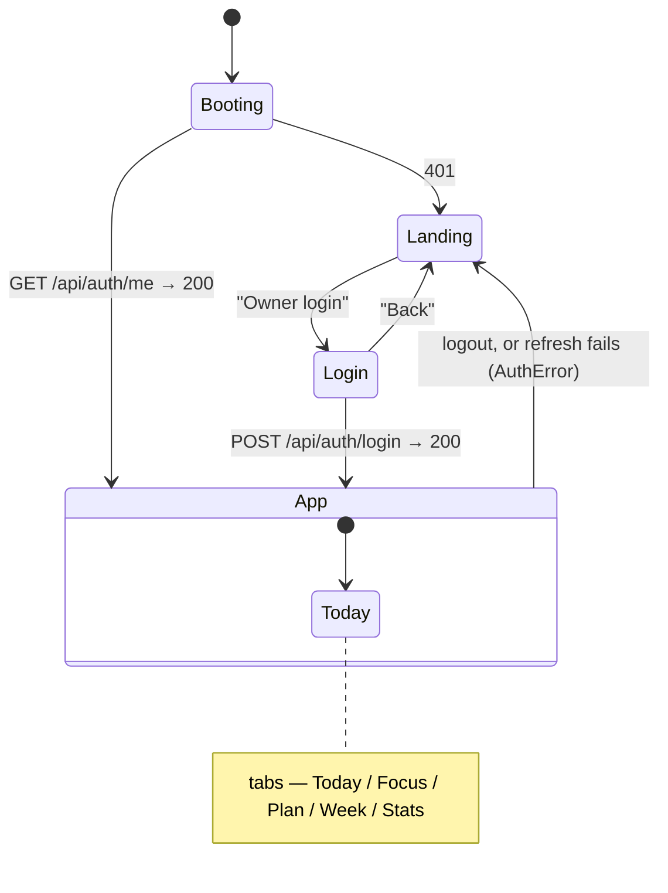

# Frontend

React 18 + TypeScript, built with Vite. Deliberately minimal: **no router, no state-management
library, no data-fetching library.** Dependencies are only `react` and `react-dom`. Routing is a
hand-rolled view/tab state machine, auth is a `fetch` wrapper over httpOnly cookies, and all
remote state is local `useState`. The whole thing is one component tree in `App.tsx`.

> Diagram convention: **Mermaid for sequence/state diagrams** (renders on GitHub and in the IDE).

## Folder structure

```
src/
├── main.tsx            React 18 root bootstrap (StrictMode, imports styles.css)
├── App.tsx             top-level shell: view/tab state machine, session probe, header
├── styles.css          single global stylesheet (dstyle palette; no CSS framework)
├── components/         shared, presentational
│   ├── Heatmap.tsx     26-week contribution grid (used by Landing + App)
│   └── StatBar.tsx     counters row (streak / this week / total / days)
├── features/
│   ├── auth/Login.tsx           username + password + TOTP form
│   ├── landing/Landing.tsx      public read-only view
│   ├── focus/FocusPage.tsx      Pomodoro timer + today's sessions
│   ├── plan/
│   │   ├── PlanPage.tsx         3-year plan tracker (status cycling, notes, import)
│   │   └── Reference.tsx        generic renderer for the reference sheets
│   └── tracking/
│       ├── Today.tsx            daily log editor
│       ├── Week.tsx             week grid + weekly review
│       └── StatsPage.tsx        bar charts
└── lib/                framework-free
    ├── api.ts          fetch wrapper + 401/refresh/retry
    ├── dates.ts        todayISO, mondayOf, addDays (local-tz safe)
    └── types.ts        interfaces + constants (CATEGORIES, WEEKLY_TARGET=16, FOCUS_DEFAULTS)
```

## Routing = a two-level state machine (`App.tsx`)

There is no router library and no URL/History involvement — everything is one path.

```ts
type View = "landing" | "login" | "app";
type Tab  = "today" | "focus" | "plan" | "week" | "stats";
```



- **`view`** picks Landing (public) / Login (form) / App (authenticated shell).
- Inside App, a `<nav class="tabs">` toggles **`tab`** between Today / Focus / Plan / Week / Stats.
- **Auth guard:** App-only content renders only when `view === "app"`. Entry is gated by a session
  probe on mount; any `AuthError` from the header-refresh path calls `setView("landing")` — the
  "redirect to login" for an expired session.

## Session state (no token in JS)

Session state is **not** a stored token — it lives entirely in the httpOnly cookie. The client
infers login status by probing the backend on mount:

```ts
useEffect(() => {
  api<{ username: string }>("/api/auth/me")
    .then(() => { setView("app"); refreshHeader(); })
    .catch(() => setView("landing"));
}, [refreshHeader]);
```

`refreshHeader` (memoized with `useCallback`) loads `/api/stats` (→ `StatBar`) and
`/api/public/stats` (→ `Heatmap`), and is passed down as `onSaved`/`onLogged` so child screens can
refresh the header after a mutation. There is **no** shared cache/context/store — each feature
screen owns its remote state locally and re-fetches in its own effects.

## The `api()` wrapper (`src/lib/api.ts`)

~56 lines. Requests are plain `fetch` with `credentials: "same-origin"` so the browser
sends/receives the auth cookies automatically — JS never reads or holds a token.

**Single-flight refresh** — the key correctness detail:

```ts
let refreshInFlight: Promise<boolean> | null = null;

function refreshOnce(): Promise<boolean> {
  if (!refreshInFlight) {
    refreshInFlight = rawFetch("/api/auth/refresh", { method: "POST" })
      .then((r) => r.ok)
      .finally(() => { refreshInFlight = null; });
  }
  return refreshInFlight;
}
```

If several requests 401 at once, only the first triggers `POST /api/auth/refresh`; the rest await
the same promise. This matters because refresh tokens are **single-use and rotated** (see
[auth.md](auth.md)) — two parallel refreshes would race, and the loser would present an
already-rotated token and get logged out. The promise clears in `.finally()` so the next expiry
starts fresh.

**401 → refresh → retry (exactly once):**

```mermaid
sequenceDiagram
    participant Screen as feature screen
    participant api as api&lt;T&gt;()
    participant BE as backend
    Screen->>api: api("/api/stats")
    api->>BE: fetch (gt_access expired)
    BE-->>api: 401
    api->>api: refreshOnce()  (deduped)
    api->>BE: POST /api/auth/refresh (gt_refresh)
    alt refresh ok
        BE-->>api: 200 + rotated cookies
        api->>BE: replay /api/stats
        BE-->>api: 200 JSON
        api-->>Screen: T
    else refresh fails
        BE-->>api: 401
        api-->>Screen: throw AuthError("session expired")
    end
```

- **Login is exempt:** a 401 on `/api/auth/login` means bad credentials, so it flows to the form
  rather than triggering a refresh.
- `AuthError extends Error` is the sentinel the UI catches to drop to Landing.
- Empty-body 200s (e.g. `GET /api/days/<unlogged date>`) return `null` instead of throwing.
- `jsonInit(method, body)` is the helper for JSON bodies. `logout()` calls `fetch` directly
  (no refresh needed).

## Feature screens

| Screen | Endpoints | Notes |
|---|---|---|
| `auth/Login` | `POST /api/auth/login` | username / password / 6-digit `otp`; inline errors; `onSuccess(username)` |
| `landing/Landing` | `GET /api/public/stats` | `StatBar` (no week tile) + `Heatmap`; **no text ever** |
| `tracking/Today` | `GET/PUT /api/days/{date}`, `DELETE` | hours (0–24, step 0.5), energy 1–5, category chips, 4 textareas; "saved ✓" toast → `onSaved()` |
| `tracking/Week` | `GET /api/days?from=&to=`, `GET/PUT /api/weeks/{monday}` | Mon–Sun grid, progress bar vs `WEEKLY_TARGET` (16), review form with `onTrack` toggle |
| `tracking/StatsPage` | `GET /api/stats` | two bar charts: hours/week (last 12), hours by category (all time) |
| `focus/FocusPage` | `GET/POST /api/focus/sessions` | Pomodoro timer (below) → `onLogged()` |
| `plan/PlanPage` | `GET /api/plan`, `PATCH /api/plan/items/{id}`, `POST /api/plan/import` | progress header + type filters, year panels with collapsible quarter roadmap, 3-state status chip (cycles on click), per-item notes, plan.json upload (empty state + re-import box). `Reference.tsx` renders the read-only sheets from row-JSON. |

### FocusPage — a durable timer

Worth understanding because it's the trickiest screen:

- **Persists to `localStorage`** under `gt-focus-timer-v1` (phase, sessionIndex, `endsAt`,
  remainingMs, config). Restored on load; corrupted JSON falls back to idle.
- Stores **absolute end-timestamps** (`endsAt` epoch ms), not a counting-down number — so a
  reload, tab switch, or laptop sleep can't drift the clock. A `setInterval(…, 500)` only drives
  re-render; a separate effect fires phase transitions when `Date.now() >= endsAt`.
- Phases `idle → focus → break → … → done`; config = sessions (1–12), focus min (5–180), break
  min (1–60).
- Each completed/ended-early session (≥1 min) is `POST`ed; the backend **atomically adds its
  minutes to that day's hours** (see [api.md](api.md)/[backend.md](backend.md)), then `onLogged()`
  refreshes the header so streak/heatmap update live.
- Side effects (`chime()` via WebAudio, `notify()` via Notification API) are wrapped in try/catch.

## Build & serving

`package.json` scripts:

```json
"dev": "vite",
"build": "tsc --noEmit && vite build",
"preview": "vite preview"
```

- **`build` typechecks first** (`tsc --noEmit`, strict — `noUnusedLocals`, `noUnusedParameters`,
  etc.) then `vite build` → `dist/` (one hashed JS + one CSS bundle). A type error, including an
  unused variable, fails the build — this is a CI gate.
- **Dev proxy** (`vite.config.ts`): Vite serves the UI on `:5173` and proxies `/api` →
  `http://localhost:8080`, so the client uses same-origin relative `/api/...` paths everywhere and
  needs no base URL or CORS. Run the backend with `COOKIE_SECURE=false` for http dev.
- **Production serving:** the Docker build (`gt2/Dockerfile`) runs `npm run build` in stage 1 and
  copies `dist/` into the Spring Boot `static/` in stage 2 — so in production there is a **single
  origin**: Spring serves both the SPA and `/api/**`. That single-origin fact is exactly why the
  httpOnly + `SameSite=Strict` cookie model works with no CORS. See [architecture.md](architecture.md).
