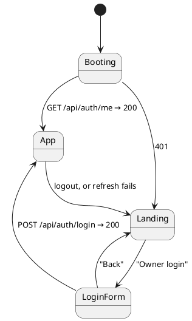

# Frontend

React 18 + TypeScript, built with Vite. No router — the app is a small state machine.

## View states



- **Landing** (public): heatmap + streak from `/api/public/stats`. Text fields never appear.
- **App** (authed): header stats + heatmap + tabs Today / Week / Stats.

## Folder structure

```
src/
├── main.tsx, App.tsx, styles.css   entry, view state machine, all styling
├── features/
│   ├── auth/        Login.tsx
│   ├── landing/     Landing.tsx (public view)
│   └── tracking/    Today.tsx, Week.tsx, StatsPage.tsx
├── components/      Heatmap.tsx, StatBar.tsx (shared by landing + app)
└── lib/             api.ts, dates.ts, types.ts
```

## The api() wrapper (`src/lib/api.ts`)

Every call goes through `api<T>()`. On 401 it POSTs `/api/auth/refresh` once and replays the
original request; a second 401 throws `AuthError`, which `App` catches to drop back to Landing.
This is the standard SPA companion to short-lived access tokens: the user never notices a
15-minute expiry.

## Conventions

- Types for all API shapes live in `src/lib/types.ts`; categories and the 16h target are
  constants there — one place to change.
- Date helpers (`todayISO`, `mondayOf`, `addDays`) in `src/lib/dates.ts`, local-timezone safe.
- Styling is a single `styles.css` using the dstyle palette (bg `#0d1b2a`, cyan/green/magenta);
  no CSS framework.
- Local dev: `npm run dev` serves the UI on :5173 and proxies `/api` to the Spring app on :8080
  (run it with `COOKIE_SECURE=false`).

## Build

`npm run build` = `tsc --noEmit` (strict; unused locals are errors) + `vite build`. The Docker
build runs this in stage 1 and bakes `dist/` into the jar's `static/` in stage 2.
