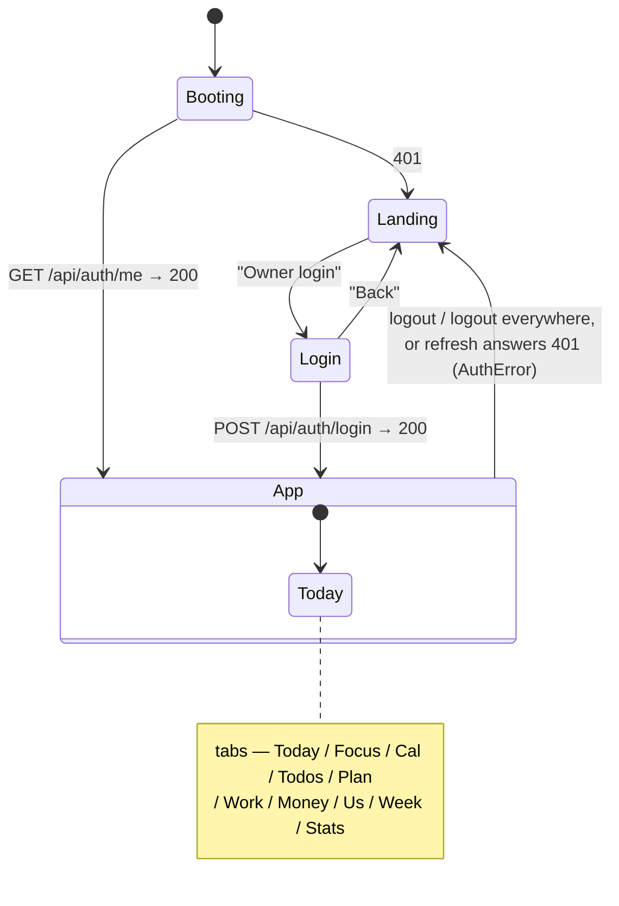

# Frontend

React 18 + TypeScript, built with Vite. Deliberately minimal: **no router, no state-management
library, no data-fetching library.** Dependencies are only `react` and `react-dom`. Routing is a
hand-rolled view/tab state machine, auth is a `fetch` wrapper over httpOnly cookies, and all
remote state is local `useState`. The whole thing is one component tree in `App.tsx`.

> Diagram convention: **Mermaid for sequence/state diagrams** (renders on GitHub and in the IDE).

## Folder structure

```
src/
├── main.tsx            React 18 root bootstrap (StrictMode, imports styles.css, registers the SW)
├── App.tsx             top-level shell: view/tab state machine, session probe, header
├── styles.css          single global stylesheet (dstyle palette; no CSS framework)
├── vite-env.d.ts       pulls in vite/client types (import.meta.env)
├── components/         shared, presentational
│   ├── BottomNav.tsx   the phone's navigation: 4 sections + a "more" sheet
│   ├── MoreSheet.tsx   modal sheet holding the sections the bar cannot fit
│   ├── TabIcon.tsx     the inline SVG icon set, one per section
│   ├── Heatmap.tsx     26-week contribution grid, per-scope ramp (used by Landing + App)
│   ├── Meter.tsx       the split study/work bar against a target — the app's one recurring device
│   ├── NumberStepper.tsx  a number field with real − / + buttons; the draft-string edit that
│   │                   makes it clearable, and the arrows type="number" never draws on a phone
│   ├── Segmented.tsx   accessible one-of-N control for switching what you're looking at
│   ├── StatBar.tsx     scope switcher + KPI row (week / streak / total / days)
│   └── WeekTotals.tsx  study · work · total for one week, on both week tabs
├── features/
│   ├── assistant/
│   │   ├── AskPage.tsx          the chat: streamed turns, a mic, the drafted-week and drafted-log cards
│   │   ├── ConversationsSheet.tsx  the thread list as a bottom sheet, grouped by day, with delete
│   │   ├── ProposedWeek.tsx     a week the assistant drafted, and the Book button (the one write)
│   │   ├── ProposedLog.tsx      a day's log it drafted, merged over the day, and the Save button
│   │   ├── WeekPlanCard.tsx     the planner on the week tab: propose, read the blocks, Book
│   │   ├── MorningBrief.tsx     the 06:00 brief above the daily log; a redraft button when it is stale
│   │   └── assistantApi.ts      the endpoints, and streamChat over the SSE reader in lib/api.ts
│   ├── auth/Login.tsx           username + password + TOTP form
│   ├── calendar/
│   │   ├── CalendarPage.tsx     month + selected day + upkeep, one request per month
│   │   ├── MonthGrid.tsx        six-week grid with per-day density dots
│   │   ├── DaySheet.tsx         the selected day's entries, all-day first
│   │   ├── EventForm.tsx        add one entry; the plan select only shows for a study block
│   │   └── UpkeepPanel.tsx      what is due, grouped overdue / this week / later
│   ├── landing/Landing.tsx      public read-only view
│   ├── focus/
│   │   ├── FocusPage.tsx        session list + POST wiring + JSX
│   │   ├── LunchSubject.tsx     picks the book/paper/repo a reading or review session is for
│   │   ├── ReadingPanel.tsx     the lunch dashboard: streak, week vs target, per-subject hours
│   │   ├── timer.ts             pure pomodoro state machine (framework-free, nowMs-parameterized)
│   │   ├── useFocusTimer.ts     hook: persistence, 500ms tick, transitions, alert wiring
│   │   └── alerts.ts            chime / notification side effects
│   ├── push/
│   │   ├── NotificationsPanel.tsx  five honest states and a "send a test"; in the more sheet and behind a header button
│   │   └── pushApi.ts           status, subscriptions, test
│   ├── plan/
│   │   ├── PlanPage.tsx         orchestration: load, update, import, composition
│   │   ├── PlanHeader.tsx       progress bar + type filter chips
│   │   ├── YearPanel.tsx        per-year panel incl. quarter roadmap cards
│   │   ├── ItemRow.tsx          status chip + expandable details + notes
│   │   ├── ImportControl.tsx    plan.json file picker
│   │   ├── planModel.ts         pure labels/constants/sorting/progress helpers
│   │   └── Reference.tsx        generic renderer for the reference sheets
│   ├── tracking/
│   │   ├── Today.tsx            daily log editor
│   │   ├── Week.tsx             week grid + weekly review
│   │   └── StatsPage.tsx        bar charts
│   ├── todo/
│   │   └── TodoPage.tsx         all / work / personal list with inline add
│   ├── work/
│   │   ├── WorkPage.tsx         sub-tab shell (Day / Week / Skills)
│   │   ├── WorkDay.tsx          daily work-log editor
│   │   ├── WorkWeek.tsx         week grid vs 40h target
│   │   └── WorkSkills.tsx       competency checklist (add / cycle / notes / delete)
│   ├── finance/
│   │   ├── FinancePage.tsx      sub-view shell (Overview / Spending / Budget / Review / Import)
│   │   ├── AccountsPanel.tsx    accounts + balances, add / edit / delete
│   │   ├── SavingsGoalCard.tsx  goal progress against the savings accounts
│   │   ├── SpendingPanel.tsx    category rollups and month-over-month
│   │   ├── BudgetPanel.tsx      the recurring plan, this month's extras, expected income
│   │   ├── RecurringPanel.tsx   charges that come back every month
│   │   ├── ReviewInbox.tsx      uncategorized queue; filing one can write a rule
│   │   ├── CategoryRulesPanel.tsx  rule list, priority order, edit / apply
│   │   ├── ImportPanel.tsx      statement upload, dry-run, batch history, undo
│   │   ├── categories.ts        the category vocabulary
│   │   └── money.ts             formatting + sign helpers (pure)
│   └── relationship/
│       ├── RelationshipPage.tsx sub-view shell for the "Us" tab
│       ├── ClosenessCard.tsx    recency per moment kind — reassurance, not a score
│       ├── IdeasPanel.tsx       ideas by effort; acting on one logs a moment
│       ├── OccasionsPanel.tsx   anniversaries/birthdays with lead time
│       ├── ReadingPanel.tsx     reading list; a takeaway can be promoted to an idea
│       └── kinds.ts             moment/idea/reading kind labels
└── lib/                framework-free
    ├── api.ts          fetch wrapper + 401/refresh/retry; AuthError vs OfflineError; stream() for SSE
    ├── dates.ts        todayISO, mondayOf, addDays (local-tz safe)
    ├── push.ts         Web Push from the browser's side: the five states, subscribe, unsubscribe
    ├── pwa.ts          service worker registration (production only)
    ├── resume.ts       useAppResume: refresh when the app comes back to the foreground
    ├── speech.ts       useSpeech: microphone → worklet → WebSocket relay → words in the box
    ├── tabs.ts         the section list, and which four the bottom bar shows
    └── types.ts        interfaces + constants (CATEGORIES, TARGETS, FOCUS_DEFAULTS)
```

Each feature owns its own API module (`financeApi.ts`, `relationshipApi.ts`, `focusApi.ts`, …)
rather than one shared client. One ergonomic hazard comes with that: a component's local handler
easily collides with the imported function of the same name (`addTransaction`, `recordSession`,
`logout`), so those imports are aliased at the import site.

## Routing = a two-level state machine (`App.tsx`)

There is no router library and no URL/History involvement — everything is one path.

```ts
type View = "landing" | "login" | "app";
type Tab  = "today" | "focus" | "todos" | "plan" | "work" | "money" | "us" | "week" | "stats";
```

`TABS` is that same array, and the nav renders straight from it — adding a tab is one entry plus
one branch. The three heaviest tabs (`work`, `money`, `us`) are shells with their own secondary
nav rather than nine more top-level entries.


```mermaid
stateDiagram-v2
    [*] --> Booting
    Booting --> App : GET /api/auth/me → 200
    Booting --> Landing : 401
    Landing --> Login : "Owner login"
    Login --> App : POST /api/auth/login → 200
    Login --> Landing : "Back"
    App --> Landing : logout / logout everywhere, or refresh answers 401 (AuthError)
    state App {
        [*] --> Today
        note right of Today
            tabs — Today / Focus / Cal / Todos / Plan
            / Work / Money / Us / Week / Stats
        end note
    }
```

- **`view`** picks Landing (public) / Login (form) / App (authenticated shell).
- Inside App, **`tab`** moves across the ten entries in `TABS`, which lives in `lib/tabs.ts`
  rather than in either navigation. There are two: the desktop `<nav class="tabs">` strip renders
  all of `TABS`, while the phone's `BottomNav` renders the four `PRIMARY_TABS` plus a "more" sheet
  holding `SECONDARY_TABS`. Both always render; `@media (pointer: coarse)` in `styles.css` decides
  which is shown, on pointer type rather than width, because a half-width window on a laptop is
  still a mouse. Promoting a tab is a one-line change to `PRIMARY_TABS` — which it already was
  once, when the calendar took a slot and `todos` moved into the sheet.
- **Auth guard:** App-only content renders only when `view === "app"`. Entry is gated by a session
  probe on mount; any `AuthError` from the header-refresh path calls `setView("landing")` — the
  "redirect to login" for an expired session.

## Session state (no token in JS)

Session state is **not** a stored token — it lives entirely in the httpOnly cookie. The client
infers login status by probing the backend on mount:

```ts
useEffect(() => {
  api<{ username: string }>("/api/auth/me")
    .then(() => { setView("app"); refreshHeader(); })
    .catch(() => setView("landing"));
}, [refreshHeader]);
```

`refreshHeader` (memoized with `useCallback`) loads `/api/stats` — a **single** request that now
carries the heatmap day series for every scope, so it feeds both `StatBar` and `Heatmap`. It is
passed down as `onSaved`/`onLogged` so child screens can refresh the header after a mutation,
including `WorkPage` (work hours move the combined totals). There is **no** shared
cache/context/store — each feature screen owns its remote state locally and re-fetches in its own
effects, with the exception of `StatsPage`, which receives the already-loaded `stats` as a prop
rather than refetching the same payload on every tab switch.

### Scope (`all` / `study` / `work`)

`App` holds a `Scope` in state, persisted to `localStorage` under `gt-scope`, and passes it to
`StatBar`, `Heatmap`, and `StatsPage`. Because the backend returns all three scopes in one payload,
switching is purely local — no refetch. Weekly targets live in `TARGETS` (`types.ts`) and nowhere
else on this side: **study 15, work 28, combined 43**. The header reads them from there rather than
writing them out.

Both are deliberately below the workbook's aspiration. Work is 28 rather than 40 because 40 is
hours *at* work — lunch and about an hour a day of meetings put the focused ceiling near 30, and a
ceiling is not a target. A goal missed every single week stops being information, which on screens
built to put an actual next to its target makes every number beside it worse. They must match
`ContextService.STUDY_TARGET_HOURS` / `WORK_TARGET_HOURS`, which is what the assistant reasons
against — see [assistant.md](assistant.md).

Two rules the components follow:

- **Colour means one thing.** `--study` (green) and `--work` (violet) encode data and nothing else;
  `--cyan` is UI chrome (headings, focus rings, active tab, selected chips) and never a series. The
  pair is validated for colour-vision deficiency — green + amber, the intuitive choice, fails
  protan separation badly.
- **The heatmap rescales per scope.** A workday is 6–9h, so reusing the study thresholds would put
  every work cell in the top bucket and render a solid slab. In `all`, a day holding both kinds is
  drawn as a hard-stop split showing the study/work share.

## The `api()` wrapper (`src/lib/api.ts`)

~56 lines. Requests are plain `fetch` with `credentials: "same-origin"` so the browser
sends/receives the auth cookies automatically — JS never reads or holds a token.

**Single-flight refresh** — the key correctness detail:

```ts
let refreshInFlight: Promise<boolean> | null = null;

function refreshOnce(): Promise<boolean> {
  if (!refreshInFlight) {
    refreshInFlight = rawFetch("/api/auth/refresh", { method: "POST" })
      .then((r) => r.ok)
      .finally(() => { refreshInFlight = null; });
  }
  return refreshInFlight;
}
```

If several requests 401 at once, only the first triggers `POST /api/auth/refresh`; the rest await
the same promise. A refresh usually hands the same session token back, and when it does rotate the
server forgives the loser of a race for a day (see [auth.md](auth.md)) — but one request instead
of two is still right. The promise clears in `.finally()` so the next expiry starts fresh. The real
type is `Promise<"ok" | "expired" | "unavailable">`: only a 401 *from the refresh endpoint* is
`expired` (→ `AuthError`, landing page); 502/503/504 and network failures are `unavailable` (→
`OfflineError`, nothing on screen changes).

**401 → refresh → retry (exactly once):**

```mermaid
sequenceDiagram
    participant Screen as feature screen
    participant api as api&lt;T&gt;()
    participant BE as backend
    Screen->>api: api("/api/stats")
    api->>BE: fetch (gt_access expired)
    BE-->>api: 401
    api->>api: refreshOnce()  (deduped)
    api->>BE: POST /api/auth/refresh (gt_refresh)
    alt refresh ok
        BE-->>api: 200 + rotated cookies
        api->>BE: replay /api/stats
        BE-->>api: 200 JSON
        api-->>Screen: T
    else refresh fails
        BE-->>api: 401
        api-->>Screen: throw AuthError("session expired")
    end
```

- **Login is exempt:** a 401 on `/api/auth/login` means bad credentials, so it flows to the form
  rather than triggering a refresh.
- `AuthError extends Error` is the sentinel the UI catches to drop to Landing.
- Empty-body 200s (e.g. `GET /api/days/<unlogged date>`) return `null` instead of throwing.
- `jsonInit(method, body)` is the helper for JSON bodies. `logout()` calls `fetch` directly
  (no refresh needed).

## Feature screens

| Screen | Endpoints | Notes |
|---|---|---|
| `auth/Login` | `POST /api/auth/login` | username / password / 6-digit `otp`; inline errors; `onSuccess(username)` |
| `landing/Landing` | `GET /api/public/stats` | plain 3-tile counter row (no scope switcher) + `Heatmap` pinned to `study`; **no text ever, no work hours** |
| `tracking/Today` | `GET/PUT /api/days/{date}`, `DELETE` | hours (0–24, step 0.5), energy 1–5, category chips, 4 textareas; "saved ✓" toast → `onSaved()` |
| `tracking/Week` | `GET /api/days?from=&to=`, `GET/PUT /api/weeks/{monday}` | Mon–Sun grid, `WeekTotals` header (study · work · total), review form with `onTrack` toggle |
| `tracking/StatsPage` | — (receives `stats` + `scope` as props) | hours/week for the last 12 as split `Meter` bars with a target marker, plus hours by category for the current scope |
| `todo/TodoPage` | `GET/POST /api/todos`, `PATCH`/`DELETE /api/todos/{id}` | all/work/personal filter, inline add with optional due date, optimistic checkbox, overdue + due-today styling |
| `focus/FocusPage` | `GET/POST /api/focus/sessions`, `PATCH /sessions/{id}/takeaway`, `GET /api/focus/reading` | Pomodoro timer (below) with a **four-way kind toggle** → `onLogged()`. `work` minutes fold into `work_logs`; `study`, `reading` and `review` into `daily_logs`. The two lunch kinds also pick a subject (`LunchSubject`) and prompt for a takeaway once the session ends |
| `focus/ReadingPanel` | `GET /api/focus/reading` | The lunch dashboard: weekday streak, days this week against target, hours per subject, recent takeaways |
| `plan/PlanPage` | `GET /api/plan`, `PATCH /api/plan/items/{id}`, `POST /api/plan/import` | progress header + type filters, year panels with collapsible quarter roadmap, 3-state status chip (cycles on click), per-item notes, plan.json upload (empty state + re-import box). `Reference.tsx` renders the read-only sheets from row-JSON. |
| `work/WorkPage` | — | secondary tab bar over Day / Week / Skills (day-job tracking, separate from study) |
| `work/WorkDay` | `GET/PUT /api/work/days/{date}` | hours, project, category chips, goals/did/blockers/learnings; try/catch save + load |
| `work/WorkWeek` | `GET /api/work/days?from=&to=` | Mon–Sun grid with the same `WeekTotals` header as the study week |
| `work/WorkSkills` | `GET/POST /api/work/skills`, `PATCH`/`DELETE /api/work/skills/{id}` | competency checklist: add, 3-state status chip (not_started/in_progress/proficient), per-skill notes, delete |
| `finance/FinancePage` | — | secondary nav over Overview / Spending / Budget / Review / Import. The tab was split into views once one page owned five unrelated questions |
| `finance/AccountsPanel` · `SavingsGoalCard` | `GET /api/finance/summary`, `accounts` CRUD, `PATCH /accounts/{id}/balance`, `goals` CRUD | balances (liabilities negative), net worth, and goal progress over the accounts flagged `countsTowardSavings` |
| `finance/SpendingPanel` · `RecurringPanel` | `GET /api/finance/spending[?from=&to=]`, `/spending/monthly`, `/recurring` | category rollups over a window, months side by side, and the charges that repeat |
| `finance/BudgetPanel` | `GET /api/finance/budget/month`, `lines` + `extras` CRUD, `PUT /budget/income` | the recurring plan and this month's one-offs kept apart, so a holiday never becomes part of next month's baseline |
| `finance/ReviewInbox` | `GET /api/finance/transactions?…`, `POST /transactions/{id}/categorize`, `PATCH /{id}/type` | paged uncategorized queue; filing a row can create the rule that files the next one. Income is excluded — it is not a spending decision |
| `finance/CategoryRulesPanel` | `GET/POST/PUT/DELETE /api/finance/rules`, `POST /rules/apply` | priority-ordered rules, edit in place, re-run over history (never over a `MANUAL` category) |
| `finance/ImportPanel` | `GET/POST /api/finance/imports`, `DELETE /imports/{id}` | statement upload with a **dry run** first, per-batch result counts, and undo as a unit |
| `relationship/RelationshipPage` | `GET /api/relationship/summary` | secondary nav for the "Us" tab; the summary drives every sub-panel's header |
| `relationship/ClosenessCard` | `GET /api/relationship/summary` | how long since each kind of moment. Recency only — no score, no streak, no target |
| `relationship/IdeasPanel` | `GET/POST/PUT/DELETE /api/relationship/ideas`, `POST /ideas/{id}/done` | least effort first, so there is always something doable tonight; marking one done logs it as a moment |
| `relationship/OccasionsPanel` | `GET/POST/PUT/DELETE /api/relationship/occasions` | anniversaries and birthdays with per-occasion lead time; a write answers with the whole list because every next date shifts together |
| `relationship/ReadingPanel` | `GET/POST/DELETE /api/relationship/reading`, `POST /{id}/read`, `POST /{id}/promote` | reading list where the takeaway is the point — and can be promoted straight into a gesture idea |
| `assistant/AskPage` | `POST /api/assistant/chat/stream`, `GET/DELETE /chat/{id}`, `GET /chat`, `GET /status`; `WS /api/speech/ws` via `lib/speech.ts` | a chat screen: the thread grows and the page scrolls; the composer (a rounded card — the words on top, the month's bill, a round mic and a round send beneath) sticks to the bottom above the bar; three starter questions fill a blank box; a stream cut re-reads the thread instead of handing the question back; the mic renders only when `/api/speech/status` says configured. See [assistant.md](assistant.md), [speech-to-text.md](speech-to-text.md) |
| `assistant/ProposedWeek` · `ProposedLog` | `GET /api/assistant/week-plan`, `POST /week-plan/accept`; `GET /day-log`, `POST /day-log/accept` | the two cards a chat turn can leave behind. Book and Save are the only writes; each fetches the stored draft rather than trusting the turn |
| `assistant/MorningBrief` | `GET/POST /api/assistant/brief` | three short pieces above the daily log; off is one line with a button that says what a redraft costs |
| `tracking/Week` (review) | `GET/POST /api/assistant/reviews` | the Friday draft, and a redraft button |
| `push/NotificationsPanel` | `GET /api/push/status`, `GET/PUT /subscriptions`, `DELETE /subscriptions/{id}`, `POST /test` | unsupported (not rendered) / needs-install / blocked / off / on; the permission prompt is the first thing the tap does. See [push-notifications.md](push-notifications.md) |

### FocusPage — a durable timer

Worth understanding because it's the trickiest screen:

- **Persists to `localStorage`** under `gt-focus-timer-v1` (phase, sessionIndex, `endsAt`,
  remainingMs, config). Restored on load; corrupted JSON falls back to idle.
- Stores **absolute end-timestamps** (`endsAt` epoch ms), not a counting-down number — so a
  reload, tab switch, or laptop sleep can't drift the clock. A `setInterval(…, 500)` only drives
  re-render; a separate effect fires phase transitions when `Date.now() >= endsAt`.
- Phases `idle → focus → break → … → done`; config = sessions (1–12), focus min (5–180), break
  min (1–60), **`kind`** (study/work/reading/review) and, for the two lunch kinds, the **subject**
  (`planItemId` + `topic`).
- **`kind` lives in the persisted config, not component state.** That matters: the timer is built
  to survive a reload mid-session, so a `kind` held in `useState` would reset to `study` on restore
  and a finished work session would fold into `daily_logs` instead of `work_logs`. `decodeState`
  defaults a missing `kind` rather than bumping the storage key, so a timer running across the
  deploy that introduced it isn't discarded.
- **The subject is persisted next to `kind` for the same reason** — a reload must not detach the
  minutes from the book they belong to. That created the bug 018 repaired: switching kind did not
  clear the subject, so picking a book for a reading session and later starting a *study* session
  filed that session against the book. Changing kind now clears the subject in the UI, and
  `FocusService` refuses to persist one on a non-lunch kind regardless of what the client sends —
  the guard lives on both sides because only the server one is guaranteed to run.
- `onFocusSessionEnd` receives the session's own `kind`, read from the timer state at the moment it
  ends — so the value logged is the one the session was *started* with, and both callbacks in
  `FocusPage` stay referentially stable (the hook keys effects off them).
- Each completed/ended-early session (≥1 min) is `POST`ed; the backend **atomically adds its
  minutes to that day's hours** (see [api.md](api.md)/[backend.md](backend.md)), then `onLogged()`
  refreshes the header so streak/heatmap update live.
- Side effects (`chime()` via WebAudio, `notify()` via Notification API) are wrapped in try/catch.

## Build & serving

`package.json` scripts:

```json
"dev": "vite",
"build": "tsc --noEmit && vite build",
"preview": "vite preview"
```

- **`build` typechecks first** (`tsc --noEmit`, strict — `noUnusedLocals`, `noUnusedParameters`,
  etc.) then `vite build` → `dist/` (one hashed JS + one CSS bundle). A type error, including an
  unused variable, fails the build — this is a CI gate.
- **Dev proxy** (`vite.config.ts`): Vite serves the UI on `:5173` and proxies `/api` →
  `http://localhost:8080`, so the client uses same-origin relative `/api/...` paths everywhere and
  needs no base URL or CORS. Run the backend with `COOKIE_SECURE=false` for http dev.
- **Production serving:** the Docker build (`gt2/Dockerfile`) runs `npm run build` in stage 1 and
  copies `dist/` into the Spring Boot `static/` in stage 2 — so in production there is a **single
  origin**: Spring serves both the SPA and `/api/**`. That single-origin fact is exactly why the
  httpOnly + `SameSite=Strict` cookie model works with no CORS. See [architecture.md](architecture.md).

## Navigation: two, one at a time

`App.tsx` renders **both** navigations on every screen and `styles.css` shows exactly one:

- **`nav.tabs`** — the horizontal strip, all nine sections. What a mouse gets.
- **`BottomNav`** — a fixed bar with four sections plus a **more** sheet. What a thumb gets.

The switch is the same `@media (pointer: coarse)` query the touch sizes use, so a phone gets the
bar at any width and a laptop keeps the strip even in a half-width window. Rendering both and
letting CSS choose means no resize listener, no `matchMedia` state, and no flash of the wrong
navigation on first paint; `display: none` also keeps the hidden one out of the accessibility
tree, so screen readers see one navigation rather than two.

**Which four are primary** lives in `lib/tabs.ts` as `PRIMARY_TABS`, not inside either component.
Today it is `today · focus · todos · plan` — the two write paths the app exists for, plus what
those hours are against. When the calendar lands it takes a slot and `todos` moves into the sheet;
that is a one-line change to the array.

Two details worth not undoing:

- **`viewport-fit=cover`** in `index.html` is what makes `env(safe-area-inset-bottom)` non-zero.
  The bar pads itself by that amount, and `.wrap` pads by the bar's height plus it — a fixed
  element is out of flow, so without that the last panel on every page hides underneath it.
- **The "more" button relabels itself** to the open section when that section lives in the sheet.
  Otherwise the bar shows nothing selected while you are looking at `money`, and the app reads as
  though it has lost its place.

The sheet is modal: Escape and the backdrop close it, `Tab` is trapped inside it, focus moves in
on open and back to the more button on close.

## Density on a phone

Before this pass, the first content panel on the today screen began at **708px in a 660px
viewport** — 107%. Every pixel above it was chrome, so opening the app meant scrolling past the
whole header to reach the form you opened it to fill in. It is **430px** now (65%), and the page is
512px shorter.

Everything is in the same `@media (pointer: coarse)` block; the desktop layout is untouched at
528px of 900, which it has the room for.

**Nothing was deleted. Things moved, or tightened:**

| what | why |
|---|---|
| Header sub-line hidden | The plan's window and the weekly budget are static text you cannot act on, and they wrap to two lines at 390px |
| Export / log out → the more sheet | Neither is a daily action |
| Secondary stat tiles → one inline strip | Label and value on one line instead of three stacked cards with their own borders |
| Heatmap cells 14px → 9px, day rail and footnote hidden | 26 columns still fit — 309px of the 326 available. **Shrinking beats truncating:** a shorter window would hide the part of the streak worth looking at |
| Wins and blockers → a `<details>` | They get written on a Friday, not a Tuesday morning. It opens itself when either has content, so nothing is ever hidden |

`.wrap`'s bottom padding is the bar's height plus clearance. A fixed element is out of flow, so
without it the last panel on every page hides underneath the bar.

## Touch targets

`styles.css` ends with a `@media (pointer: coarse)` block that raises every interactive element
to a 44px floor. The rest of the file is sized for a mouse — a 13px button with 7px of padding is
31px tall, which is fine for a cursor and too small for a thumb.

**The query asks about the pointer, not the width.** A phone gets the larger targets at any width;
the ThinkPad keeps the dense layout even in a half-width window, which is a normal way to work on
a laptop and has nothing to do with fingers. Nothing in the block changes a colour, a border or a
font family — it is height, padding, and the two touch behaviours browsers get wrong by default
(`touch-action: manipulation` to drop the 300ms double-tap wait, and a real `:active` state to
replace Safari's grey tap flash).

Three rules in there are not obvious and should not be "tidied up":

- **`input:not([type="checkbox"])`** — a `min-height` beats a checkbox's `height`, so including it
  stretches every checkbox into a 22×44 rectangle.
- **`font-size: 16px` on fields** — not a type choice. iOS zooms the viewport when a focused field
  is smaller and leaves you scrolled sideways. Two fields (`.todoadd input[type="date"]` and
  `input[type="file"]`) set a smaller size earlier in the file and win on specificity, so they are
  named again explicitly.
- **`.todolist label { min-height: 44px }`** — the label is what toggles a todo, and it was only as
  tall as its own text: a 28px target inside a 52px row, with dead space above and below that
  looked tappable and was not.

It also asserts that **no bottom-bar slot is covered** by page content. The bar is drawn over
content by design and wins on z-index; if anything ever lands on top of a slot, that slot silently
stops being tappable and the tap goes to whatever is above it. The check names that directly rather
than discovering it as a flaky click — navigation in the tool dispatches the click on the element,
so a layering bug is reported as a layering bug instead of a timeout.

Verified by measuring the rendered page rather than reading the CSS. That check is committed as
[`gt2/tools/audit`](../tools/audit/README.md) — it drives the running app in a phone context,
measures every interactive element on every tab, and exits non-zero on anything under the floor.
It has since been joined by two siblings in the same package: `session` (a focus session must
survive a bad minute of network) and `trust` (a remembered device must never become a way in
without the password):

```
cd gt2/tools/audit && npm install && npx playwright install chromium
GT_USERNAME=… GT_PASSWORD=… GT_TOTP_SECRET=… npm run touch     # or: session, trust
```

It lives in its own package rather than in `frontend/` because Playwright downloads a browser on
install and the frontend's `npm ci` runs on every CI build. It is not wired into CI: it needs a
running app and real credentials.

## Installable app (PWA)

The app installs to a phone home screen and to the Windows/Linux taskbar. Three files carry it,
all under `public/` so Vite copies them verbatim to the root of `dist/`:

| File | Role |
|---|---|
| `manifest.webmanifest` | name, `display: standalone`, `#0d1b2a` theme, the icon set |
| `sw.js` | the service worker (below) |
| `icon-192/512.png`, `icon-maskable-512.png`, `apple-touch-icon.png` | generated, see below |

**The service worker is a speed feature, not an offline mode.** Every screen renders server data,
so an app that opened without a network would have nothing to show. It does two things:

- **Navigations** are network-first with the cached `index.html` as a fallback, so a deploy is
  picked up immediately and a flaky connection still opens the app.
- **Static assets** (`/assets/**`, icons, fonts) are stale-while-revalidate. Vite content-hashes
  those filenames, so a cache hit is always the right bytes for that URL.

**`/api` is never intercepted.** Auth rides in httpOnly cookies with a rotating refresh token, and
the responses are the most personal data in the app; neither belongs in Cache Storage, and a stale
authed response served from a cache is a bug with no upside. Those requests fall through to the
network untouched, exactly as if no worker were installed.

**Cache invalidation:** `sw.js` contains a `__BUILD_ID__` placeholder that the `pwaBuildId` plugin
in `vite.config.ts` replaces at build time with a hash of the emitted filenames. Cache names carry
that id, so every deploy gets fresh caches and `activate` deletes the previous ones. The placeholder
is mandatory — the plugin throws if it is missing, because a constant cache name would silently
serve the previous build's assets forever.

**Icons are generated, not committed by hand.** `tools/make_icons.py` renders them from the same
geometry as `favicon.svg` using only `zlib` and `struct` — no image dependency, and the mark stays
in step with the favicon. Re-run it after editing either:

```
cd gt2/frontend && python3 tools/make_icons.py
```

**Two server-side requirements**, both in the backend:

- `SecurityConfig.PUBLIC_PATHS` allows `/manifest.webmanifest`, `/sw.js` and the icons. All of them
  are fetched before login — the worker registers on the landing page, and the install prompt reads
  the manifest while logged out.
- `StaticContentConfig` teaches Tomcat the `.webmanifest` extension. Its defaults predate the type,
  so the manifest would otherwise serve as `application/octet-stream`; browsers are inconsistent
  about accepting that, and when one rejects it the install prompt simply never appears.
