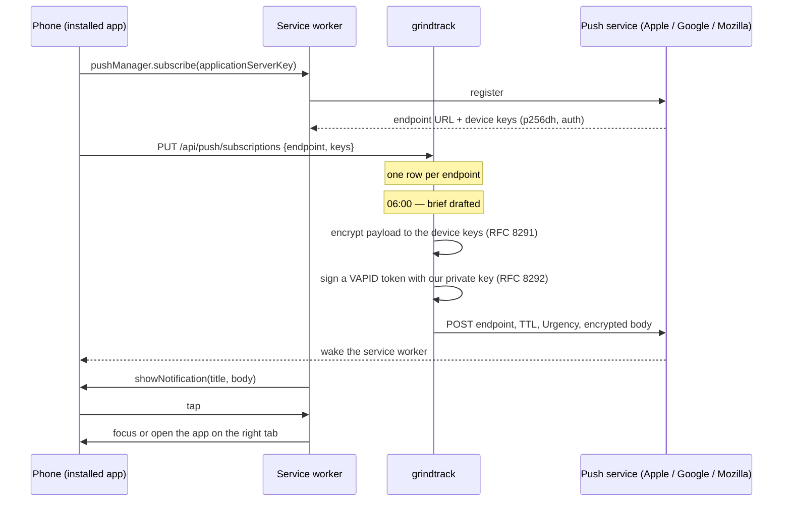

# Push notifications

The app so far has been something you open. Two things it does are worth being told about
without opening it: the morning brief drafted at six, and the Friday review. This document is
the design for delivering those two to the phone, and the ground for anything that follows
(a block starting in ten minutes, an upkeep item due).

The shape of the decision is the same one the assistant made. Nothing new is invented on the
server side beyond a table and one outbound call; the browser and the platforms already carry
the hard parts, and the app's job is to use them without leaking a key, a secret, or a
sentence of the brief to anyone but the phone.

## What ships first

| Notification | When | Title | Body | Opens |
|---|---|---|---|---|
| Morning brief | after the 06:00 draft lands | `morning brief` | the brief's headline | today tab |
| Weekly review | after the Friday 17:00 draft lands | `weekly review is ready` | one fixed sentence | week tab |
| Test | on a click | `notifications are on` | one fixed sentence | today tab |

Two real ones and a test. Both real ones are things the scheduler already produces; the push
is one more line after the row is written. They fire only when the draft *succeeded* — a push
saying "your brief is ready" with no brief behind it is worse than silence.

**Not in this round**, and deliberately: reminders for calendar blocks. That needs a scheduler
that scans the calendar every few minutes and remembers what it already sent, which is a
different piece of work from "tell me when the scheduled job finishes". The plumbing below is
built so it is one more producer when the time comes.

## How Web Push works, in the part that matters here



Three parties, two key pairs.

- **The VAPID pair** identifies *the sender*. The public half is handed to the browser when it
  subscribes; the private half signs a short JWT on every send, and the push service checks
  that the sender of a message is the party the subscription was created for. Without it,
  anyone who learned an endpoint URL could send to that phone.
- **The device pair** belongs to *the subscription*. The browser generates it; the app stores
  the public half and uses it to encrypt each payload. The push service relays bytes it cannot
  read. This is what makes it acceptable to put the brief's headline — "two blocks against CKA,
  etcd lab first" — in a message that transits Apple's servers.

The endpoint URL is a capability: it names one browser on one device, and it is the address
messages go to. It is stored, never logged in full, and never returned to a client other than
as a way for that client to recognise its own row.

## Server

### Sending without a library

The two RFCs, 8291 (encryption) and 8292 (VAPID), are about two hundred lines over what the
JDK already has: ECDH on P-256, HMAC-SHA256 for the HKDF steps, AES-128-GCM for the body,
`SHA256withECDSAinP1363Format` for the JWT signature. The usual Java library for this pulls
in BouncyCastle for the same primitives, which is a large dependency for a feature that sends
two messages a day. It is written by hand, in `push/Vapid.java` and `push/PayloadCipher.java`,
and tested against the worked example in RFC 8291 Appendix A — the one place a hand-rolled
cipher can be checked byte-for-byte rather than trusted.

The seam for tests is `PushTransport`: one method, `send(endpoint, headers, body)`, returning
a status code. Production wires `java.net.http.HttpClient` with a ten-second timeout; tests
wire a fake and check what was handed to it.

### What a send does with the answer

| Push service says | Meaning | The app does |
|---|---|---|
| 201 | queued | records `last_sent_at` |
| 404, 410 | this subscription is gone — the user revoked it or reinstalled | deletes the row |
| 429, 5xx, timeout | not now | logs, keeps the row, does not retry |

No retries. A missed 06:00 push is a missed nudge; the brief is still on the today tab, and a
retry loop is more code than the message is worth. The one place that matters — the test
button — reports the outcome to the person who pressed it.

### Storage

```sql
push_subscriptions (
  id            bigserial primary key,
  endpoint      text not null unique,   -- the push service URL for one browser on one device
  p256dh        text not null,          -- device public key, base64url
  auth          text not null,          -- device auth secret, base64url
  user_agent    text,                   -- for the list: "iPhone · Safari"
  created_at    timestamptz not null,
  last_sent_at  timestamptz
)
```

One row per endpoint, upserted: a browser that subscribes twice replaces its keys rather than
doubling its notifications. One account, so no owner column — the day a second user exists,
this table needs one, like every other table in the app.

### Configuration

```yaml
grindtrack:
  push:
    vapid-public-key:  ${PUSH_VAPID_PUBLIC_KEY:}
    vapid-private-key: ${PUSH_VAPID_PRIVATE_KEY:}
    subject:           ${PUSH_VAPID_SUBJECT:mailto:casey@example.invalid}
```

Absent keys mean **off**, in the same way an absent `ANTHROPIC_API_KEY` means the assistant is
off: the status endpoint says so, the subscribe endpoints answer 503 with a sentence, the
schedulers skip the push line, and nothing else in the app knows. The keys live in
`grindtrack-secrets` next to the API key and are wired into the deployment with
`optional: true`, so the manifest change can land before the keys exist.

Generating the pair is a one-off, on a laptop, with what is already installed:

```bash
node -e '
const { generateKeyPairSync } = require("crypto");
const { privateKey } = generateKeyPairSync("ec", { namedCurve: "prime256v1" });
const j = privateKey.export({ format: "jwk" });
const b = (s) => Buffer.from(s, "base64url");
console.log("PUSH_VAPID_PUBLIC_KEY=" + Buffer.concat([Buffer.from([4]), b(j.x), b(j.y)]).toString("base64url"));
console.log("PUSH_VAPID_PRIVATE_KEY=" + j.d);'
```

then into the secret with the same `kubectl patch secret … --type=merge -p '{"stringData":…}'`
used for the API key, and a rollout restart so the pod reads them. **Losing or rotating the
private key invalidates every subscription** — the push services will refuse sends signed with
a different key than the one the phone subscribed to — so the phones re-subscribe. The
settings panel makes that one tap; the app cannot do it silently, because permission is
granted per key.

### Endpoints — `/api/push`, authenticated

| Method | Path | Body | Answer |
|---|---|---|---|
| GET | `/status` | – | `{configured, publicKey, devices}`. `publicKey` is the VAPID public key, which the browser needs to subscribe; `devices` is the row count. |
| GET | `/subscriptions` | – | `[{id, label, createdAt, lastSentAt, endpoint}]` — the endpoint is included so the browser can mark its own row "this device". |
| PUT | `/subscriptions` | `{endpoint, keys: {p256dh, auth}, userAgent?}` | upsert by endpoint; `{id, devices}` |
| DELETE | `/subscriptions/{id}` | – | `{deleted: id}` |
| POST | `/test` | `{endpoint?}` | sends the test notification — to one device when an endpoint is given, else to all; `{sent, gone}` |

The subscribe call is a PUT because it is idempotent by endpoint. Everything here needs the
session cookie: a subscription is a promise to send this account's data to a device, so only
the account may make it.

### Producers

`PushService.send(Notification)` where a notification is `(title, body, tab, tag, ttlSeconds)`.
`tag` collapses duplicates on the device — two morning briefs on one day, from a redraft,
replace rather than stack. `ttl` is how long the push service holds an undelivered message: six
hours for the brief (a brief delivered at noon is noise), a day for the review.

The two schedulers call it after their `generate` returns, inside the same `try`, after the
log line. A push failure is caught and logged on its own so it cannot make a succeeded draft
look like a failed one.

## Client

### The service worker gains two listeners

`push`: parse the JSON payload, `showNotification(title, {body, icon, badge, tag, data: {tab}})`.
The worker is where a push *must* be handled — the page may not be open, and on iOS the app
is usually not running. The existing rules of the worker are untouched: `/api` is still never
intercepted, nothing new is cached.

`notificationclick`: close the notification; if a window of the app is open, focus it and post
`{type: "open-tab", tab}`; otherwise `openWindow("/?tab=" + tab)`. The app reads `?tab=` once
at start and listens for the message, so a tap on "morning brief" lands on the today tab
whether the app was running or not.

### `lib/push.ts`

A small module that answers one question — what state is this browser in — and does two things.

| State | Meaning | The panel shows |
|---|---|---|
| `unsupported` | no `PushManager` and not iOS | nothing at all — the panel does not render |
| `needs-install` | iOS Safari, not installed to the home screen | one sentence: install it first (share → add to home screen) |
| `blocked` | `Notification.permission === "denied"` | one sentence: allow it in settings |
| `off` | supported, no subscription | **turn on notifications** |
| `on` | subscribed and the row exists | *on · this device* — **send a test**, **turn off** |

`subscribe()` must run inside a click: iOS shows the permission prompt only from a user
gesture, and a prompt raised any other way is silently denied and *stays* denied. So the panel
button calls it directly, with no `await` before the permission request.

`subscribe()` is: get the registration, `pushManager.subscribe({userVisibleOnly: true,
applicationServerKey})` with the status endpoint's public key, PUT the result. `unsubscribe()`
is the reverse: DELETE the row, then `subscription.unsubscribe()` — server first, so a device
that loses the network mid-way is a row that will 410 and clean itself up rather than a phone
that keeps a subscription nobody knows about.

### Where the panel lives

In the more sheet on a phone, under the section grid — the same sheet that holds log out and
export, because it is the same kind of thing: about this device, not about today. On a desktop
the sheet is not reachable, so the header gets a `notifications` button that opens the same
panel. Same component, two doors.

### iOS, specifically

Web push on iPhone requires iOS 16.4 or later **and the app installed to the home screen** —
Safari in the browser proper has no `PushManager`. The panel detects that case and says so
rather than showing a button that would do nothing. Once installed: the permission prompt is
the system one, it appears once, and a denial can only be undone in Settings → Notifications
→ grindtrack. The badge on the icon and the sound are the system's defaults.

## Security notes

- **Payloads are encrypted to the device.** The push services (Apple's, Google's, Mozilla's)
  relay ciphertext. The headline of a brief — the most personal sentence the app produces
  unprompted — is readable only on the phone.
- **The VAPID private key signs every send** and lives only in the Kubernetes secret. It never
  reaches a client; the public half does, and is safe to.
- **Endpoints are capabilities.** They are stored and returned only to the authenticated
  account, and logged truncated.
- **Nothing is sent that is not already on a screen.** A push is a pointer to a draft that
  exists; the draft is the thing, and it is behind the login as before.
- **Single account.** No owner column, no per-user fan-out. Written down here, as on the
  `assistant_reports` table, so the day a second user exists it is a known change.

## Testing without a phone

- `PayloadCipherTest`: RFC 8291 Appendix A, byte-for-byte. The cipher takes its ephemeral key
  and salt as parameters so the example's fixed values can be fed in.
- `VapidTest`: a signed token verifies with the public key, carries the right audience (the
  push service origin), subject, and an expiry under twenty-four hours.
- `PushServiceTest`: with a fake transport — 201 records the send, 410 deletes the row, 500
  keeps it; off is a state, not an error; the test message goes to one endpoint when asked.
- `PushControllerTest`: the shape of the five endpoints, and that a subscribe with a bad key
  is a 400 with a sentence.
- Frontend: Playwright with a scripted `PushManager` and `Notification`, checking each of the
  five states renders the right thing and that subscribe PUTs what the browser produced.

The one thing no test covers is the real push service accepting a real message. That is the
**send a test** button, and the runbook says to press it.

## Runbook

1. Generate the pair (above) on a laptop. Do not commit either half.
2. Patch the secret and restart:
   ```bash
   kubectl -n grindtrack patch secret grindtrack-secrets --type=merge \
     -p '{"stringData":{"PUSH_VAPID_PUBLIC_KEY":"…","PUSH_VAPID_PRIVATE_KEY":"…","PUSH_VAPID_SUBJECT":"mailto:you@example.com"}}'
   kubectl -n grindtrack rollout restart deployment/grindtrack
   ```
3. On the phone, in the installed app: more → **turn on notifications** → allow.
4. **Send a test.** It should arrive within a few seconds.
5. Tomorrow at six, the brief.

## What this sets up

Once a phone can be reached, the producers are the interesting part. In rough order of value:
a block starting in ten minutes (a scan of the calendar every five minutes, remembering what it
sent); an upkeep item due today; the streak about to break at nine in the evening with no log.
Each is one more `PushService.send` and one more scheduler, and none of them needs another
key, table, or permission.
