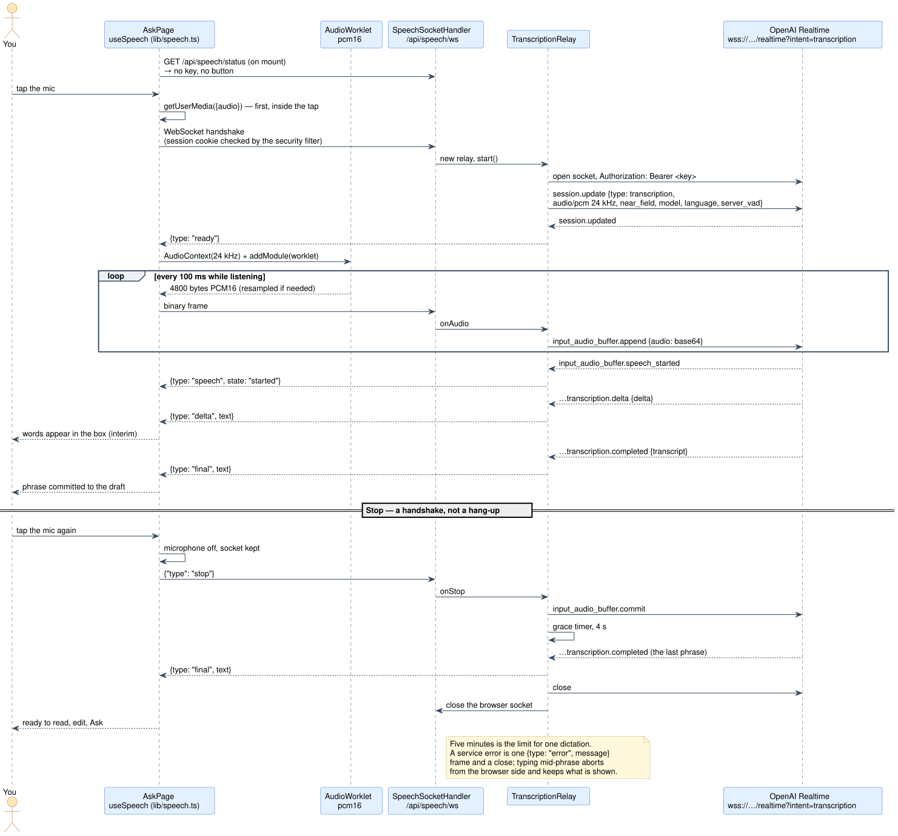

# Speech to text

The mic button in the ask box. Tap it, talk, and each phrase lands in the box about a second
after you pause; read it, edit it, then press Ask. Nothing is sent to the assistant by talking.

This is the second version. The first used the browser's own recognizer (the Web Speech API),
which was free and needed no server change, and which turned out to be unreliable in the
installed iPhone app and absent in Firefox. This one streams the microphone to a transcription
model through a relay on the server. What the browser has to provide now — a microphone, an
`AudioWorklet`, a WebSocket — every current browser does, installed or not.

## How it works



<sub>PlantUML source: [`diagrams/speech-relay.puml`](diagrams/speech-relay.puml) — edit it and regenerate with [`diagrams/render.sh`](diagrams/render.sh).</sub>

Three parts, one protocol each:

| Part | Where | Speaks |
|---|---|---|
| The hook | `frontend/src/lib/speech.ts` — `useSpeech` | microphone → PCM16 frames → binary WebSocket frames; JSON frames back |
| The relay | `backend/.../speech/service/TranscriptionRelay` | the Realtime API's transcription events, in both directions |
| The socket | `speech/api/SpeechSocketHandler` at `/api/speech/ws` | one socket per dictation, one relay per socket |

### Why a relay

The key. It travels in the server's handshake header to the model and nowhere else; the phone
never sees it. The alternative — the browser talking to the model directly with a short-lived
token — is a token endpoint, a second credential lifetime to reason about, and a browser that
holds something worth stealing for ten minutes. A relay is a hundred lines and keeps the
credential where every other credential in this app already lives.

### The audio

The hook captures the microphone with `getUserMedia` **first, inside the tap** — iOS grants the
microphone only from a user gesture — then opens the socket, then builds an `AudioContext` at
24 kHz and loads a worklet. The worklet turns float samples into 16-bit PCM in frames of 2,400
samples (a tenth of a second, 4,800 bytes), resampling by linear interpolation when the browser
picks its own rate (Safari does). The worklet is a string in `speech.ts` rather than a file,
because Vite would otherwise need a separate entry for eighty lines only this file uses.

Nothing is sent before the server says `ready`: audio that arrived before the session was
configured would be in an unknown format.

### The relay's protocol

To the model, the relay opens `wss://api.openai.com/v1/realtime?intent=transcription` and sends
one `session.update`:

```json
{ "type": "session.update",
  "session": { "type": "transcription",
    "audio": { "input": {
      "format": { "type": "audio/pcm", "rate": 24000 },
      "noise_reduction": { "type": "near_field" },
      "transcription": { "model": "gpt-4o-mini-transcribe", "language": "en" },
      "turn_detection": { "type": "server_vad" } } } } }
```

Then every audio frame becomes `{"type":"input_audio_buffer.append","audio":"<base64>"}`. Server
VAD means the model decides where phrases end; the relay never has to.

To the browser, five small frames:

| Frame | Means | The hook does |
|---|---|---|
| `{"type":"ready"}` | the session is configured | starts sending audio |
| `{"type":"delta","text":"…"}` | part of the current phrase | appends to the interim text shown in the box |
| `{"type":"final","text":"…"}` | the phrase settled | commits it to the draft, clears the interim |
| `{"type":"speech","state":"started"\|"stopped"}` | the model heard you start or stop | nothing today; a future "hearing you" indicator |
| `{"type":"error","message":"…"}` | something failed; the socket closes after it | shows the sentence under the box, turns the mic off |

The browser sends one text frame, `{"type":"stop"}`.

### Stop is a handshake

The last thing said must not be lost to the act of pressing the button. So on stop the hook turns
the microphone off but keeps the socket; the relay sends `input_audio_buffer.commit` and waits
for that phrase's `completed` event, then closes both sides. A grace timer of four seconds closes
a relay whose last phrase never comes back. A commit with nothing buffered — the person said
nothing after the last phrase — comes back from the model as an error whose code contains
`commit_empty`, and the relay treats that as a normal end rather than a failure to read.

Typing while listening is the other exit: the hook aborts from its side (closes the socket, drops
the phrase in flight) and keeps exactly what is on screen, so nothing lands twice.

### Limits and edges

- **Five minutes** is the limit for one dictation, enforced in the relay: a mic left on cannot run
  up a bill.
- **Off is a state.** No `OPENAI_API_KEY` means `GET /api/speech/status` says
  `configured: false` and the button is not rendered. A socket opened anyway gets one `error`
  frame and a close.
- **The handshake is authenticated.** It is an ordinary GET through the security filter, so the
  session cookie gates it like every other endpoint. Spring's default origin check makes it
  same-origin only.
- **Tomcat's frame buffer** is raised from 8 KB to 64 KB for this endpoint; an audio frame is a
  few kilobytes, and a burst after a stall may be more.
- **The JDK WebSocket client refuses overlapping sends**, so the upstream connection chains them;
  every frame waits for the one before it.

## Configuration and cost

```yaml
grindtrack.speech:
  api-key: ${OPENAI_API_KEY:}
  model: gpt-4o-mini-transcribe
  language: en
```

| Model | Price | Feel |
|---|---|---|
| `gpt-4o-mini-transcribe` (default) | about $0.003 a minute | a phrase appears about a second after you pause |
| `gpt-4o-transcribe` | about $0.006 a minute | same shape, more accurate |
| `gpt-live-transcribe` | about $0.017 a minute | word by word as you speak |

Switching is one line in `application.yml`. Prices are OpenAI's list at the time of writing;
check before relying on them. At the default, an hour of dictation a month is about twenty cents.

## Runbook

The env var is already on the deployment (k8s repo, `base/app-deployment.yaml`, optional). It
needs a value:

```bash
# 1. a fresh key into the secret
kubectl -n grindtrack patch secret grindtrack-secrets --type=merge \
  -p '{"stringData":{"OPENAI_API_KEY":"sk-…"}}'

# 2. restart so the pod reads it (env vars are resolved once, at container start)
kubectl -n grindtrack rollout restart deploy/grindtrack
kubectl -n grindtrack rollout status deploy/grindtrack

# 3. prove the pod has it
kubectl -n grindtrack exec deploy/grindtrack -- sh -c 'test -n "$OPENAI_API_KEY" && echo key present'
```

Then, logged in, open `/api/speech/status` in a tab: it should read
`{"configured":true,"model":"gpt-4o-mini-transcribe"}`. Reload the app; the mic is on the ask
tab.

**First dictation.** Tap the mic, allow the microphone, say a sentence, pause. If nothing lands
and a sentence appears under the box, that sentence is the diagnosis:

| Under the box | Means | Do |
|---|---|---|
| microphone blocked | the browser or the installed app denied it | allow it in settings, reopen |
| could not reach the transcription service | the pod could not open the socket to OpenAI | `kubectl logs` for `transcription`; check egress from the cluster |
| transcription failed: … | the model rejected something — a bad key, a rate limit, an unknown model | the message says which; `kubectl logs` has the code |
| the transcription service closed the connection | the socket dropped mid-dictation | try again; if it repeats, the logs |
| five minutes is the limit for one dictation | it worked, for five minutes | tap the mic again |

**Reading the logs:**

```bash
kubectl -n grindtrack logs deploy/grindtrack | grep -iE "transcription|speech"
```

## Testing without a key

`TranscriptionUpstream` is an interface; the relay is tested against a fake service and a fake
browser (`TranscriptionRelayTest`): the session it opens, audio to append events, transcript
events to `delta`/`final` frames, the stop handshake, the empty-commit case, the grace timer, a
service error, and the two kinds of close. `SpeechControllerTest` covers the status endpoint.

On the browser side, a Playwright harness with Chromium's fake microphone and a scripted socket
checked that the worklet produces 4,800-byte frames, nothing is sent before `ready`, deltas
revise live, a final commits, stop keeps the socket for a late phrase, a server error is a
sentence with the mic off, and typing mid-phrase aborts.

What no test covers is the real model accepting a real session. The session shape above comes
from the `openai` npm package's type definitions (7.15.0); the first dictation on a phone is the
live check.

## Exercises

1. **Watch the frames.** In the browser's devtools, open the network tab, filter to WS, tap the
   mic, and read the frames in both directions against the table above.
2. **Switch the model** to `gpt-live-transcribe` locally and feel the difference in latency and
   price. Switch it back.
3. **Show "hearing you".** The `speech` frame is delivered and ignored. Render a small indicator
   between `started` and `stopped`. The hook already parses the frame; the change is in
   `speech.ts` state and one line in `AskPage`.
4. **Add a language chooser.** `language` is a fixed `en`. Thread a value from the browser
   through the handshake (a query parameter the handler reads) into the relay's `session.update`.
